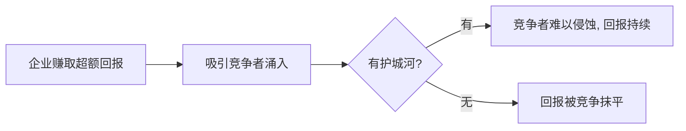

# 巴菲特护城河理论

> [!note] 核心概念
> "护城河"是巴菲特对**持久竞争优势**的比喻：城堡（企业）要有又宽又深的护城河，才能在竞争对手（攻城者）的不断进攻下，长期守住超额回报。没有护城河的高回报，会被竞争迅速抹平。

## 一、为什么护城河决定长期回报

自由竞争的铁律是：**高回报会吸引竞争者，竞争会把回报拉回平均水平**。护城河就是阻止这个过程的力量。

## 二、五类护城河

| 护城河类型 | 定义 | 典型来源 |
|---|---|---|
| **无形资产** | 品牌、专利、监管许可 | 强品牌的定价权、专利保护期 |
| **转换成本** | 客户更换供应商代价高 | 企业软件、银行账户体系 |
| **网络效应** | 用户越多越有价值 | 支付网络、平台、交易所 |
| **成本优势** | 持续低于对手的成本 | 规模采购、独特资源、流程 |
| **规模效应** | 规模本身形成壁垒 | 高固定成本行业的龙头 |

> [!tip] 区分"真护城河"与"伪护城河"
> 好产品、高市占、当红技术**不一定**是护城河——它们可能被模仿或颠覆。真护城河要能**持久**抵御竞争。问一句：十年后对手还是攻不进来吗？

## 三、护城河分析四问法

1. **有没有护城河？** 看是否长期维持高利润率 + 高资本回报率。
2. **来源是什么？** 归到上面五类中的哪一种（来源不清的"优势"靠不住）。
3. **有多宽？** 能维持几年的竞争优势？
4. **在变宽还是变窄？** 竞争格局、技术、监管的演变方向。

## 四、护城河的量化线索

| 指标 | 强护城河特征 |
|---|---|
| ROIC（投入资本回报率） | 长期持续偏高（如稳定 > 15%，示例） |
| 毛利率/净利率 | 稳定且高于行业平均 |
| 市场份额 | 稳定靠前，而非靠烧钱抢来 |
| 定价权 | 能把成本上涨转嫁给客户而不流失客户 |

ROIC 与利润率的拆解见 [[杜邦分析法]]、[[财务比率分析]]。

> [!warning] 财务指标是"结果"，不是"原因"
> 高 ROIC 是护城河的**表现**。要追问"为什么它能维持高 ROIC"——找到那个商业原因，才算真正理解了护城河。

## 五、护城河会被填平

护城河不是永恒的，要警惕它变窄：

- **技术变迁**：新技术颠覆旧壁垒（如线下渠道被电商削弱）；
- **监管变化**：牌照/专利到期或政策调整；
- **管理层失误**：透支品牌、乱并购、资本错配；
- **消费习惯迁移**：用户偏好转移。

## 常见误区

| 误区 | 更好的理解 |
|---|---|
| 龙头=有护城河 | 份额可能靠补贴，未必持久 |
| 技术领先=护城河 | 技术易被超越，除非有专利/网络效应锁定 |
| 护城河一劳永逸 | 要持续跟踪它在变宽还是变窄 |
| 高增长=好生意 | 无护城河的增长会被竞争吃掉利润 |

## 相关链接
- [[巴菲特价值投资核心原则]]
- [[巴菲特估值方法]]
- [[巴菲特分析框架]]
- [[巴菲特永恒投资原则]]
- [[杜邦分析法]]
- [[财务比率分析]]
- [[估值方法入门]]

## 实战掌握清单

> [!tip] 交易者视角
> 巴菲特护城河理论 的学习重点不是记住术语，而是把它放进研究、组合、执行和复盘的闭环。投资大师的思想不能停在语录层面，必须翻译成能力圈、估值、护城河、仓位和持有纪律。

### 关键判断

- 先区分思想适用于企业分析、宏观周期、风险控制还是心理纪律。
- 把原则转成研究清单，例如商业模式、管理层、现金流、竞争优势和安全边际。
- 识别思想的前提条件，避免把长期投资口号用于短线题材。

### 落地动作

1. 为每条理念找一个成功案例和一个失败反例。
2. 把买入理由压缩成可验证假设，而不是名人背书。
3. 复盘时检查自己是在坚持原则，还是用原则合理化亏损。

### 失效边界

- 忽略估值过高。
- 把护城河误判成短期景气。
- 缺少退出条件，导致价值陷阱长期占用资本。

### 复盘问题

- 这项知识改变了哪一个具体决策：标的、方向、仓位、退出、对冲还是不交易？
- 如果判断相反，最大亏损、最长恢复期和退出触发条件是什么？
- 有没有一个更简单的基准方法可以取得相近结果？

## 深度案例与训练

### 理念落地

围绕 巴菲特护城河理论 写出对应的能力圈、安全边际、商业模式、管理层、估值和仓位规则。大师思想必须落成自己的检查清单。

### 训练方法

- 每条原则找一个成功案例和一个失败反例。
- 写出适用条件和不适用条件。
- 复盘自己是否在用理念合理化亏损。

### 边界

长期主义不等于无条件持有，安全边际不等于永远不会亏。
