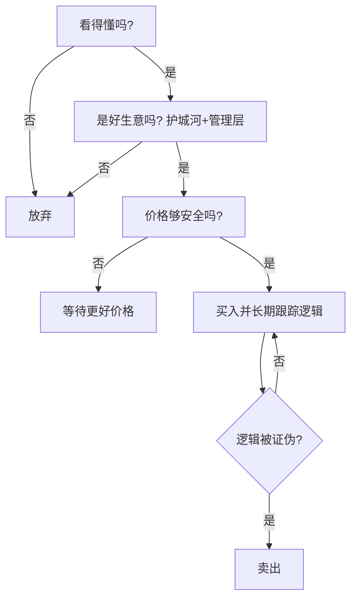

# 巴菲特永恒投资原则

> [!note] 二十条铁律
> 这些原则散见于巴菲特数十年的股东信与访谈，核心其实只有几个反复出现的主题：**别亏大钱、只做看得懂的、好价格买好生意、长期持有、远离杠杆与噪音**。下面分四篇梳理，并连到本库的对应深入笔记。

## 一、投资哲学篇

| 原则 | 内涵 | 关联 |
|---|---|---|
| 不要亏损 | "第一条：不要赔钱；第二条：别忘了第一条"——强调避免**永久性**亏损 | [[风险管理框架]] |
| 安全边际 | 永远以远低于内在价值的价格买 | [[估值方法入门]] |
| 市场先生 | 市场是来服务你的，不是来指导你的 | [[行为金融学基础]] |
| 能力圈 | 只投你真正理解的生意 | [[巴菲特价值投资核心原则]] |
| 独立思考 | 别人贪婪时恐惧，别人恐惧时贪婪 | [[投资心理偏误]] |

> [!important] "不要亏损"指的是不要永久损失
> 巴菲特区分**波动**与**永久性资本损失**：股价短期下跌不可怕，可怕的是生意变坏、买太贵、用杠杆被强平导致的不可逆亏损。

## 二、选股原则篇

| 原则 | 说明 |
|---|---|
| 护城河 | 只投有持久竞争优势的企业（[[巴菲特护城河理论]]） |
| 优秀管理 | 管理层要诚实且会配置资本 |
| 确定性 | 宁要模糊的正确，不要精确的错误 |
| 价格合理 | 以合理价买伟大公司，胜过以便宜价买平庸公司 |
| 现金流为王 | 关注自由现金流，而非会计利润（[[三张财务报表]]） |

> [!tip] 从"捡烟蒂"到"买好公司"的进化
> 早期巴菲特买极便宜的平庸公司（格雷厄姆式烟蒂股）；在芒格影响下，转向"以合理价格买伟大公司"。这是其思想最重要的一次升级（见 [[穷查理宝典摘要]]）。

## 三、持有原则篇

| 原则 | 说明 |
|---|---|
| 长期持有 | 最喜欢的持有期是"永远"（[[复利思维]]） |
| 集中投资 | 把鸡蛋放在少数看得懂的篮子里，并看好它 |
| 不频繁交易 | 摩擦成本与税负是复利的敌人 |
| 忽略噪音 | 不被短期波动和宏观预测牵着走 |
| 反向思维 | 在别人恐惧时买入 |

> [!warning] 集中投资是双刃剑
> 集中能放大认知优势，但前提是你**真的**有认知优势且做对了风控。对多数人，适度分散更稳妥（见 [[资产配置入门]]、[[组合构建方法]]）。巴菲特的集中建立在极深的研究之上，不是随意重仓。

## 四、风险控制篇

| 原则 | 说明 |
|---|---|
| 不借钱投资 | "杠杆是唯一能让聪明人破产的东西"（[[资金管理与杠杆]]） |
| 储备现金 | 永远保持充足流动性，危机才是机会 |
| 避免永久损失 | 波动不是风险，永久性资本损失才是 |
| 不懂不做 | 错过机会，好过犯下大错 |
| 持续学习 | 知识像复利一样积累 |

## 把原则变成自己的清单

## 常见误区

| 误区 | 更好的理解 |
|---|---|
| 巴菲特从不卖 | 逻辑被证伪、或有更好机会时他也卖 |
| 长期持有=无脑拿住 | 是持续验证生意逻辑 |
| 集中投资适合所有人 | 需极深研究+风控，普通人宜适度分散 |
| 抄巴菲特持仓就行 | 你不知道他的成本、仓位和卖出点 |
| 不借钱太保守 | 杠杆的尾部风险是不可逆的 |

## 相关链接
- [[巴菲特价值投资核心原则]]
- [[巴菲特护城河理论]]
- [[巴菲特估值方法]]
- [[穷查理宝典摘要]]
- [[复利思维]]
- [[风险管理框架]]
- [[资金管理与杠杆]]

## 课程化学习补充

> [!important] 学习定位
> 经典投资思想的价值在于建立决策原则：能力圈、安全边际、长期复利、反身性和风险控制，而不是照搬大师持仓。本文仅用于学习、研究与复盘，不构成任何投资建议。

### 必须掌握的问题

- 企业是否在能力圈内
- 安全边际来自估值还是质量
- 持有逻辑是否可被证伪
- 仓位是否匹配不确定性

### 实战应用流程

1. 先写清楚你的投资假设：为什么这个信号、资产或方法应该产生收益。
2. 明确数据口径：样本范围、更新时间、复权/分红/停牌处理和交易日历。
3. 做最小可行验证：先用简单规则验证方向，再逐步加入复杂模型。
4. 把成本和约束前置：手续费、滑点、冲击成本、保证金、流动性和容量都要进入测算。
5. 上线后持续复盘：记录信号、下单、成交、持仓、回撤和失效原因。

### 风险与失效条件

- 把名人语录当交易信号
- 长期主义掩盖错误
- 低估值陷阱
- 忽视组合层面的回撤

### 复盘问题

- 这笔交易或这套模型赚的是什么钱：风险补偿、行为偏差、流动性溢价，还是偶然噪音？
- 如果市场环境反过来，最大亏损和最长恢复期会是多少？
- 当前结论是否依赖某个不可持续假设，例如低利率、低波动、充裕流动性或监管套利？
- 有没有一个更简单的基准策略能取得接近效果？

### 延伸学习

- [[安全边际]]
- [[巴菲特价值投资核心原则]]
- [[资产配置入门]]
- [[交易心理纪律]]

## 跨领域进阶扩展

> [!tip] 交易者视角
> 学到 `巴菲特永恒投资原则` 时，不要只把它当成孤立知识点。把经典思想转成可执行清单，不复制大师语录或历史持仓。优秀投资交易者会把它放入“宏观背景 - 资产选择 - 估值/信号 - 组合风险 - 交易执行 - 复盘反馈”的闭环。

### 与其他知识的连接

- 能力圈和安全边际
- 企业质量和估值区间
- 反身性、周期和风险控制
- 长期持有和错误纠正

### 进阶训练

1. 把一个大师原则写成买入前检查清单
2. 为长期持仓写出卖出条件
3. 找一个经典原则失效的历史案例

### 能力验收

- 能否说清楚这个主题影响的是收益来源、风险来源、交易成本、流动性还是心理纪律？
- 能否指出它在什么市场环境、资产类别或交易周期中更有效？
- 能否把它写成一条可复盘的研究或交易规则？
- 能否说明如果判断错误，组合最大损失和退出机制是什么？

### 全局关联

- [[综合金融知识体系/金融投资全知识地图|金融投资全知识地图]]
- [[综合金融知识体系/优秀投资交易者能力地图|优秀投资交易者能力地图]]
- [[综合金融知识体系/一次性学习路线与复盘模板|一次性学习路线与复盘模板]]
