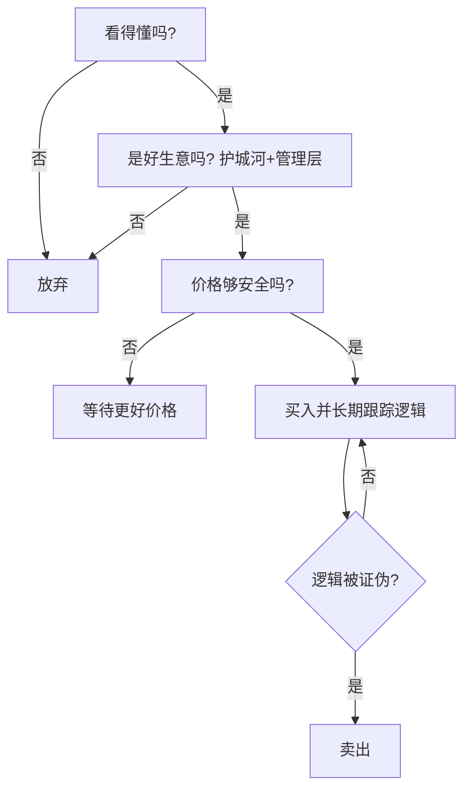

# 巴菲特永恒投资原则

> [!note] 二十条铁律
> 这些原则散见于巴菲特数十年的股东信与访谈，核心其实只有几个反复出现的主题：**别亏大钱、只做看得懂的、好价格买好生意、长期持有、远离杠杆与噪音**。下面分四篇梳理，并连到本库的对应深入笔记。

## 一、投资哲学篇

| 原则 | 内涵 | 关联 |
|---|---|---|
| 不要亏损 | "第一条：不要赔钱；第二条：别忘了第一条"——强调避免**永久性**亏损 | [[风险管理框架]] |
| 安全边际 | 永远以远低于内在价值的价格买 | [[估值方法入门]] |
| 市场先生 | 市场是来服务你的，不是来指导你的 | [[行为金融学基础]] |
| 能力圈 | 只投你真正理解的生意 | [[巴菲特价值投资核心原则]] |
| 独立思考 | 别人贪婪时恐惧，别人恐惧时贪婪 | [[投资心理偏误]] |

> [!important] "不要亏损"指的是不要永久损失
> 巴菲特区分**波动**与**永久性资本损失**：股价短期下跌不可怕，可怕的是生意变坏、买太贵、用杠杆被强平导致的不可逆亏损。

## 二、选股原则篇

| 原则 | 说明 |
|---|---|
| 护城河 | 只投有持久竞争优势的企业（[[巴菲特护城河理论]]） |
| 优秀管理 | 管理层要诚实且会配置资本 |
| 确定性 | 宁要模糊的正确，不要精确的错误 |
| 价格合理 | 以合理价买伟大公司，胜过以便宜价买平庸公司 |
| 现金流为王 | 关注自由现金流，而非会计利润（[[三张财务报表]]） |

> [!tip] 从"捡烟蒂"到"买好公司"的进化
> 早期巴菲特买极便宜的平庸公司（格雷厄姆式烟蒂股）；在芒格影响下，转向"以合理价格买伟大公司"。这是其思想最重要的一次升级（见 [[穷查理宝典摘要]]）。

## 三、持有原则篇

| 原则 | 说明 |
|---|---|
| 长期持有 | 最喜欢的持有期是"永远"（[[复利思维]]） |
| 集中投资 | 把鸡蛋放在少数看得懂的篮子里，并看好它 |
| 不频繁交易 | 摩擦成本与税负是复利的敌人 |
| 忽略噪音 | 不被短期波动和宏观预测牵着走 |
| 反向思维 | 在别人恐惧时买入 |

> [!warning] 集中投资是双刃剑
> 集中能放大认知优势，但前提是你**真的**有认知优势且做对了风控。对多数人，适度分散更稳妥（见 [[资产配置入门]]、[[组合构建方法]]）。巴菲特的集中建立在极深的研究之上，不是随意重仓。

## 四、风险控制篇

| 原则 | 说明 |
|---|---|
| 不借钱投资 | "杠杆是唯一能让聪明人破产的东西"（[[资金管理与杠杆]]） |
| 储备现金 | 永远保持充足流动性，危机才是机会 |
| 避免永久损失 | 波动不是风险，永久性资本损失才是 |
| 不懂不做 | 错过机会，好过犯下大错 |
| 持续学习 | 知识像复利一样积累 |

## 把原则变成自己的清单

## 常见误区

| 误区 | 更好的理解 |
|---|---|
| 巴菲特从不卖 | 逻辑被证伪、或有更好机会时他也卖 |
| 长期持有=无脑拿住 | 是持续验证生意逻辑 |
| 集中投资适合所有人 | 需极深研究+风控，普通人宜适度分散 |
| 抄巴菲特持仓就行 | 你不知道他的成本、仓位和卖出点 |
| 不借钱太保守 | 杠杆的尾部风险是不可逆的 |

## 相关链接
- [[巴菲特价值投资核心原则]]
- [[巴菲特护城河理论]]
- [[巴菲特估值方法]]
- [[穷查理宝典摘要]]
- [[复利思维]]
- [[风险管理框架]]
- [[资金管理与杠杆]]

## 实战掌握清单

> [!tip] 交易者视角
> 巴菲特永恒投资原则 的学习重点不是记住术语，而是把它放进研究、组合、执行和复盘的闭环。投资大师的思想不能停在语录层面，必须翻译成能力圈、估值、护城河、仓位和持有纪律。

### 关键判断

- 先区分思想适用于企业分析、宏观周期、风险控制还是心理纪律。
- 把原则转成研究清单，例如商业模式、管理层、现金流、竞争优势和安全边际。
- 识别思想的前提条件，避免把长期投资口号用于短线题材。

### 落地动作

1. 为每条理念找一个成功案例和一个失败反例。
2. 把买入理由压缩成可验证假设，而不是名人背书。
3. 复盘时检查自己是在坚持原则，还是用原则合理化亏损。

### 失效边界

- 忽略估值过高。
- 把护城河误判成短期景气。
- 缺少退出条件，导致价值陷阱长期占用资本。

### 复盘问题

- 这项知识改变了哪一个具体决策：标的、方向、仓位、退出、对冲还是不交易？
- 如果判断相反，最大亏损、最长恢复期和退出触发条件是什么？
- 有没有一个更简单的基准方法可以取得相近结果？
