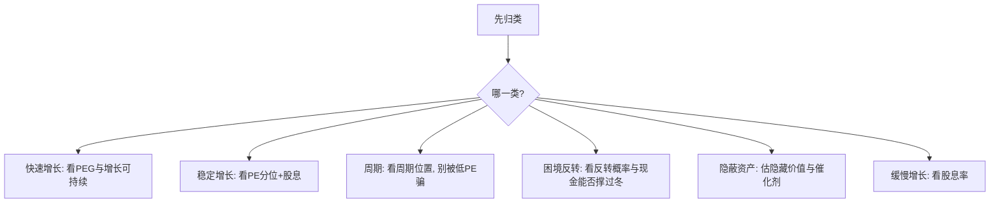

# 彼得林奇的六种股票分类法

> [!note] 核心框架
> 彼得林奇管理麦哲伦基金期间取得了长期亮眼的业绩。他的关键心法之一是：**不同类型的股票，逻辑、估值、买卖时机完全不同，不能一套标准打天下**。他把股票分成六类，先归类、再用对应方法分析。

## 一、六类股票

| 类型 | 特征 | 投资逻辑 | 关注点 |
|---|---|---|---|
| **缓慢增长型** | 增速低、成熟行业 | 收息为主 | 股息率、派息可持续性 |
| **稳定增长型** | 中速增长、大市值蓝筹 | 低位买、赚估值修复+成长 | PE 历史分位 |
| **快速增长型** | 高增速、规模较小 | 核心进攻、找 PEG<1 | 增长可持续性 |
| **周期型** | 随宏观/行业周期起伏 | 逆周期布局 | 周期位置、库存 |
| **困境反转型** | 暂时困境、有望翻身 | 高赔率博弈 | 反转概率、资产负债表能否撑住 |
| **隐蔽资产型** | 资产价值未被股价反映 | 深度价值挖掘 | 隐藏资产的真实价值 |

## 二、不同类型，不同打法

> [!warning] 最常见的错误是"用错类型的标尺"
> 用成长股的眼光（追高增长）去买周期股，会在景气顶部接盘；用周期股的眼光（等低 PE）去买成长股，会永远等不到上车。**归错类，后面全错。**

## 三、买卖时机对照

| 类型 | 买入时机 | 卖出时机 |
|---|---|---|
| 缓慢增长 | 明显超跌、股息率高 | 大涨后股息吸引力下降 |
| 稳定增长 | PE 处历史低位 | PE 到历史高位 |
| 快速增长 | 估值合理的成长期 | 增速明显放缓、PEG 抬升 |
| 周期型 | 行业谷底（盈利差、PE 高/负） | 景气高峰、库存堆积、PE 低 |
| 困境反转 | 困境已充分反映、现金能撑住 | 反转兑现、逻辑走完 |
| 隐蔽资产 | 资产被大幅折价 | 价值被市场认识/收购要约出现 |

## 四、林奇的选股经验法则

| 法则 | 说明 |
|---|---|
| 从生活中发现 | 投资你了解、能观察到其产品的公司 |
| 避开热门股 | 热门行业的热门股最易被高估 |
| 名字枯燥反而好 | 不性感的公司常被忽视、定价更便宜 |
| 关注机构低配 | 被华尔街冷落的票可能有预期差 |
| 重视资产负债表 | 现金多、负债低提供安全垫（[[三张财务报表]]） |

> [!tip] "从生活中发现"不是终点而是起点
> 看到某产品热销只是**线索**，还要回去做功课：归类、看财务、估值、找催化剂、确认增长可持续。逛街选股不等于研究选股。

## 五、与 PEG 的衔接

快速增长型主要用 PEG 判断估值（见 [[彼得林奇PEG选股法]]）；其余类型要换用股息率、PE 历史分位、反转概率、资产折价等不同标尺。

## 常见误区

| 误区 | 更好的理解 |
|---|---|
| 一套估值打所有股票 | 六类各有标尺 |
| 周期股低 PE 买入 | 低 PE 常是周期顶部 |
| 困境反转=抄底烂公司 | 要确认现金流能撑过困境 |
| 生活里发现就能买 | 线索之后必须做研究 |
| 快速增长能永远快 | 增速终会放缓，要盯拐点 |

## 相关链接
- [[彼得林奇PEG选股法]]
- [[巴菲特价值投资核心原则]]
- [[估值方法入门]]
- [[三张财务报表]]

## 实战掌握清单

> [!tip] 交易者视角
> 彼得林奇的六种股票分类法 的学习重点不是记住术语，而是把它放进研究、组合、执行和复盘的闭环。投资大师的思想不能停在语录层面，必须翻译成能力圈、估值、护城河、仓位和持有纪律。

### 关键判断

- 先区分思想适用于企业分析、宏观周期、风险控制还是心理纪律。
- 把原则转成研究清单，例如商业模式、管理层、现金流、竞争优势和安全边际。
- 识别思想的前提条件，避免把长期投资口号用于短线题材。

### 落地动作

1. 为每条理念找一个成功案例和一个失败反例。
2. 把买入理由压缩成可验证假设，而不是名人背书。
3. 复盘时检查自己是在坚持原则，还是用原则合理化亏损。

### 失效边界

- 忽略估值过高。
- 把护城河误判成短期景气。
- 缺少退出条件，导致价值陷阱长期占用资本。

### 复盘问题

- 这项知识改变了哪一个具体决策：标的、方向、仓位、退出、对冲还是不交易？
- 如果判断相反，最大亏损、最长恢复期和退出触发条件是什么？
- 有没有一个更简单的基准方法可以取得相近结果？
