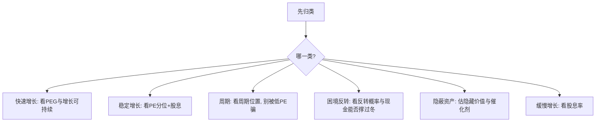

# 彼得林奇的六种股票分类法

> [!note] 核心框架
> 彼得林奇管理麦哲伦基金期间取得了长期亮眼的业绩。他的关键心法之一是：**不同类型的股票，逻辑、估值、买卖时机完全不同，不能一套标准打天下**。他把股票分成六类，先归类、再用对应方法分析。

## 一、六类股票

| 类型 | 特征 | 投资逻辑 | 关注点 |
|---|---|---|---|
| **缓慢增长型** | 增速低、成熟行业 | 收息为主 | 股息率、派息可持续性 |
| **稳定增长型** | 中速增长、大市值蓝筹 | 低位买、赚估值修复+成长 | PE 历史分位 |
| **快速增长型** | 高增速、规模较小 | 核心进攻、找 PEG<1 | 增长可持续性 |
| **周期型** | 随宏观/行业周期起伏 | 逆周期布局 | 周期位置、库存 |
| **困境反转型** | 暂时困境、有望翻身 | 高赔率博弈 | 反转概率、资产负债表能否撑住 |
| **隐蔽资产型** | 资产价值未被股价反映 | 深度价值挖掘 | 隐藏资产的真实价值 |

## 二、不同类型，不同打法

> [!warning] 最常见的错误是"用错类型的标尺"
> 用成长股的眼光（追高增长）去买周期股，会在景气顶部接盘；用周期股的眼光（等低 PE）去买成长股，会永远等不到上车。**归错类，后面全错。**

## 三、买卖时机对照

| 类型 | 买入时机 | 卖出时机 |
|---|---|---|
| 缓慢增长 | 明显超跌、股息率高 | 大涨后股息吸引力下降 |
| 稳定增长 | PE 处历史低位 | PE 到历史高位 |
| 快速增长 | 估值合理的成长期 | 增速明显放缓、PEG 抬升 |
| 周期型 | 行业谷底（盈利差、PE 高/负） | 景气高峰、库存堆积、PE 低 |
| 困境反转 | 困境已充分反映、现金能撑住 | 反转兑现、逻辑走完 |
| 隐蔽资产 | 资产被大幅折价 | 价值被市场认识/收购要约出现 |

## 四、林奇的选股经验法则

| 法则 | 说明 |
|---|---|
| 从生活中发现 | 投资你了解、能观察到其产品的公司 |
| 避开热门股 | 热门行业的热门股最易被高估 |
| 名字枯燥反而好 | 不性感的公司常被忽视、定价更便宜 |
| 关注机构低配 | 被华尔街冷落的票可能有预期差 |
| 重视资产负债表 | 现金多、负债低提供安全垫（[[三张财务报表]]） |

> [!tip] "从生活中发现"不是终点而是起点
> 看到某产品热销只是**线索**，还要回去做功课：归类、看财务、估值、找催化剂、确认增长可持续。逛街选股不等于研究选股。

## 五、与 PEG 的衔接

快速增长型主要用 PEG 判断估值（见 [[彼得林奇PEG选股法]]）；其余类型要换用股息率、PE 历史分位、反转概率、资产折价等不同标尺。

## 常见误区

| 误区 | 更好的理解 |
|---|---|
| 一套估值打所有股票 | 六类各有标尺 |
| 周期股低 PE 买入 | 低 PE 常是周期顶部 |
| 困境反转=抄底烂公司 | 要确认现金流能撑过困境 |
| 生活里发现就能买 | 线索之后必须做研究 |
| 快速增长能永远快 | 增速终会放缓，要盯拐点 |

## 相关链接
- [[彼得林奇PEG选股法]]
- [[巴菲特价值投资核心原则]]
- [[估值方法入门]]
- [[三张财务报表]]

## 课程化学习补充

> [!important] 学习定位
> 经典投资思想的价值在于建立决策原则：能力圈、安全边际、长期复利、反身性和风险控制，而不是照搬大师持仓。本文仅用于学习、研究与复盘，不构成任何投资建议。

### 必须掌握的问题

- 企业是否在能力圈内
- 安全边际来自估值还是质量
- 持有逻辑是否可被证伪
- 仓位是否匹配不确定性

### 实战应用流程

1. 先写清楚你的投资假设：为什么这个信号、资产或方法应该产生收益。
2. 明确数据口径：样本范围、更新时间、复权/分红/停牌处理和交易日历。
3. 做最小可行验证：先用简单规则验证方向，再逐步加入复杂模型。
4. 把成本和约束前置：手续费、滑点、冲击成本、保证金、流动性和容量都要进入测算。
5. 上线后持续复盘：记录信号、下单、成交、持仓、回撤和失效原因。

### 风险与失效条件

- 把名人语录当交易信号
- 长期主义掩盖错误
- 低估值陷阱
- 忽视组合层面的回撤

### 复盘问题

- 这笔交易或这套模型赚的是什么钱：风险补偿、行为偏差、流动性溢价，还是偶然噪音？
- 如果市场环境反过来，最大亏损和最长恢复期会是多少？
- 当前结论是否依赖某个不可持续假设，例如低利率、低波动、充裕流动性或监管套利？
- 有没有一个更简单的基准策略能取得接近效果？

### 延伸学习

- [[安全边际]]
- [[巴菲特价值投资核心原则]]
- [[资产配置入门]]
- [[交易心理纪律]]

## 跨领域进阶扩展

> [!tip] 交易者视角
> 学到 `彼得林奇的六种股票分类法` 时，不要只把它当成孤立知识点。把经典思想转成可执行清单，不复制大师语录或历史持仓。优秀投资交易者会把它放入“宏观背景 - 资产选择 - 估值/信号 - 组合风险 - 交易执行 - 复盘反馈”的闭环。

### 与其他知识的连接

- 能力圈和安全边际
- 企业质量和估值区间
- 反身性、周期和风险控制
- 长期持有和错误纠正

### 进阶训练

1. 把一个大师原则写成买入前检查清单
2. 为长期持仓写出卖出条件
3. 找一个经典原则失效的历史案例

### 能力验收

- 能否说清楚这个主题影响的是收益来源、风险来源、交易成本、流动性还是心理纪律？
- 能否指出它在什么市场环境、资产类别或交易周期中更有效？
- 能否把它写成一条可复盘的研究或交易规则？
- 能否说明如果判断错误，组合最大损失和退出机制是什么？

### 全局关联

- [[综合金融知识体系/金融投资全知识地图|金融投资全知识地图]]
- [[综合金融知识体系/优秀投资交易者能力地图|优秀投资交易者能力地图]]
- [[综合金融知识体系/一次性学习路线与复盘模板|一次性学习路线与复盘模板]]
