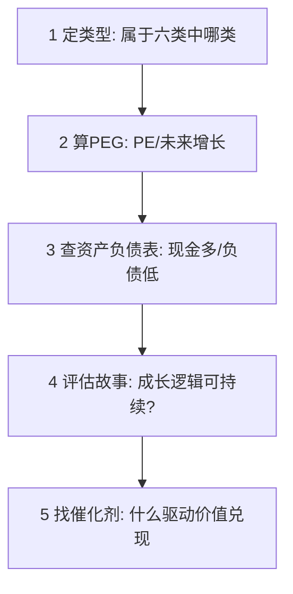

# 彼得林奇 PEG 选股法

> [!note] 核心指标
> PEG 把"贵不贵"（PE）和"长得快不快"（增长率）放在一起看。它回答一个关键问题：**为成长付的价钱合不合理**。PEG ≈ 1 大致合理，PEG < 1 偏低估——这是"以合理价格买成长"（GARP）的最经典工具。

## 一、PEG 的计算

$$
\text{PEG} = \frac{\text{市盈率 PE}}{\text{盈利增长率 G(\%)}}
$$

例（示例）：PE = 30，未来 3 年预期年增长率 G = 30% → PEG = 30/30 = 1.0，估值与增长匹配；若 G = 15%，PEG = 2.0，为高增长付了过高价。

> [!tip] PEG 的直觉
> PE 表示"市场愿意为每 1 元盈利付多少倍价钱"。增长越快，越值得付高 PE。PEG 就是把 PE 用增长率"打个折"，让不同增速的股票可比。PE 的基础见 [[估值方法入门]]。

## 二、解读标准

| PEG | 含义 | 操作倾向 |
|---|---|---|
| < 0.5 | 深度低估（若增长可信） | 重点关注 |
| 0.5 – 1 | 合理偏低 | 可以考虑 |
| 1 – 2 | 合理偏高 | 持有/观望 |
| > 2 | 偏贵 | 谨慎/回避 |

> [!warning] PEG 低不等于便宜
> PEG 的分母是**预期增长率**——它是预测，可能错。如果增长率被高估，PEG 会显得很低却是陷阱。务必追问：**这个增长能持续吗？靠什么持续？**

## 三、林奇式选股五步

类型划分见 [[彼得林奇6种股票类型]]。

## 四、PEG 的适用边界

| 股票类型 | PEG 是否适用 | 替代/补充 |
|---|---|---|
| 快速增长型 | ✅ 最适用（找 PEG < 1） | 关注增长可持续性 |
| 稳定增长型 | ⚠️ 部分适用 | 看 PE 历史分位 + 股息 |
| 缓慢增长型 | ❌ 不适用 | 用股息率 |
| 周期型 | ❌ 不适用 | PE 高时（盈利谷底）可能是机会 |
| 困境反转型 | ❌ 不适用 | 看反转概率而非 PEG |
| 亏损企业 | ❌ PE 无意义 | 用 PS、现金流等 |

> [!important] 周期股的 PE 陷阱
> 周期股在盈利高峰时 PE 最低（看着"便宜"），却往往是顶部；在盈利谷底时 PE 极高甚至为负，反而可能临近底部。对周期股用 PEG/低 PE 选股极易踩反。

## 五、实战要点

- **增长率取多久**：常用未来 3–5 年的可持续增长率，而非某一年的爆发；
- **交叉验证**：用现金流、负债、护城河验证增长的"含金量"（[[三张财务报表]]、[[巴菲特护城河理论]]）；
- **从生活中找线索**：林奇主张投资你了解的、能观察到其产品热销的公司。

## 常见误区

| 误区 | 更好的理解 |
|---|---|
| PEG < 1 就买 | 先确认增长率预测可信、可持续 |
| PEG 适用所有股票 | 周期股、亏损股、缓慢增长股都不适用 |
| 增长率用历史一年 | 应估可持续的中期增长 |
| 只看 PEG | 还要看资产负债表与商业逻辑 |

## 相关链接
- [[彼得林奇6种股票类型]]
- [[巴菲特估值方法]]
- [[估值方法入门]]
- [[财务比率分析]]

## 实战掌握清单

> [!tip] 交易者视角
> 彼得林奇 PEG 选股法 的学习重点不是记住术语，而是把它放进研究、组合、执行和复盘的闭环。投资大师的思想不能停在语录层面，必须翻译成能力圈、估值、护城河、仓位和持有纪律。

### 关键判断

- 先区分思想适用于企业分析、宏观周期、风险控制还是心理纪律。
- 把原则转成研究清单，例如商业模式、管理层、现金流、竞争优势和安全边际。
- 识别思想的前提条件，避免把长期投资口号用于短线题材。

### 落地动作

1. 为每条理念找一个成功案例和一个失败反例。
2. 把买入理由压缩成可验证假设，而不是名人背书。
3. 复盘时检查自己是在坚持原则，还是用原则合理化亏损。

### 失效边界

- 忽略估值过高。
- 把护城河误判成短期景气。
- 缺少退出条件，导致价值陷阱长期占用资本。

### 复盘问题

- 这项知识改变了哪一个具体决策：标的、方向、仓位、退出、对冲还是不交易？
- 如果判断相反，最大亏损、最长恢复期和退出触发条件是什么？
- 有没有一个更简单的基准方法可以取得相近结果？
