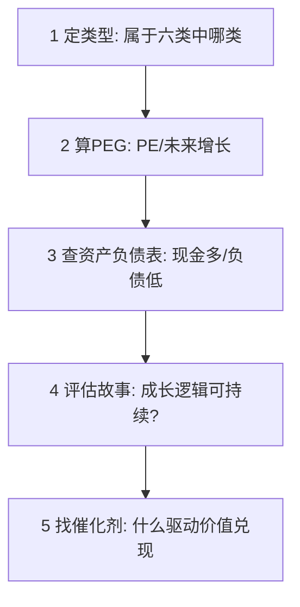

# 彼得林奇 PEG 选股法

> [!note] 核心指标
> PEG 把"贵不贵"（PE）和"长得快不快"（增长率）放在一起看。它回答一个关键问题：**为成长付的价钱合不合理**。PEG ≈ 1 大致合理，PEG < 1 偏低估——这是"以合理价格买成长"（GARP）的最经典工具。

## 一、PEG 的计算

$$
\text{PEG} = \frac{\text{市盈率 PE}}{\text{盈利增长率 G(\%)}}
$$

例（示例）：PE = 30，未来 3 年预期年增长率 G = 30% → PEG = 30/30 = 1.0，估值与增长匹配；若 G = 15%，PEG = 2.0，为高增长付了过高价。

> [!tip] PEG 的直觉
> PE 表示"市场愿意为每 1 元盈利付多少倍价钱"。增长越快，越值得付高 PE。PEG 就是把 PE 用增长率"打个折"，让不同增速的股票可比。PE 的基础见 [[估值方法入门]]。

## 二、解读标准

| PEG | 含义 | 操作倾向 |
|---|---|---|
| < 0.5 | 深度低估（若增长可信） | 重点关注 |
| 0.5 – 1 | 合理偏低 | 可以考虑 |
| 1 – 2 | 合理偏高 | 持有/观望 |
| > 2 | 偏贵 | 谨慎/回避 |

> [!warning] PEG 低不等于便宜
> PEG 的分母是**预期增长率**——它是预测，可能错。如果增长率被高估，PEG 会显得很低却是陷阱。务必追问：**这个增长能持续吗？靠什么持续？**

## 三、林奇式选股五步

类型划分见 [[彼得林奇6种股票类型]]。

## 四、PEG 的适用边界

| 股票类型 | PEG 是否适用 | 替代/补充 |
|---|---|---|
| 快速增长型 | ✅ 最适用（找 PEG < 1） | 关注增长可持续性 |
| 稳定增长型 | ⚠️ 部分适用 | 看 PE 历史分位 + 股息 |
| 缓慢增长型 | ❌ 不适用 | 用股息率 |
| 周期型 | ❌ 不适用 | PE 高时（盈利谷底）可能是机会 |
| 困境反转型 | ❌ 不适用 | 看反转概率而非 PEG |
| 亏损企业 | ❌ PE 无意义 | 用 PS、现金流等 |

> [!important] 周期股的 PE 陷阱
> 周期股在盈利高峰时 PE 最低（看着"便宜"），却往往是顶部；在盈利谷底时 PE 极高甚至为负，反而可能临近底部。对周期股用 PEG/低 PE 选股极易踩反。

## 五、实战要点

- **增长率取多久**：常用未来 3–5 年的可持续增长率，而非某一年的爆发；
- **交叉验证**：用现金流、负债、护城河验证增长的"含金量"（[[三张财务报表]]、[[巴菲特护城河理论]]）；
- **从生活中找线索**：林奇主张投资你了解的、能观察到其产品热销的公司。

## 常见误区

| 误区 | 更好的理解 |
|---|---|
| PEG < 1 就买 | 先确认增长率预测可信、可持续 |
| PEG 适用所有股票 | 周期股、亏损股、缓慢增长股都不适用 |
| 增长率用历史一年 | 应估可持续的中期增长 |
| 只看 PEG | 还要看资产负债表与商业逻辑 |

## 相关链接
- [[彼得林奇6种股票类型]]
- [[巴菲特估值方法]]
- [[估值方法入门]]
- [[财务比率分析]]

## 课程化学习补充

> [!important] 学习定位
> 经典投资思想的价值在于建立决策原则：能力圈、安全边际、长期复利、反身性和风险控制，而不是照搬大师持仓。本文仅用于学习、研究与复盘，不构成任何投资建议。

### 必须掌握的问题

- 企业是否在能力圈内
- 安全边际来自估值还是质量
- 持有逻辑是否可被证伪
- 仓位是否匹配不确定性

### 实战应用流程

1. 先写清楚你的投资假设：为什么这个信号、资产或方法应该产生收益。
2. 明确数据口径：样本范围、更新时间、复权/分红/停牌处理和交易日历。
3. 做最小可行验证：先用简单规则验证方向，再逐步加入复杂模型。
4. 把成本和约束前置：手续费、滑点、冲击成本、保证金、流动性和容量都要进入测算。
5. 上线后持续复盘：记录信号、下单、成交、持仓、回撤和失效原因。

### 风险与失效条件

- 把名人语录当交易信号
- 长期主义掩盖错误
- 低估值陷阱
- 忽视组合层面的回撤

### 复盘问题

- 这笔交易或这套模型赚的是什么钱：风险补偿、行为偏差、流动性溢价，还是偶然噪音？
- 如果市场环境反过来，最大亏损和最长恢复期会是多少？
- 当前结论是否依赖某个不可持续假设，例如低利率、低波动、充裕流动性或监管套利？
- 有没有一个更简单的基准策略能取得接近效果？

### 延伸学习

- [[安全边际]]
- [[巴菲特价值投资核心原则]]
- [[资产配置入门]]
- [[交易心理纪律]]

## 跨领域进阶扩展

> [!tip] 交易者视角
> 学到 `彼得林奇 PEG 选股法` 时，不要只把它当成孤立知识点。把经典思想转成可执行清单，不复制大师语录或历史持仓。优秀投资交易者会把它放入“宏观背景 - 资产选择 - 估值/信号 - 组合风险 - 交易执行 - 复盘反馈”的闭环。

### 与其他知识的连接

- 能力圈和安全边际
- 企业质量和估值区间
- 反身性、周期和风险控制
- 长期持有和错误纠正

### 进阶训练

1. 把一个大师原则写成买入前检查清单
2. 为长期持仓写出卖出条件
3. 找一个经典原则失效的历史案例

### 能力验收

- 能否说清楚这个主题影响的是收益来源、风险来源、交易成本、流动性还是心理纪律？
- 能否指出它在什么市场环境、资产类别或交易周期中更有效？
- 能否把它写成一条可复盘的研究或交易规则？
- 能否说明如果判断错误，组合最大损失和退出机制是什么？

### 全局关联

- [[综合金融知识体系/金融投资全知识地图|金融投资全知识地图]]
- [[综合金融知识体系/优秀投资交易者能力地图|优秀投资交易者能力地图]]
- [[综合金融知识体系/一次性学习路线与复盘模板|一次性学习路线与复盘模板]]
