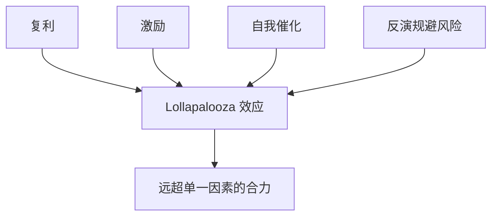

# 芒格六大思维模型

> [!note] 核心要义
> 芒格主张用**多学科的思维模型**组成一张"格栅"（latticework）去理解世界：手里只有一把锤子，看什么都像钉子。把不同学科的核心模型挂在一起，才能更接近现实。下面六个是他反复强调的高频工具。

## 六大模型一览

| 模型 | 来源学科 | 核心内容 | 投资中的应用 |
|---|---|---|---|
| **复利模型** | 数学 | 指数增长的力量 | 长期持有、知识积累（[[复利思维]]） |
| **反演模型** | 数学/逻辑 | 从"想避免的结果"倒推 | 先排除会让你破产的 |
| **冗余备份** | 工程学 | 关键系统要有备份 | 安全边际、留现金 |
| **自我催化** | 化学 | 正反馈循环 | 网络效应、品牌飞轮 |
| **进化论** | 生物学 | 适者生存、竞争与淘汰 | 行业竞争格局、护城河 |
| **激励模型** | 心理学 | 行为被激励驱动 | 看懂管理层与市场行为 |

## 一、反演模型：反过来想

> "要是知道我会死在哪里就好了，那我将永远不去那个地方。"

正向问"怎么成功"很难；反过来问"怎么会失败"，把失败因素一条条排除，往往更有效。

- **投资**：与其急着找牛股，先排除会让你永久亏损的（高杠杆、看不懂、买太贵）；
- **商业**：先想"什么会让这家公司倒闭"，再反其道而行；
- 与巴菲特"不要亏损"一脉相承（见 [[巴菲特永恒投资原则]]）。

## 二、激励模型：看懂利益

> "告诉我激励是什么，我就告诉你结果。"

人的行为高度受激励驱动，**理解激励机制就能预测行为**。

- 分析公司：管理层的薪酬/考核怎么定？会激励他们做长期对的事，还是冲短期数字？
- 分析市场：卖方为什么推荐这只票？中介的激励和你的利益一致吗？
- 这是识别利益冲突、看穿"屁股决定脑袋"的利器。

## 三、复利模型与冗余备份

- **复利**：时间 + 不中断，是财富与认知增长的根本（[[复利思维]]）。芒格强调"一生只打 20 个孔"，少做、做对、长期持有。
- **冗余备份 → 安全边际**：工程上飞机有备用引擎、桥梁承重远超设计负荷；投资上就是**安全边际**与**现金缓冲**——为意外留余地（[[风险管理框架]]）。

## 四、自我催化与进化论

- **自我催化（正反馈）**：网络效应、品牌飞轮——越用越多人用、越强越强，是护城河的来源之一（[[巴菲特护城河理论]]）。
- **进化论**：行业是残酷的竞争生态，强者生存但也可能被颠覆；理解竞争动态才能判断护城河会变宽还是变窄。

## 五、Lollapalooza：多模型共振

> [!important] Lollapalooza 效应
> 当多个模型/力量指向同一方向时，效果会**非线性放大**。好的投资机会，往往是多个有利因素叠加；最危险的暴雷，也常是多个风险因素共振。

## 常见误区

| 误区 | 更好的理解 |
|---|---|
| 模型越多越好 | 关键是把少数核心模型用熟、会组合 |
| 思维模型是玄学 | 它们是可操作的分析工具，要落到具体决策 |
| 只正向找成功 | 反演排除失败往往更高效 |
| 忽略激励 | 不看激励就看不懂人的真实行为 |

## 相关链接
- [[穷查理宝典摘要]]
- [[芒格核心思想清单]]
- [[芒格多元学科模型]]
- [[巴菲特价值投资核心原则]]
- [[复利思维]]
- [[投资心理偏误]]

## 课程化学习补充

> [!important] 学习定位
> 经典投资思想的价值在于建立决策原则：能力圈、安全边际、长期复利、反身性和风险控制，而不是照搬大师持仓。本文仅用于学习、研究与复盘，不构成任何投资建议。

### 必须掌握的问题

- 企业是否在能力圈内
- 安全边际来自估值还是质量
- 持有逻辑是否可被证伪
- 仓位是否匹配不确定性

### 实战应用流程

1. 先写清楚你的投资假设：为什么这个信号、资产或方法应该产生收益。
2. 明确数据口径：样本范围、更新时间、复权/分红/停牌处理和交易日历。
3. 做最小可行验证：先用简单规则验证方向，再逐步加入复杂模型。
4. 把成本和约束前置：手续费、滑点、冲击成本、保证金、流动性和容量都要进入测算。
5. 上线后持续复盘：记录信号、下单、成交、持仓、回撤和失效原因。

### 风险与失效条件

- 把名人语录当交易信号
- 长期主义掩盖错误
- 低估值陷阱
- 忽视组合层面的回撤

### 复盘问题

- 这笔交易或这套模型赚的是什么钱：风险补偿、行为偏差、流动性溢价，还是偶然噪音？
- 如果市场环境反过来，最大亏损和最长恢复期会是多少？
- 当前结论是否依赖某个不可持续假设，例如低利率、低波动、充裕流动性或监管套利？
- 有没有一个更简单的基准策略能取得接近效果？

### 延伸学习

- [[安全边际]]
- [[巴菲特价值投资核心原则]]
- [[资产配置入门]]
- [[交易心理纪律]]
