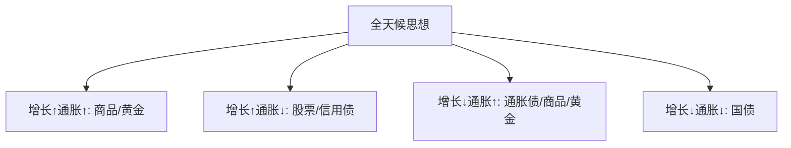

# 桥水基金创始人 Ray Dalio：全天候投资组合

> [!note] 核心理念
> 全天候（All Weather）追求"无论经济走向哪种环境都不至于崩盘"。它的灵魂不是某个固定比例，而是两点：**按风险（而非资金）分散**，以及**为四种经济环境各留一份押注**。

## 一、要解决的问题

达利欧的提问是："如何构建一个**无论发生什么**都还能活下去的组合？"

传统 60/40 的隐患：虽然资金上 60% 股 40% 债，但**风险**几乎全部来自股票（股票波动远大于债券）。所以"资金分散"其实"风险集中"。

> [!important] 资金分散 ≠ 风险分散
> 这是全天候最重要的洞见，也是 [[风险预算与风险归因]] 的核心：要看每类资产**贡献了多少风险**，而不是占了多少钱。

## 二、四种经济环境

把宏观简化为两个维度：增长（超/低于预期）× 通胀（超/低于预期），得到四象限，每个象限有受益资产：

| 环境 | 受益资产 |
|---|---|
| 增长↑ + 通胀↑ | 商品、黄金、新兴市场股 |
| 增长↑ + 通胀↓ | 股票、公司债 |
| 增长↓ + 通胀↑ | 通胀挂钩债券、商品、黄金 |
| 增长↓ + 通胀↓ | 长期国债、投资级债 |

理念是：**不预测**会进入哪个象限，而是每个象限都配一点、并让各象限的风险敞口大致均衡。

## 三、经典示例配置（仅为示意）

| 资产类别 | 比例（示例） |
|---|---|
| 长期国债 | 40% |
| 中期国债 | 15% |
| 股票 | 30% |
| 黄金 | 7.5% |
| 大宗商品 | 7.5% |

> [!warning] 别照抄比例
> 债券占比高，是因为**用风险衡量**时股票波动远大于债券，要靠多配低波动的债券来平衡风险贡献——不是看好债券收益。这套比例基于特定市场与利率环境，**股债相关性会随通胀环境变号**（见 [[固定收益与利率]]、[[相关性与协方差估计]]），照抄有风险。

## 四、全天候 vs 普通组合

| 特征 | 说明 |
|---|---|
| 不择时 | 不预测方向，只做环境分散 |
| 波动较低 | 回撤通常显著小于纯股票 |
| 多元收益来源 | 不同环境有不同资产顶上 |
| 被动管理 | 定期再平衡即可（[[资产配置入门]]） |
| 长期复利 | 不追最高年化，重在稳定可持续 |

## 五、风险平价的代价

> [!tip] 全天候不是没有弱点
> - 为了平衡风险，常需要**对低波动资产加杠杆**（或用高久期债券），这在利率快速上行、股债同跌的环境会受伤；
> - 强股票牛市中会明显跑输纯股票；
> - 依赖"股债负相关"的历史假设，该假设并非永恒。

风险平价的权重逻辑见 [[组合构建方法]] 与 [[风险预算与风险归因]]。

## 常见误区

| 误区 | 更好的理解 |
|---|---|
| 全天候=稳赚不亏 | 仍会回撤，尤其股债同跌时 |
| 照抄比例就行 | 比例依赖利率/相关性环境 |
| 债多=保守 | 风险平价里债多是为平衡风险贡献 |
| 不用再平衡 | 再平衡是其纪律来源 |

## 相关链接
- [[达利欧全天候策略]]
- [[达利欧大周期秩序]]
- [[达利欧十大财务规则]]
- [[桥水基金原则]]
- [[资产配置入门]]
- [[组合构建方法]]
- [[风险预算与风险归因]]

## 实战掌握清单

> [!tip] 交易者视角
> 桥水基金创始人 Ray Dalio：全天候投资组合 的学习重点不是记住术语，而是把它放进研究、组合、执行和复盘的闭环。投资大师的思想不能停在语录层面，必须翻译成能力圈、估值、护城河、仓位和持有纪律。

### 关键判断

- 先区分思想适用于企业分析、宏观周期、风险控制还是心理纪律。
- 把原则转成研究清单，例如商业模式、管理层、现金流、竞争优势和安全边际。
- 识别思想的前提条件，避免把长期投资口号用于短线题材。

### 落地动作

1. 为每条理念找一个成功案例和一个失败反例。
2. 把买入理由压缩成可验证假设，而不是名人背书。
3. 复盘时检查自己是在坚持原则，还是用原则合理化亏损。

### 失效边界

- 忽略估值过高。
- 把护城河误判成短期景气。
- 缺少退出条件，导致价值陷阱长期占用资本。

### 复盘问题

- 这项知识改变了哪一个具体决策：标的、方向、仓位、退出、对冲还是不交易？
- 如果判断相反，最大亏损、最长恢复期和退出触发条件是什么？
- 有没有一个更简单的基准方法可以取得相近结果？
