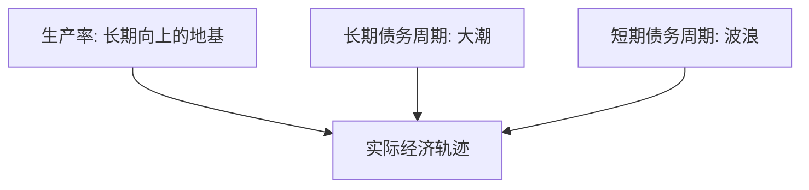

# 达利欧：大周期秩序

> [!note] 核心观点
> 达利欧把经济看成一台由几个"周期"叠加驱动的机器：**长期债务周期、短期债务周期、生产率增长**三股力量交织，决定了繁荣与萧条的循环。看懂这三者的互动，就能理解大多数宏观事件"为什么会发生"。

## 一、三大驱动力

| 力量 | 周期长度（量级） | 特征 |
|---|---|---|
| 生产率增长 | 数十年 | 缓慢稳定，决定长期上升趋势 |
| 长期债务周期 | 数十年级（如 50–75 年） | 债务积累 → 去杠杆的"超级周期" |
| 短期债务周期 | 数年级（如 5–8 年） | 即常说的商业周期，受央行政策调节 |

> [!tip] 三条线叠加
> 把生产率想成缓慢上升的地基，长期债务周期是几十年一次的大潮，短期债务周期是叠加其上的小波浪。你感受到的"经济好/坏"，是三者合力的结果。

## 二、短期债务周期（商业周期）

- 经济扩张 → 信贷扩张、需求旺、通胀升 → 央行加息降温 → 需求收缩、衰退 → 央行降息刺激 → 复苏。
- 由**央行货币政策**主导调节（[[宏观经济基础]] 有详细机制）。

## 三、长期债务周期

债务增速长期快于收入，会积累到不可持续，最终进入去杠杆。阶段大致：

| 阶段 | 特征 |
|---|---|
| 早期 | 债务低、信用好，借贷推动增长 |
| 中期 | 债务加速、资产泡沫形成 |
| 顶部 | 债务不可持续，泡沫见顶 |
| 萧条/去杠杆 | 资产价格暴跌、信用收缩 |
| 再平衡 | 债务重组 + 央行干预，逐步回归 |

### 去杠杆的四种手段

| 手段 | 性质 |
|---|---|
| 债务削减/违约 | 通缩性、痛苦 |
| 紧缩支出 | 通缩性 |
| 财富转移（税收/再分配） | 中性偏政治 |
| 印钞/货币化 | 通胀性 |

> [!important] "和谐去杠杆"
> 达利欧强调，成功的去杠杆是上述四种手段的**平衡**——通缩性手段（违约、紧缩）与通胀性手段（印钞）搭配得当，才能既降债务又不至于崩溃或恶性通胀。这也解释了为何危机后央行常大规模放水。

## 四、对投资者的启示

- 关注**全球债务水平**与利率周期的位置；
- 不同周期阶段配置不同资产（与 [[达利欧全天候投资组合]] 的环境分散一脉相承）；
- 理解央行政策的底层逻辑，而非只看新闻标题；
- "历史会重复，但不会完全一样"——机制重演，细节各异（呼应 [[实战案例与经典风险事件]]）。

## 常见误区

| 误区 | 更好的理解 |
|---|---|
| 周期能精确预测时点 | 能判断"位置/阶段"，难精确择时 |
| 印钞一定恶性通胀 | 取决于与通缩性手段的平衡 |
| 这次不一样 | 机制往往重演，警惕该幻觉 |
| 宏观无用 | 它决定资产配置的大背景 |

## 相关链接
- [[达利欧全天候投资组合]]
- [[达利欧债务认知]]
- [[桥水基金原则]]
- [[宏观经济基础]]
- [[固定收益与利率]]
- [[实战案例与经典风险事件]]
