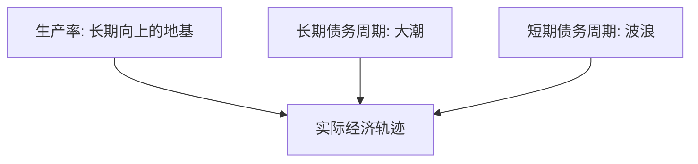

# 达利欧：大周期秩序

> [!note] 核心观点
> 达利欧把经济看成一台由几个"周期"叠加驱动的机器：**长期债务周期、短期债务周期、生产率增长**三股力量交织，决定了繁荣与萧条的循环。看懂这三者的互动，就能理解大多数宏观事件"为什么会发生"。

## 一、三大驱动力

| 力量 | 周期长度（量级） | 特征 |
|---|---|---|
| 生产率增长 | 数十年 | 缓慢稳定，决定长期上升趋势 |
| 长期债务周期 | 数十年级（如 50–75 年） | 债务积累 → 去杠杆的"超级周期" |
| 短期债务周期 | 数年级（如 5–8 年） | 即常说的商业周期，受央行政策调节 |

> [!tip] 三条线叠加
> 把生产率想成缓慢上升的地基，长期债务周期是几十年一次的大潮，短期债务周期是叠加其上的小波浪。你感受到的"经济好/坏"，是三者合力的结果。

## 二、短期债务周期（商业周期）

- 经济扩张 → 信贷扩张、需求旺、通胀升 → 央行加息降温 → 需求收缩、衰退 → 央行降息刺激 → 复苏。
- 由**央行货币政策**主导调节（[[宏观经济基础]] 有详细机制）。

## 三、长期债务周期

债务增速长期快于收入，会积累到不可持续，最终进入去杠杆。阶段大致：

| 阶段 | 特征 |
|---|---|
| 早期 | 债务低、信用好，借贷推动增长 |
| 中期 | 债务加速、资产泡沫形成 |
| 顶部 | 债务不可持续，泡沫见顶 |
| 萧条/去杠杆 | 资产价格暴跌、信用收缩 |
| 再平衡 | 债务重组 + 央行干预，逐步回归 |

### 去杠杆的四种手段

| 手段 | 性质 |
|---|---|
| 债务削减/违约 | 通缩性、痛苦 |
| 紧缩支出 | 通缩性 |
| 财富转移（税收/再分配） | 中性偏政治 |
| 印钞/货币化 | 通胀性 |

> [!important] "和谐去杠杆"
> 达利欧强调，成功的去杠杆是上述四种手段的**平衡**——通缩性手段（违约、紧缩）与通胀性手段（印钞）搭配得当，才能既降债务又不至于崩溃或恶性通胀。这也解释了为何危机后央行常大规模放水。

## 四、对投资者的启示

- 关注**全球债务水平**与利率周期的位置；
- 不同周期阶段配置不同资产（与 [[达利欧全天候投资组合]] 的环境分散一脉相承）；
- 理解央行政策的底层逻辑，而非只看新闻标题；
- "历史会重复，但不会完全一样"——机制重演，细节各异（呼应 [[实战案例与经典风险事件]]）。

## 常见误区

| 误区 | 更好的理解 |
|---|---|
| 周期能精确预测时点 | 能判断"位置/阶段"，难精确择时 |
| 印钞一定恶性通胀 | 取决于与通缩性手段的平衡 |
| 这次不一样 | 机制往往重演，警惕该幻觉 |
| 宏观无用 | 它决定资产配置的大背景 |

## 相关链接
- [[达利欧全天候投资组合]]
- [[达利欧债务认知]]
- [[桥水基金原则]]
- [[宏观经济基础]]
- [[固定收益与利率]]
- [[实战案例与经典风险事件]]

## 课程化学习补充

> [!important] 学习定位
> 经典投资思想的价值在于建立决策原则：能力圈、安全边际、长期复利、反身性和风险控制，而不是照搬大师持仓。本文仅用于学习、研究与复盘，不构成任何投资建议。

### 必须掌握的问题

- 企业是否在能力圈内
- 安全边际来自估值还是质量
- 持有逻辑是否可被证伪
- 仓位是否匹配不确定性

### 实战应用流程

1. 先写清楚你的投资假设：为什么这个信号、资产或方法应该产生收益。
2. 明确数据口径：样本范围、更新时间、复权/分红/停牌处理和交易日历。
3. 做最小可行验证：先用简单规则验证方向，再逐步加入复杂模型。
4. 把成本和约束前置：手续费、滑点、冲击成本、保证金、流动性和容量都要进入测算。
5. 上线后持续复盘：记录信号、下单、成交、持仓、回撤和失效原因。

### 风险与失效条件

- 把名人语录当交易信号
- 长期主义掩盖错误
- 低估值陷阱
- 忽视组合层面的回撤

### 复盘问题

- 这笔交易或这套模型赚的是什么钱：风险补偿、行为偏差、流动性溢价，还是偶然噪音？
- 如果市场环境反过来，最大亏损和最长恢复期会是多少？
- 当前结论是否依赖某个不可持续假设，例如低利率、低波动、充裕流动性或监管套利？
- 有没有一个更简单的基准策略能取得接近效果？

### 延伸学习

- [[安全边际]]
- [[巴菲特价值投资核心原则]]
- [[资产配置入门]]
- [[交易心理纪律]]

## 跨领域进阶扩展

> [!tip] 交易者视角
> 学到 `达利欧：大周期秩序` 时，不要只把它当成孤立知识点。把经典思想转成可执行清单，不复制大师语录或历史持仓。优秀投资交易者会把它放入“宏观背景 - 资产选择 - 估值/信号 - 组合风险 - 交易执行 - 复盘反馈”的闭环。

### 与其他知识的连接

- 能力圈和安全边际
- 企业质量和估值区间
- 反身性、周期和风险控制
- 长期持有和错误纠正

### 进阶训练

1. 把一个大师原则写成买入前检查清单
2. 为长期持仓写出卖出条件
3. 找一个经典原则失效的历史案例

### 能力验收

- 能否说清楚这个主题影响的是收益来源、风险来源、交易成本、流动性还是心理纪律？
- 能否指出它在什么市场环境、资产类别或交易周期中更有效？
- 能否把它写成一条可复盘的研究或交易规则？
- 能否说明如果判断错误，组合最大损失和退出机制是什么？

### 全局关联

- [[综合金融知识体系/金融投资全知识地图|金融投资全知识地图]]
- [[综合金融知识体系/优秀投资交易者能力地图|优秀投资交易者能力地图]]
- [[综合金融知识体系/一次性学习路线与复盘模板|一次性学习路线与复盘模板]]
