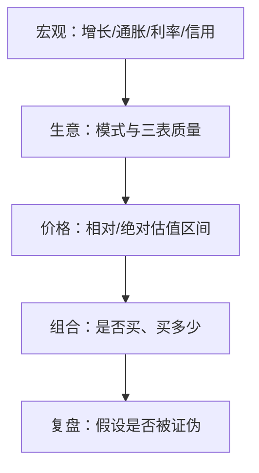

# 公司与宏观分析实操导航

> [!note] 核心问题
> 阶段二要求「看懂公司与市场」，进阶专题把宏观、财报、估值拆得很细。本篇给出 **2 周主路径**：宏观定环境 → 财报验证生意 → 估值给区间 → 交付一页公司研究（对接作业清单与数据脚本），避免在指标海洋里迷路。

## 学习目标

1. 用「环境—生意—价格」三层组织阅读。  
2. 完成或升级一份真实公司分析 v0.1/v0.2。  
3. 会用 quant-lab/公开源拉行情与财务样例。  
4. 估值只做区间与情景，不写假精确目标价。  
5. 宏观观点不直接等同于交易信号。  

## 三层框架



| 层 | 问题 | 进阶目录 | 课程 |
|---|---|---|---|
| 宏观 | 大环境是否友好？ | [[宏观经济分析/目录]] | [[宏观经济基础]] |
| 生意 | 公司如何赚钱、账是否干净？ | [[基本面分析/目录]] | [[三张财务报表]] 等 |
| 价格 | 贵还是便宜、错在哪？ | [[估值方法/目录]] | [[估值方法入门]] |

组合层仓位见 [[组合与仓位实操导航]]，本波不展开。

## 与阶段二作业的关系

| 作业 | 入口 |
|---|---|
| 打通清单 | [[阶段二作业打通清单]] |
| 取数 | [[财务数据实操]] · `pull_akshare_example` / `pull_financials_example` |
| 本导航 | 告诉你进阶文读哪些、宏观补什么 |

**建议：** 先按作业清单选公司并拉数，再用本路径把分析加厚到 v0.2。

## 推荐 2 周路径

| 天 | 读什么 | 做 |
|---:|---|---|
| 1 | [[阶段二作业打通清单]] + 选题 | 公司代码、行业、为何在能力圈 |
| 2 | 课程 [[三张财务报表]] + 进阶「财务报表基础」抽样 | 三表交叉 3 个问题 |
| 3 | [[财务比率分析]] / 质量评估抽样 | 盈利、杠杆、周转表 |
| 4 | [[杜邦分析法]] + 进阶 ROE 相关 | ROE 拆解一句话 |
| 5 | 现金流分析抽样 | 经营现金流 vs 净利 |
| 6 | [[估值方法入门]] + 相对估值一篇 | PE/PB 历史或同行（注明假设） |
| 7 | 绝对估值意识（DCF 一篇略读即可） | 三情景：乐观/中性/悲观**定性** |
| 8 | [[宏观经济基础]] + 宏观指标 1–2 篇 | 利率/增长对该行业影响 5 行 |
| 9 | [[财务数据实操]] 复核数据与 PIT 声明 | meta 与诚信声明 |
| 10 | 输出「公司研究一页纸」升级版 | 见下表 |

## 数据怎么取（实操）

```powershell
cd ...\quant-lab
python scripts/pull_akshare_example.py --symbol 你的代码
python scripts/pull_financials_example.py --symbol 你的代码 --kind indicator
```

| 注意 | 说明 |
|---|---|
| 接口变更 | 以 AKShare 文档为准；失败可年报 PDF 手工 |
| PIT | 作业阶段声明即可；严肃研究要对齐公告日 |
| 单位 | 元/万元统一 |

宏观数据练习：FRED（海外）、公开宏观序列（见 [[学习网站与社区导航]]、[[金融数据API全面汇总]]）。

## 公司研究一页纸（升级模板）

| 区块 | 必填 |
|---|---|
| 公司/代码/行业 |  |
| 商业模式一句话 |  |
| 最近 3 期：营收、净利、经营现金流 |  |
| ROE 与杜邦直觉 |  |
| 质量风险 3 条 |  |
| 估值方法与区间（假设） |  |
| 宏观敏感点（利率/地产/出口等） |  |
| 数据来源与是否 PIT |  |
| 结论：观察/深入研究/放弃 |  |
| 若买入：最大仓位（链到风控卡） |  |

## 专题内怎么抽样（勿通读）

### 宏观（[[宏观经济分析/目录]]）

优先：增长/通胀/利率相关指标 → 货币政策框架一篇 → 全球联动按需。  
纪律：**宏观是情景，不是买卖点。**

### 基本面（[[基本面分析/目录]]）

优先：财报基础 → 现金流 → 杜邦/ROE → 财务质量 → 实战篇。  
因子化基本面进 [[因子投资实操导航]]，先别跳。

### 估值（[[估值方法/目录]]）

优先：相对估值 → 综合对比 → 实战指南；DCF 作思维训练。  
纪律：**区间 + 敏感性 + 交叉验证。**

## 常见误区

| 误区 | 更好的理解 |
|---|---|
| 读完所有宏观指标再看公司 | 公司作业驱动宏观 |
| 估值给出精确目标价 | 情景区间 |
| 利润高=好公司 | 看现金流与再投资 |
| 接口大表当分析 | 要摘要与判断 |
| 宏观多头就满仓 | 仓位见组合导航 |

## 练习（本波验收）

- [ ] 选定一家公司并完成数据拉取或 PDF 抄录  
- [ ] 一页纸填完（含宏观敏感点）  
- [ ] 估值仅区间、有假设声明  
- [ ] 链到阶段二作业路径  
- [ ] 明确「不交易/可观察」结论之一  

## 相关概念

[[阶段二作业打通清单]] [[财务数据实操]] [[宏观经济分析/目录]] [[基本面分析/目录]] [[估值方法/目录]] [[三张财务报表]] [[估值方法入门]] [[因子投资实操导航]] [[全库百科化路线图]]
