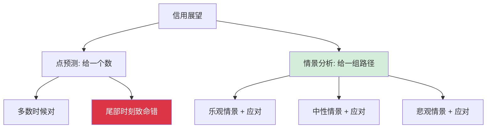
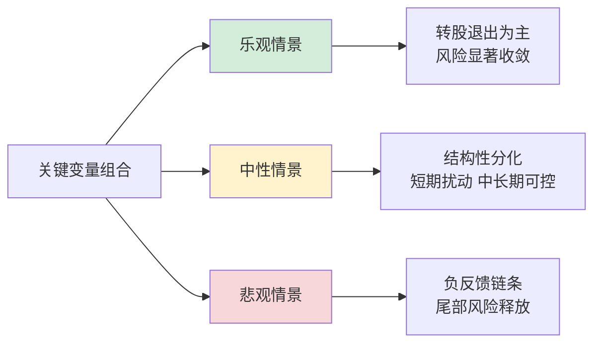
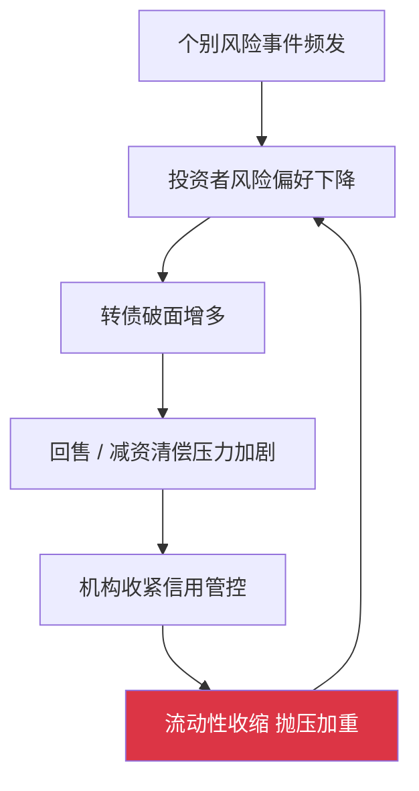

# 2025年转债信用风险展望：情景分析框架

> [!note] 核心观点
> 对信用风险的"展望"，不是去猜某个点位或某个具体违约名单，而是**搭建一套情景分析框架**：把影响信用的关键变量列清楚，沙盘推演乐观、中性、悲观三种路径各自的驱动因素与应对方式。本篇不做任何精确预测、不编造统计数字，而是提供一种"如果……那么……"的结构化思考方式——让你在任何一种情景真正落地时，都知道自己该站在哪里、该做什么。

> [!warning] 关于"展望"的方法论声明
> 本篇刻意**不给出**精确的违约率、降级数量、到期规模等数字，也不预测权益市场点位。原因有二：其一，精确预测在信用领域几乎注定失准；其二，投资者真正需要的不是一个会过期的数字，而是一套**在不同情景下都能用**的反应机制。下文所有"驱动因素"均为机制描述，所有阈值思考均为方法示范。

## 一、为什么信用展望要用"情景分析"而非"点预测"

信用风险是**非线性、尾部主导**的：绝大多数时间风平浪静，风险却集中在少数极端时刻爆发。这种特性决定了点预测的脆弱——你预测"温和"，多数年份会对，但真正伤人的恰是那个你没预测到的尾部。

> [!tip] 情景分析的价值
> 情景分析不追求"猜中哪个情景会发生"，而是确保**无论哪个情景发生，你都已经想好了对策**。它把"预测的准确性"问题，转化为"准备的充分性"问题——后者才是投资者可控的。

## 二、先锁定驱动信用风险的关键变量

任何情景都由同一组变量驱动，只是取值不同。先把这些"旋钮"列清楚，三情景不过是给这些旋钮设定不同档位。

| 关键变量 | 对信用风险的作用方向 | 观察抓手 |
| --- | --- | --- |
| 权益市场环境 | 走强→平价上行、转股退出顺畅、化债渠道拓宽 | 正股趋势、转股价值与赎回价的关系 |
| 宏观与融资环境 | 宽松→再融资容易、利差收窄、债底稳固 | 信用利差、再融资难易度 |
| 行业景气分布 | 景气下行行业集中→该板块降级压力大 | 产能利用率、价格战、毛利趋势 |
| 到期与回售节奏 | 临期/回售集中→现金流压力上升 | 存续期结构、回售触发临近度 |
| 评级调整节奏 | 集中复评+顺周期→下调抛压阶段性放大 | 年报季、跟踪评级窗口 |
| 退出方式结构 | 转股为主→对发行人现金流压力小 | 历史退出方式、平价水平 |

> [!important] 一个核心机制：权益市场是信用风险的"总开关"
> 转债的信用风险与权益市场**深度耦合**。市场走强时，正股上行带动平价上升，发行人可通过促转股完成退出，几乎不动用现金——这等于把"债务"无痛转成了"股权"，化债渠道大开。反之，市场低迷时，转股路径堵塞，发行人被迫面对真金白银的回售与兑付，信用压力骤升。**理解了这层耦合，就理解了为什么信用展望离不开对权益环境的判断。**

## 三、三情景沙盘推演

下面把上述变量分别拨到不同档位，推演三种典型路径。注意：三者并非"非此即彼"，现实往往是**结构性分化**——部分板块走乐观路径，另一些走悲观路径。

### 1. 乐观情景：权益回暖 + 融资宽松

| 维度 | 该情景下的取值 |
| --- | --- |
| 权益市场 | 趋势性回暖，平价普遍上行 |
| 融资环境 | 宽松，利差收窄，再融资顺畅 |
| 退出方式 | 以转股、强赎为主，现金兑付压力小 |
| 评级动作 | 下调零星化，修复动能强 |

**驱动逻辑**：权益走强 → 平价上升 → 发行人促转股/触发强赎 → 债务无痛转股权 → 现金流压力释放 → 评级稳定甚至上修。低价券随平价修复而反弹，信用担忧快速消退。

> [!tip] 乐观情景下的应对
> - **可适度信用下沉**，但仍守住评级与资质底线，不为搏弹性而丢纪律；
> - 关注"平价接近强赎线"的个券，提前评估强赎对持仓的影响；
> - 警惕**乐观情绪的自我强化**——越是顺风，越要为情景切换预留余地。

### 2. 中性情景：结构性分化（最可能的常态）

| 维度 | 该情景下的取值 |
| --- | --- |
| 权益市场 | 震荡分化，板块间冷热不均 |
| 融资环境 | 中性，优质与弱资质再融资难度拉开 |
| 退出方式 | 优质转股顺畅，弱资质面临回售/兑付考验 |
| 评级动作 | 短期受集中复评扰动，中长期总体可控 |

**驱动逻辑**：市场不构成系统性单边压力，但也无力普涨。结果是**优质与低资质转债走势分化**——高资质享受稀缺溢价，问题低价券则在债底塌陷边缘徘徊。短期风险主要来自评级调整的**季节性抛压**，但只要无大面积违约，中长期信用格局总体可控。

> [!note] 中性情景的关键判断：分化而非崩塌
> 这一情景下，最忌"一刀切"地看多或看空整个市场。正确动作是**在分化中选边**：聚焦高资质、回避"问题低价券"，把组合的信用重心向稳健一侧倾斜。

### 3. 悲观情景：权益承压 + 风险负反馈

悲观情景的核心不是"某家公司暴雷"，而是**负反馈链条被激活**——单个风险事件引发系统性的信心收缩。

| 维度 | 该情景下的取值 |
| --- | --- |
| 权益市场 | 持续承压，转股路径堵塞 |
| 融资环境 | 收紧，利差走阔，债底普遍下移 |
| 退出方式 | 现金兑付/回售压力上升，化债渠道收窄 |
| 评级动作 | 下调增多，抛压与流动性风险叠加 |

**驱动逻辑**：权益低迷使转股退出受阻 → 发行人被迫面对现金兑付 → 个别风险事件触发市场风偏下降 → 破面券增多、回售压力加剧 → 机构加强信用管控、被动减持 → 流动性收缩进一步压低价格，形成**自我强化的负反馈环**。

> [!warning] 悲观情景下的应对
> - **提升组合整体评级**，主动收缩信用敞口，剔除"短债+高杠杆+弱外部支持"的标准受害者画像；
> - 严控杠杆，给流动性收缩预留缓冲（参见 [[资金管理与杠杆]]）；
> - 警惕"低价抄底"冲动——负反馈中的低价往往是债底塌陷的结果，而非安全垫（"信用陷阱"详见 [[转债信用风险可控]]）；
> - 关注**退市风险的边际变化**：交易类、财务类、规范类退市的触发条件是否临近。

## 四、临期与到期：所有情景共同面对的"硬约束"

无论身处哪种情景，存续期临近到期/回售的转债都面临一道绕不开的"现金流大考"。这里给出**思考结构**而非具体数字：

| 临期券类型 | 信用压力 | 判断要点 |
| --- | --- | --- |
| 平价高于到期赎回价 | 低 | 大概率以转股退出，几乎不动现金 |
| 国央企 / 强外部支持 | 较低 | 再融资与外部支持托底，兑付确定性高 |
| 弱资质民企 | 较高 | 需逐一核查现金/再融资能力，警惕回售挤兑 |

> [!important] 临期分析的正确姿势
> 不要被"到期总规模有多大"这种宏观数字吓住，也不要被它麻痹。真正决定风险的是**结构**：有多少能靠转股无痛退出、有多少有外部支持托底、又有多少是必须拿现金硬兑的弱资质券。**看结构，不看总量**——这是临期风险评估的第一原则。

## 五、常见误区与风险

> [!warning] 五大常见误区
> 1. **"展望=预测一个数"**：信用风险是尾部主导的，点预测在关键时刻最不可靠。展望的价值在于**为每种情景准备好对策**，而非押注哪个情景发生。
> 2. **"看到'风险可控'就放松"**：可控是**概率性、组合层面**的判断，且高度依赖权益环境这一前提。前提一旦逆转（悲观情景），"可控"会迅速失色（参见 [[转债信用风险可控]]）。
> 3. **"用单一情景指导全部仓位"**：现实多为**结构性分化**，乐观与悲观可能同时存在于不同板块。一刀切看多/看空都会出错。
> 4. **"到期规模大=系统性危机"**：决定风险的是退出结构（转股 vs 现金兑付），不是名义总量。被总量数字牵着走，会误判方向。
> 5. **"低价券是抄底良机"**：悲观情景的低价常源于债底塌陷与流动性收缩，而非超跌。负反馈中抄底，可能抄在半山腰。

> [!important] 底线认知：展望是为了"有备"，不是为了"猜对"
> 一份好的信用展望，衡量标准不是"预测得多准"，而是"无论哪种情景落地，你是否都已想好下一步"。把精力从"猜中明天"转向"备齐对策"，才是面对信用不确定性的正确姿态。

## 六、把情景框架落到组合上

| 你判断当前更接近 | 组合重心 | 关键纪律 |
| --- | --- | --- |
| 乐观情景 | 可适度下沉，保留弹性 | 守评级底线，警惕情绪自我强化 |
| 中性情景 | 高资质为主，分化中选边 | 回避问题低价券 |
| 悲观情景 | 提升整体评级，收缩敞口 | 严控杠杆、拒绝盲目抄底 |
| 情景不明 | 向稳健一侧倾斜 | 宁可少赚，不可踩雷 |

> [!tip] 与全局风控的衔接
> 情景框架最终要落到 [[风险管理框架]] 与 [[投资策略核心逻辑]] 的执行上：用**维度分散**抵御系统性同涨同跌，用**仓位与杠杆纪律**控制尾部冲击的破坏半径，用**资质底线**过滤掉"信用陷阱"。降级潮的成因机制，可进一步参见 [[转债降级潮溯源]]。

## 相关链接
- [[转债评级下调分析]]
- [[转债降级潮溯源]]
- [[转债信用风险可控]]
- [[可转债核心概念]]
- [[风险管理框架]]
- [[投资策略核心逻辑]]
- [[资金管理与杠杆]]

## 课程化学习补充

> [!important] 学习定位
> 可转债同时有债性、股性和条款博弈，分析必须把债底、转股价值、溢价率、信用风险和强赎风险放在一起。本文仅用于学习、研究与复盘，不构成任何投资建议。

### 必须掌握的问题

- 债底和 YTM 是否合理
- 转股溢价率是否过高
- 正股弹性和信用质量如何
- 强赎/回售/下修条款是否触发临界

### 实战应用流程

1. 先写清楚你的投资假设：为什么这个信号、资产或方法应该产生收益。
2. 明确数据口径：样本范围、更新时间、复权/分红/停牌处理和交易日历。
3. 做最小可行验证：先用简单规则验证方向，再逐步加入复杂模型。
4. 把成本和约束前置：手续费、滑点、冲击成本、保证金、流动性和容量都要进入测算。
5. 上线后持续复盘：记录信号、下单、成交、持仓、回撤和失效原因。

### 风险与失效条件

- 信用下沉
- 高价高溢价双杀
- 流动性薄导致滑点
- 强赎前追高

### 复盘问题

- 这笔交易或这套模型赚的是什么钱：风险补偿、行为偏差、流动性溢价，还是偶然噪音？
- 如果市场环境反过来，最大亏损和最长恢复期会是多少？
- 当前结论是否依赖某个不可持续假设，例如低利率、低波动、充裕流动性或监管套利？
- 有没有一个更简单的基准策略能取得接近效果？

### 延伸学习

- [[可转债核心概念]]
- [[固定收益与利率]]
- [[市场微观结构与交易执行]]
- [[风险度量指标]]
