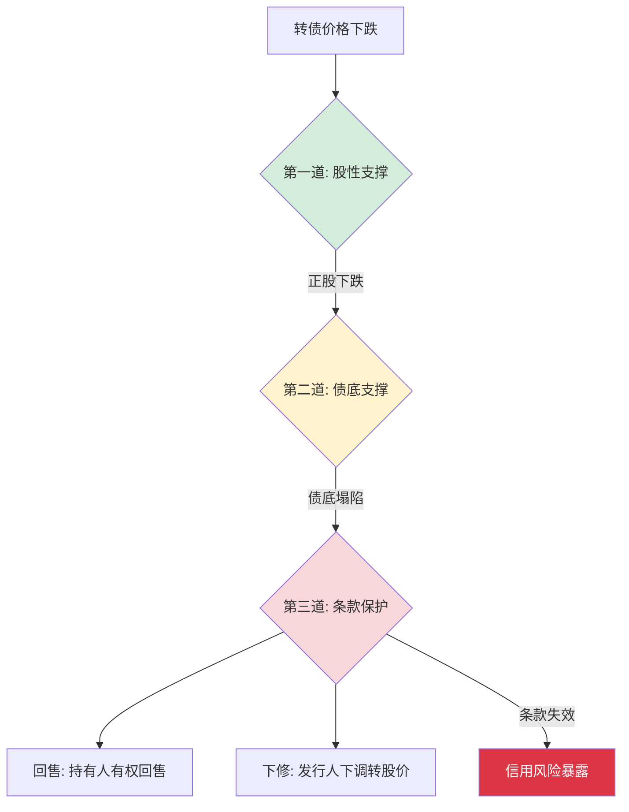

# 转债市场信用冲击风险可控

> [!note] 核心结论
> 可转债的信用风险"总体可控，但绝不可忽视"。可控，是因为它同时拥有**债底保护、回售条款、下修条款**三重缓冲，且组合化、分散化持有能进一步摊薄个券风险；不可忽视，是因为这三重缓冲**都是有条件的**——一旦发行人信用恶化，债底会"塌陷"，回售可能形同虚设。本篇拆解"可控"成立的条件与边界，强调一个底线认知：**可控 ≠ 没有**。

## 一、为什么说"可控"：转债的三重缓冲

可转债是"债性"与"股性"的混合体。相比纯粹的股票，它在下跌途中有几道额外的"刹车"。理解这几道刹车的工作原理，是理解"风险可控"的前提。

| 缓冲层 | 保护机制 | 生效条件 | 失效情形 |
| --- | --- | --- | --- |
| 股性支撑 | 正股上涨带动平价上行 | 权益市场向好、正股有基本面 | 正股持续下跌、退市 |
| 债底支撑 | 到期还本付息形成价格地板 | 发行人有偿债能力 | 信用恶化、评级下调、违约 |
| 回售条款 | 满足条件时持有人可按约定价回售 | 触发回售期且发行人能兑付 | 现金流枯竭、无力兑付 |
| 下修条款 | 发行人主动下调转股价抬升平价 | 发行人有下修意愿与空间 | 大股东不愿稀释、董事会否决 |

> [!tip] 关键直觉
> 这三道刹车是**串联**而非并联：当正股和债底同时失灵时，转债就退化为一只"信用债+看涨期权"，其下限完全取决于发行人能否还钱。所谓"可控"，本质是赌**绝大多数发行人不会走到还不起钱那一步**。

## 二、债底保护的条件与局限

"债底"（纯债价值）是转债区别于股票的核心安全垫，但它是一个**估算值**，而非刚性承诺。

### 1. 债底是怎么算出来的

债底等于把转债未来所有的票息和到期本金，按一个"合理"的折现率贴现回来：

$$
\text{债底} = \sum_{t=1}^{n} \frac{C_t}{(1+r)^t} + \frac{F}{(1+r)^n}
$$

其中 $C_t$ 为第 $t$ 期票息，$F$ 为到期赎回价（含本金），$r$ 为折现率。

而折现率 $r$ 由两部分构成：

$$
r = r_{\text{无风险}} + \text{信用利差}
$$

> [!warning] 债底的"软肋"就藏在折现率里
> 债底不是固定的地板。当发行人信用恶化时，市场要求的**信用利差会迅速走阔**，折现率 $r$ 上升，债底随之**下移**。换言之，你以为脚下踩着 90 元的债底，信用一旦出问题，这块"地板"可能瞬间塌到 70 元甚至更低。债底是会移动的地板，不是焊死的钢板。

### 2. 信用利差如何"吃掉"债底（示例）

下表为**假设示例**，演示同一只转债在不同信用状态下债底的变化（数字均为示意，非真实个券）：

| 信用状态 | 假设折现率 $r$ | 估算债底 | 相对变化 |
| --- | --- | --- | --- |
| 高评级、展望稳定 | 3.5% | 约 95 元 | 基准 |
| 评级下调一档 | 6.0% | 约 86 元 | -9 元 |
| 列入评级观察、利差走阔 | 9.0% | 约 76 元 | -19 元 |
| 市场担忧违约 | 15%+ | 约 60 元或更低 | 大幅塌陷 |

可以看到：债底对信用利差**高度敏感**。低价转债看似"跌无可跌"，恰恰可能是市场已经在用更高的折现率给它定价——这正是后文要讲的"信用陷阱"。

### 3. 债底保护的三个前提

> [!important] 债底有效的三个隐含假设
> 1. **发行人能活到到期**：债底假设公司不违约、不退市，能正常还本付息。
> 2. **现金流能覆盖兑付**：到期或回售时，公司账上有足够现金或再融资能力。
> 3. **法律地位有效**：转债作为债权，在清偿顺序上优先于股东，但**劣后于有担保债务和银行贷款**。

任何一个前提被打破，债底的"保护"就会打折扣。

## 三、回售条款：有用但非万能

回售条款赋予持有人在特定条件下，把转债按约定价格"卖回"给发行人的权利，是债性保护的重要一环。

### 1. 两类回售触发

| 回售类型 | 触发条件（示例） | 保护性质 |
| --- | --- | --- |
| 有条件回售 | 正股价格持续低于转股价的某一比例（如 70%）一段时间 | 保护持有人免于长期深度套牢 |
| 附加回售 | 募集资金用途发生重大变化等 | 保护持有人免于资金被挪用 |

### 2. 回售保护的局限

> [!warning] 回售的三个"但是"
> - **回售要花钱**：回售本质是要发行人拿出现金赎回。若公司本就资金紧张，大规模回售反而可能成为**压垮现金流的最后一根稻草**。
> - **发行人会"对抗"回售**：很多发行人会在回售触发前主动**下修转股价**，把平价抬上去，从而规避回售。下修对持有人不全是坏事，但它意味着你想要的现金兑付往往拿不到。
> - **回售有窗口期**：通常只在转债存续的后段（如最后两个计息年度）才生效，前期下跌时回售条款"够不着"。

## 四、分散持有：把"可控"落到组合层面

单只转债的信用风险是"非黑即白"的——要么平稳兑付，要么暴雷。但在组合层面，通过分散可以把这种二元风险转化为可管理的**概率问题**。

> [!tip] 分散的两条实操原则
> 1. **数量分散**：持有足够多的个券，使单券权重足够低，单只暴雷不至于伤筋动骨。
> 2. **维度分散**：不仅分散数量，还要分散**行业、评级、到期年限**——避免"看似分散，实则同涨同跌"（例如全部集中在同一景气下行的行业，详见 [[转债降级潮溯源]]）。

这与 [[风险管理框架]] 中"不把鸡蛋放在一个篮子、也不把篮子放在同一辆车上"的思想一脉相承。

## 五、信用风险评估维度

判断一只转债的"可控度"，可从以下维度自上而下打分：

| 维度 | 关键指标 | 健康信号 | 警惕信号 |
| --- | --- | --- | --- |
| 偿债能力 | 流动比率、利息保障倍数、货币资金/短债 | 现金充裕、利息覆盖高 | 现金不足以覆盖短债 |
| 资本结构 | 资产负债率、短期债务占比 | 杠杆适中、债务结构长期化 | 高杠杆、短债集中到期 |
| 外部评级 | 评级等级、评级展望 | 高等级、展望稳定 | 列入观察、展望负面（详见 [[转债评级下调分析]]） |
| 外部支持 | 大股东实力、是否国资背景 | 股东有能力且有意愿支持 | 股东自身承压、股权高质押 |
| 条款博弈 | 是否临近回售、有无下修空间 | 有下修意愿与空间 | 既无下修意愿又临近回售 |

> [!note] 一个反直觉的提醒
> **价格越低，越要问"为什么这么低"**。健康转债的低价多源于正股下跌（股性问题，债底仍在）；而问题转债的低价往往源于债底塌陷（信用问题）。前者是机会，后者是陷阱——区分二者是 [[双低策略详解]] 能否安全落地的关键。

## 六、常见误区与风险

> [!warning] 五大常见误区
> 1. **"转债保本"**：转债**不保本**。债底是估算的、会移动的，并非刚兑承诺。历史上已有转债违约、退市的先例（此处不展开具体个案）。
> 2. **"价格低=安全"**：低价可能恰恰是市场对其信用定价的结果。**低价不等于低风险，甚至可能是高风险的信号**——这就是"信用陷阱"。
> 3. **"有回售就放心"**：回售要发行人拿出真金白银；现金流枯竭时，回售权可能无法兑现，且发行人常用下修来规避回售。
> 4. **"评级高就一劳永逸"**：评级是**动态**的，会被下调；评级下调往往滞后于基本面恶化，等到下调时价格可能已经反应过了（详见 [[转债评级下调分析]]）。
> 5. **"分散了就安全"**：若所有持仓集中在同一行业或同一类低资质发行人，"分散"是假的，遇到降级潮会同步受损（详见 [[转债降级潮溯源]]）。

> [!important] 底线认知：可控 ≠ 没有
> "信用风险可控"是一个**概率性、组合层面**的判断，不是对任何单只转债的安全承诺。把"可控"误读为"无风险"，是转债投资中最危险的认知偏差。正确的姿态是：**承认风险存在 → 用评估维度筛掉高危个券 → 用分散把残余风险摊薄到可承受范围**。

## 七、情景化的应对框架

不同信用环境下，"可控"的成色不同，应对也应随之调整（以下为**情景描述**，非对特定年份的预测）：

| 信用环境情景 | 典型特征 | 应对策略 |
| --- | --- | --- |
| 信用宽松、违约稀少 | 利差收窄、债底稳固 | 可适度下沉，但仍守住评级底线 |
| 信用分化 | 优质与低资质转债走势分化 | 聚焦高资质、回避"问题低价券" |
| 信用收缩、降级增多 | 利差走阔、债底普遍下移 | 提升组合整体评级，收缩信用敞口 |

更系统的展望方法见 [[2025年转债信用风险展望]]。

## 相关链接
- [[转债评级下调分析]]
- [[转债降级潮溯源]]
- [[2025年转债信用风险展望]]
- [[可转债核心概念]]
- [[双低策略详解]]
- [[风险管理框架]]
- [[固定收益与利率]]

## 课程化学习补充

> [!important] 学习定位
> 可转债同时有债性、股性和条款博弈，分析必须把债底、转股价值、溢价率、信用风险和强赎风险放在一起。本文仅用于学习、研究与复盘，不构成任何投资建议。

### 必须掌握的问题

- 债底和 YTM 是否合理
- 转股溢价率是否过高
- 正股弹性和信用质量如何
- 强赎/回售/下修条款是否触发临界

### 实战应用流程

1. 先写清楚你的投资假设：为什么这个信号、资产或方法应该产生收益。
2. 明确数据口径：样本范围、更新时间、复权/分红/停牌处理和交易日历。
3. 做最小可行验证：先用简单规则验证方向，再逐步加入复杂模型。
4. 把成本和约束前置：手续费、滑点、冲击成本、保证金、流动性和容量都要进入测算。
5. 上线后持续复盘：记录信号、下单、成交、持仓、回撤和失效原因。

### 风险与失效条件

- 信用下沉
- 高价高溢价双杀
- 流动性薄导致滑点
- 强赎前追高

### 复盘问题

- 这笔交易或这套模型赚的是什么钱：风险补偿、行为偏差、流动性溢价，还是偶然噪音？
- 如果市场环境反过来，最大亏损和最长恢复期会是多少？
- 当前结论是否依赖某个不可持续假设，例如低利率、低波动、充裕流动性或监管套利？
- 有没有一个更简单的基准策略能取得接近效果？

### 延伸学习

- [[可转债核心概念]]
- [[固定收益与利率]]
- [[市场微观结构与交易执行]]
- [[风险度量指标]]
