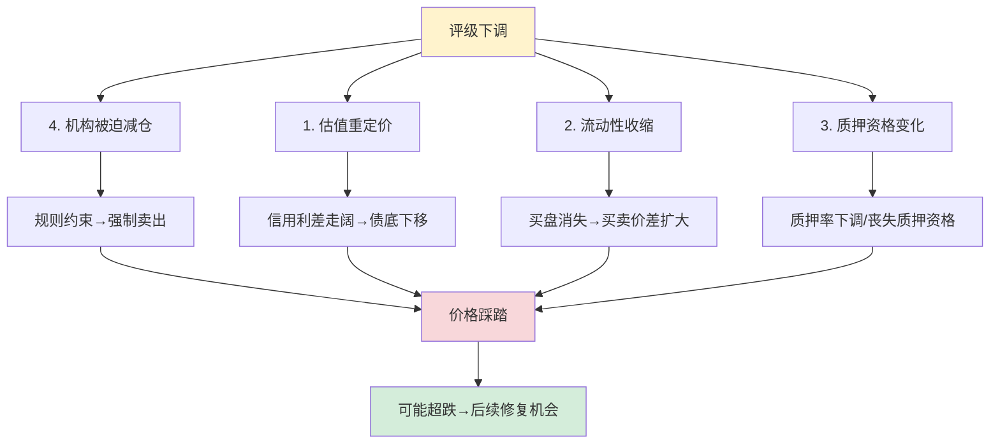
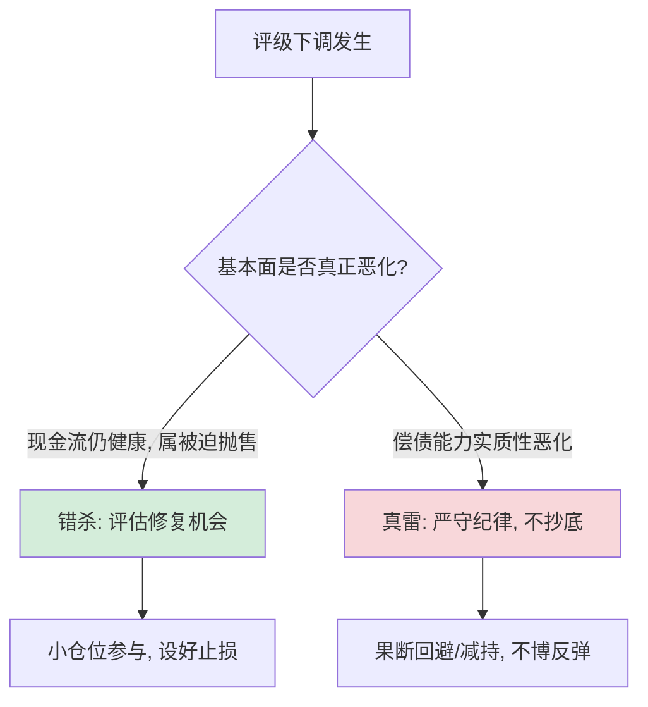

# 转债评级下调怎么看？

> [!note] 核心结论
> 评级下调本身往往**不是新信息**——它通常滞后于基本面恶化，是对已经发生的风险的"官方确认"。但下调会触发一系列**机制性连锁反应**：估值重定价、流动性枯竭、质押资格丧失、机构被迫减仓。理解这条"影响链"，并学会在下调发生**之前**识别信号，是转债信用风险管理的核心技能。

## 一、评级与下调的基础认知

### 1. 评级符号的含义

国内主体信用评级通常采用如下等级（由高到低）：

| 等级 | 含义 | 在转债中的角色 |
| --- | --- | --- |
| AAA | 偿债能力极强 | 高等级、机构核心持仓、可质押 |
| AA+ | 偿债能力很强 | 高等级、流动性好 |
| AA | 偿债能力较强 | 转债市场主力区间，分化的临界带 |
| AA- | 偿债能力中等 | 信用敏感区，下调易触发减仓 |
| A+ 及以下 | 偿债能力转弱 | 低资质区，流动性差、易被错杀也易踩雷 |

> [!tip] 一个关键阈值
> 很多机构（如部分债基、银行理财）的投资范围有**评级下限约束**（例如不得低于 AA）。这意味着评级一旦跌破阈值，相关机构会**被规则强制卖出**——这是评级下调引发踩踏的制度根源。

### 2. 评级展望与评级观察

评级下调往往不是"一步到位"，而是有前兆：

**展望负面 → 评级观察 → 正式下调**，这条链条给了投资者宝贵的反应窗口。能否在"展望负面"阶段就行动，决定了你是规避者还是接盘者。

## 二、评级下调的影响链条

这是本篇的核心。评级下调之所以可怕，不在于"一个字母变了"，而在于它会**串联触发**四重连锁反应。

### 1. 估值重定价：债底下移

评级下调直接抬高市场要求的**信用利差**，折现率上升，纯债价值（债底）随之下移。原本看似稳固的"价格地板"会塌陷。

$$
r = r_{\text{无风险}} + \text{信用利差} \uparrow \quad \Rightarrow \quad \text{债底} \downarrow
$$

> [!example] 债底下移示例（假设）
> 某转债评级由 AA 下调至 AA-，市场要求的信用利差从约 200bp 走阔至约 450bp。在其他条件不变下，估算债底可能从约 92 元下移至约 84 元（数字为**示意假设**，非真实个券）。这 8 元的差额，就是"地板塌陷"的可视化。

### 2. 流动性收缩：想卖卖不掉

| 下调前 | 下调后 |
| --- | --- |
| 买卖盘活跃、价差小 | 买盘骤减、价差扩大 |
| 大单可平稳成交 | 稍大卖单即砸出深坑 |
| 估值连续 | 价格跳空、波动放大 |

> [!warning] 流动性是"晴天借伞"
> 信用恶化时，所有人都想卖、没人愿买，**流动性会在最需要它的时候消失**。低资质、小盘转债尤其如此。这意味着账面上的"债底"在你真正想离场时，可能根本无法以该价格变现。

### 3. 质押资格变化：杠杆链条断裂

许多机构用转债做**质押式回购**融资。评级下调可能导致：

- 交易所/中证登**下调质押折算率**，甚至**取消入库资格**；
- 用该券融资的机构需**补充质押物或被迫平仓**；
- 形成"下调 → 平仓 → 价格下跌 → 进一步触发风控"的负反馈。

> [!important] 质押资格丧失的杀伤力
> 这一环常被散户忽视，却是机构端最致命的链条。失去质押资格意味着该券对加杠杆的机构**瞬间失去配置价值**，相关持仓会被快速清出——与 [[资金管理与杠杆]] 中"杠杆在逆风时会反噬"的逻辑一致。

### 4. 机构被迫减仓：非自愿的踩踏

如前述，债基、理财等存在评级下限约束。一旦跌破阈值：

- 卖出**不是因为看空，而是因为合规**；
- 多家机构在**同一时点、同一方向**抛售；
- 缺乏自然买盘承接 → 价格快速下挫，甚至出现"非理性超跌"。

> [!note] 危与机并存
> 正因为这种抛售是"被迫的、非基本面的"，下调后常出现**先抑后扬**的轨迹：恐慌性减仓把价格打到基本面之下，待强制卖盘出清后，对其中**现金流仍健康、仅被错杀**的个券，可能出现估值修复机会。但请注意——**只有"错杀"才有修复，"真雷"只会继续下跌**，二者的甄别是难点。

## 三、如何识别评级下调风险信号

与其在下调后被动应对，不如提前识别信号。下调风险信号可分为三层。

### 1. 财务层信号（最根本）

| 信号 | 含义 | 警戒方向 |
| --- | --- | --- |
| 持续亏损 | 盈利能力恶化 | 连续多季净利润/EBITDA 为负 |
| 利息保障倍数走低 | 利润难覆盖利息 | 显著低于 1 倍即高危 |
| 流动比率/速动比率下降 | 短期偿债承压 | 持续低于 1 |
| 货币资金/短期债务 | 现金能否覆盖短债 | 比值持续低于 1 |
| 经营性现金流转负 | 主业造血能力丧失 | 连续为负且无改善 |

### 2. 治理与外部层信号

> [!warning] 这些"软信号"常先于财务恶化暴露
> - **大股东高比例股权质押**，且股价逼近平仓线；
> - 频繁的**信息披露违规、监管问询、审计意见非标**；
> - 实控人变动、核心高管离职、被立案调查；
> - 担保、对外借款、关联交易等或有负债激增。

### 3. 市场层信号（最灵敏，但也最滞后于基本面、领先于评级）

| 市场信号 | 解读 |
| --- | --- |
| 转债价格持续阴跌、跌破债底 | 市场已在用更高利差定价信用风险 |
| 同一发行人的信用债利差走阔 | 债券市场先于评级机构警觉 |
| 转股溢价率被动压缩 | 债性、股性同时走弱 |
| 成交异常放大伴随价格下挫 | 可能有知情资金在出逃 |

> [!tip] 信号的"时序"
> 一般顺序是：**市场价格/利差先动 → 财务报表确认 → 评级机构最后下调**。等到评级正式下调，价格往往已经反应了大半。**真正的超额收益来自在"展望负面"或市场信号出现时就行动，而非等待评级落地。**

### 4. 评级调整的季节性提示

评级机构通常在**年报披露后集中开展跟踪评级**（多在年中前后），因此评级下调存在**季节性扎堆**现象。这意味着：

> [!note] 季节性窗口的应对
> 在跟踪评级集中披露的时间窗口前，对持仓中**财务已显疲态、评级处于敏感区间（如 AA-）**的个券应提前评估，避免在下调集中期被动承受流动性冲击。

## 四、下调后的应对策略框架

评级下调发生后，应基于"是错杀还是真雷"做分类处置：

| 应对思路 | 适用情形 | 操作要点 |
| --- | --- | --- |
| 偏股型对冲 | 正股有弹性、股性主导 | 用正股上涨潜力对冲信用扰动 |
| 错杀修复 | 现金流稳健但估值被过度压制 | 甄别"被错杀"，小仓位、严止损 |
| 短久期高 YTM 防御 | 临近回售/到期、债底相对扎实 | 用回售条款锁定下限，吃确定收益 |

> [!important] 应对的第一纪律
> **先判断真伪，再谈抄底**。把"真雷"当"错杀"去抄底，是转债投资中最典型的亏损方式。宁可错过一个错杀的反弹，也不要踩中一个真实的违约。

## 五、常见误区与风险

> [!warning] 五大常见误区
> 1. **"等评级下调了再卖"**：评级滞后于基本面，等下调落地，价格、流动性、质押资格往往已同步恶化，离场成本极高。
> 2. **"下调=必然超跌反弹，闭眼抄底"**：只有"错杀"才有修复，"真雷"会继续下跌乃至违约。把统计上的"先抑后扬"规律套用到每只个券上，是幸存者偏差。
> 3. **"只看评级符号"**：评级是结果不是原因，且不同机构、不同时点口径有差异。应回到财务与现金流本身判断。
> 4. **"忽视质押与机构行为"**：散户只盯基本面，却低估了"质押资格丧失"和"机构合规性强制卖出"带来的技术性抛压。
> 5. **"用债底兜底却不看流动性"**：信用恶化时流动性最先消失，账面债底未必能变现，"地板价"可能只是纸面数字。

## 相关链接
- [[转债信用风险可控]]
- [[转债降级潮溯源]]
- [[2025年转债信用风险展望]]
- [[可转债核心概念]]
- [[风险管理框架]]
- [[资金管理与杠杆]]
- [[固定收益与利率]]

## 课程化学习补充

> [!important] 学习定位
> 可转债同时有债性、股性和条款博弈，分析必须把债底、转股价值、溢价率、信用风险和强赎风险放在一起。本文仅用于学习、研究与复盘，不构成任何投资建议。

### 必须掌握的问题

- 债底和 YTM 是否合理
- 转股溢价率是否过高
- 正股弹性和信用质量如何
- 强赎/回售/下修条款是否触发临界

### 实战应用流程

1. 先写清楚你的投资假设：为什么这个信号、资产或方法应该产生收益。
2. 明确数据口径：样本范围、更新时间、复权/分红/停牌处理和交易日历。
3. 做最小可行验证：先用简单规则验证方向，再逐步加入复杂模型。
4. 把成本和约束前置：手续费、滑点、冲击成本、保证金、流动性和容量都要进入测算。
5. 上线后持续复盘：记录信号、下单、成交、持仓、回撤和失效原因。

### 风险与失效条件

- 信用下沉
- 高价高溢价双杀
- 流动性薄导致滑点
- 强赎前追高

### 复盘问题

- 这笔交易或这套模型赚的是什么钱：风险补偿、行为偏差、流动性溢价，还是偶然噪音？
- 如果市场环境反过来，最大亏损和最长恢复期会是多少？
- 当前结论是否依赖某个不可持续假设，例如低利率、低波动、充裕流动性或监管套利？
- 有没有一个更简单的基准策略能取得接近效果？

### 延伸学习

- [[可转债核心概念]]
- [[固定收益与利率]]
- [[市场微观结构与交易执行]]
- [[风险度量指标]]
