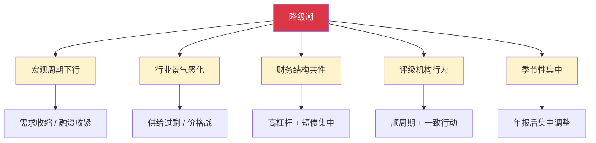

# 转债降级潮之下：溯源、机制与风险特征

> [!note] 核心观点
> 转债评级下调很少是"孤立事件"。当一批转债在相近时间段被集中下调时，背后往往不是某家公司单独"出了问题"，而是**宏观周期、行业景气、财务结构、评级机构行为与季节性**这几股力量在同一时间窗口叠加共振的结果。本篇不纠缠任何具体个案的数字，而是拆解"降级为何会成潮"的内在机制——理解了机制，才能在下一轮潮水来临前看见潮汐的方向。

## 一、先厘清概念：什么叫"降级潮"

"降级"是指评级机构下调发行人主体信用等级或债项等级（如 AA → AA-）；"降级潮"则强调它在**时间上的集中性**与**对象上的同质性**——大量发行人在较短窗口内被同向下调，且这些发行人在行业、性质、资质上高度相似。

> [!tip] 关键直觉：潮 = 同因 × 同时
> 单只转债降级是"个体事件"，受公司自身经营左右；而"降级潮"是"系统事件"，由**共同的外部驱动因素**在**共同的时间窗口**触发。把降级潮当成一堆互不相关的个案来理解，是最大的认知误区——它恰恰是相关性极高的一组事件。

转债市场的信用演进，大致经历了从"个案化 → 规模化 → 常态化"的路径。理解这条路径，是理解降级潮的历史背景。

| 阶段 | 大致特征 | 信用层面的含义 |
| --- | --- | --- |
| 个案化 | 早期市场以高资质发行人为主，下调零星出现 | 信用风险被视为"小概率意外" |
| 规模化 | 市场扩容、发行门槛放宽，中低评级发行人占比上升 | 信用分层出现，风险开始"有结构" |
| 常态化 | 零违约预期被打破，下调与负面行动趋于经常化 | 信用风险成为定价中不可忽视的常规变量 |

> [!warning] 一个底线事实
> 转债市场长期存在的"零违约信仰"已经被打破。这意味着：**评级下调不再是终点，它可能只是通往违约链条上的一个中间站**。把"从未违约"当成"不会违约"，是降级潮中最危险的惯性思维。

## 二、降级为何会"成潮"：五重驱动机制

降级潮的形成，可以理解为五股力量的叠加。它们各自都能制造下调，但只有当它们在同一时间窗口共振时，才会从"零星下调"演变为"潮"。

### 1. 宏观周期：潮水的"总闸门"

宏观经济下行期，总需求收缩、企业盈利普遍承压，同时融资环境往往同步收紧（信用利差走阔、再融资难度上升）。这会从两端挤压发行人：**收入端变弱、融资端变贵**。当宏观逆风同时吹向大量发行人时，下调便不再是个案，而是"批量"发生。

> [!tip] 顺周期性是关键
> 信用风险天然具有**顺周期**特征：经济好时人人现金流充裕、评级稳定；经济差时违约与下调同步上升。降级潮往往是宏观周期在信用维度上的"投影"。

### 2. 行业景气：把潮水"聚焦"到特定板块

宏观是总闸门，行业景气则决定潮水**冲向哪里**。一个行业若处于景气下行，通常会同时出现：供给过剩、价格战、产能利用率下降、毛利收窄。该行业内发行人的财务表现会**同向恶化**——这正是降级潮往往"扎堆"在少数行业的根本原因。

> [!example] 为什么有些景气下行的行业反而"扛住了"
> 并非所有承压行业都会爆发降级潮。某些行业即使总量层面景气下行，头部发行人仍可能凭借以下机制缓冲压力（此处仅为机制归纳，不指向具体个券）：
> - **市场可分流**：海外或新兴市场需求对冲国内压力；
> - **技术与成本优势**：在价格战中仍能维持正毛利；
> - **资金储备相对充裕**：账上现金能熬过周期底部；
> - **转债剩余期限充足**：兑付压力尚未临近，时间换空间。
> 这提示我们：**看行业更要看个体在行业中的位置**——同一行业内,头部与尾部的信用命运可能截然不同。

### 3. 财务结构：决定谁"先倒下"的共性弱点

被卷入降级潮的发行人，财务画像往往高度相似。这种"共性弱点"使得同一冲击下，他们几乎**同时触发**下调阈值。

| 财务弱点 | 在冲击下的放大效应 |
| --- | --- |
| 高资产负债率 | 杠杆放大盈利波动，景气下行时净利润更快转负 |
| 短期债务集中到期 | 再融资窗口一旦收紧，流动性瞬间紧张 |
| 货币资金薄、现金流弱 | 缺乏缓冲垫，外部冲击直接传导至偿债能力 |
| 业务集中度过高 | 单一客户/单一产品风险无法对冲 |
| 股权高比例质押 | 股价下跌触发平仓，治理与融资双重承压 |

> [!warning] "短债 + 高杠杆"是降级潮的标准受害者画像
> 这两项叠加，意味着发行人既**还得多**又**借得贵**。一旦融资环境收紧，这类发行人会最先暴露流动性缺口，从而成为评级机构最先下手的对象。这也是为什么降级潮往往**集中在中低评级、民营、依赖外部融资**的发行人群体。

### 4. 评级机构行为：潮水的"放大器"

评级机构并非完全独立于市场的"裁判"，其行为本身会**强化**降级的集中性：

- **顺周期调整**：评级方法中包含盈利、现金流、杠杆等指标，这些指标在景气下行时同步恶化，导致评级机构在同一时段对大量发行人做出下调。
- **一致行动倾向**：当某一行业风险被市场广泛关注后，评级机构出于审慎与声誉考虑，往往会对该行业内同类发行人采取相似动作，形成"跟随式下调"。
- **滞后性**：评级调整通常**滞后于**基本面恶化与市场定价。等到正式下调公告发出时，价格可能早已反应，下调成了"对既成事实的确认"（这一滞后特征详见 [[转债评级下调分析]]）。

> [!important] 评级是"动态"的，不是"一次性"的
> 把外部评级当成一劳永逸的安全标签，是典型误区。评级会随基本面与周期被动态调整；在降级潮中，评级机构的顺周期与一致行动，会把原本分散的下调"打包"成集中事件。

### 5. 季节性：潮水的"时间窗口"

降级在时间分布上并非均匀，而是存在明显的**季节性聚集**，其根源在于信息披露节奏：

- 年报、审计意见等关键信息在固定时段集中披露，财务问题（如审计非标、商誉减值、巨额亏损）在此时集中"水落石出"。
- 评级机构的**定期跟踪复评**也多在年报后启动，于是下调动作天然向特定月份聚集。
- 回售、付息等条款时点临近时，发行人现金流压力上升，也会成为评级机构关注与调整的触发点。

> [!tip] 实战含义
> 投资者应对评级跟踪的**季节性窗口**保持警觉：在年报披露与集中复评的时段前后，对持仓中资质偏弱、信息披露质量差的个券，应主动提高审视频率，而非被动等待下调公告。

## 三、风险特征：降级潮的"画像"

把上述机制落到可观察的特征上，降级潮通常呈现如下结构性画像（以下为**结构性归纳**，非精确统计）：

| 特征维度 | 典型倾向 | 背后机制 |
| --- | --- | --- |
| 评级分布 | 集中于中低等级 | 高资质发行人缓冲厚，先承压的是弱资质 |
| 企业性质 | 民营占比偏高 | 外部支持弱、再融资更依赖市场 |
| 重复性 | 部分发行人多次被下调 | 基本面恶化是渐进过程，一次下调常非终点 |
| 行业分布 | 扎堆于景气下行行业 | 行业景气是潮水的"聚焦器" |
| 触发诱因 | 治理/信披问题常伴随 | 审计非标、信披违规放大不信任 |

> [!note] "多次降级"是一个危险信号
> 降级很少"一步到位"。一家发行人若被**连续下调**，往往说明其基本面在持续恶化、且评级机构在逐步确认风险。对持有人而言，第一次下调更应被视为**预警**而非"靴子落地"——后面可能还有第二只、第三只靴子。

## 四、常见误区与风险

> [!warning] 五大常见误区
> 1. **"降级是个案，与我无关"**：降级潮的本质是**高相关的系统事件**。若持仓集中在同一行业/同类弱资质发行人，所谓"分散"在降级潮中会同步失效（参见 [[转债信用风险可控]] 中"假分散"的讨论）。
> 2. **"等评级下调了再跑"**：评级**滞后**于基本面与价格。等公告出来时，价格往往已经反应，离场成本已大幅抬高。
> 3. **"高评级=永久安全"**：评级是动态的。降级潮中，今天的 AA 可能就是明天的 AA-；安全标签会被周期撕掉。
> 4. **"低价就是跌到位了"**：低价可能正是市场提前对其信用定价的结果——这是"信用陷阱"，而非"安全垫"（详见 [[转债信用风险可控]]）。
> 5. **"行业承压=全行业完蛋"**：同一行业内头部与尾部命运可能分化。**只看行业、不看个体位置**，会错杀优质、漏判劣质。

> [!important] 底线认知：潮汐可预判，巨浪难逃顶
> 降级潮虽难精确预测时点，但其**驱动机制是可观察的**：宏观转冷、行业杀价、短债集中、年报季临近——当这些信号同时出现，就应主动收缩信用敞口、提升组合整体评级，而不是等潮水拍到脸上才反应。

## 五、从机制到应对：一张行动清单

| 触发信号（机制层面） | 含义 | 应对动作 |
| --- | --- | --- |
| 宏观景气与融资环境同步转冷 | 降级总闸门打开 | 整体降低信用下沉力度 |
| 某行业出现持续价格战/产能过剩 | 潮水聚焦该板块 | 回避该行业弱资质个券 |
| 持仓发行人短债集中、现金薄 | 标准受害者画像 | 优先剔除"短债+高杠杆"组合 |
| 临近年报季 / 集中复评窗口 | 季节性高发期 | 提高审视频率，预留缓冲 |
| 已出现首次下调 | 预警而非终点 | 警惕二次下调，不抄"评级下调"的底 |

> [!tip] 与组合管理框架的衔接
> 降级潮的应对，本质上是 [[风险管理框架]] 在信用维度的落地：用**维度分散**（行业、评级、期限）抵御系统性同涨同跌，用**仓位与杠杆纪律**（参见 [[资金管理与杠杆]]）控制单一冲击的破坏半径。更系统的前瞻方法，见 [[2025年转债信用风险展望]] 的情景分析。

## 相关链接
- [[转债评级下调分析]]
- [[转债信用风险可控]]
- [[2025年转债信用风险展望]]
- [[可转债核心概念]]
- [[风险管理框架]]
- [[资金管理与杠杆]]
- [[固定收益与利率]]

## 课程化学习补充

> [!important] 学习定位
> 可转债同时有债性、股性和条款博弈，分析必须把债底、转股价值、溢价率、信用风险和强赎风险放在一起。本文仅用于学习、研究与复盘，不构成任何投资建议。

### 必须掌握的问题

- 债底和 YTM 是否合理
- 转股溢价率是否过高
- 正股弹性和信用质量如何
- 强赎/回售/下修条款是否触发临界

### 实战应用流程

1. 先写清楚你的投资假设：为什么这个信号、资产或方法应该产生收益。
2. 明确数据口径：样本范围、更新时间、复权/分红/停牌处理和交易日历。
3. 做最小可行验证：先用简单规则验证方向，再逐步加入复杂模型。
4. 把成本和约束前置：手续费、滑点、冲击成本、保证金、流动性和容量都要进入测算。
5. 上线后持续复盘：记录信号、下单、成交、持仓、回撤和失效原因。

### 风险与失效条件

- 信用下沉
- 高价高溢价双杀
- 流动性薄导致滑点
- 强赎前追高

### 复盘问题

- 这笔交易或这套模型赚的是什么钱：风险补偿、行为偏差、流动性溢价，还是偶然噪音？
- 如果市场环境反过来，最大亏损和最长恢复期会是多少？
- 当前结论是否依赖某个不可持续假设，例如低利率、低波动、充裕流动性或监管套利？
- 有没有一个更简单的基准策略能取得接近效果？

### 延伸学习

- [[可转债核心概念]]
- [[固定收益与利率]]
- [[市场微观结构与交易执行]]
- [[风险度量指标]]

## 跨领域进阶扩展

> [!tip] 交易者视角
> 学到 `转债降级潮之下：溯源、机制与风险特征` 时，不要只把它当成孤立知识点。把可转债拆成债底、股性、条款和流动性四个维度。优秀投资交易者会把它放入“宏观背景 - 资产选择 - 估值/信号 - 组合风险 - 交易执行 - 复盘反馈”的闭环。

### 与其他知识的连接

- 正股基本面和波动率
- 转股溢价率、YTM 和债底
- 强赎、回售、下修和信用风险
- 盘口流动性和交易制度

### 进阶训练

1. 给一只转债画出债底-转股价值-溢价率图
2. 列出条款触发条件
3. 测算强赎风险和流动性退出成本

### 能力验收

- 能否说清楚这个主题影响的是收益来源、风险来源、交易成本、流动性还是心理纪律？
- 能否指出它在什么市场环境、资产类别或交易周期中更有效？
- 能否把它写成一条可复盘的研究或交易规则？
- 能否说明如果判断错误，组合最大损失和退出机制是什么？

### 全局关联

- [[综合金融知识体系/金融投资全知识地图|金融投资全知识地图]]
- [[综合金融知识体系/优秀投资交易者能力地图|优秀投资交易者能力地图]]
- [[综合金融知识体系/一次性学习路线与复盘模板|一次性学习路线与复盘模板]]
