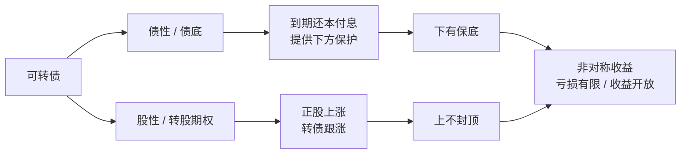
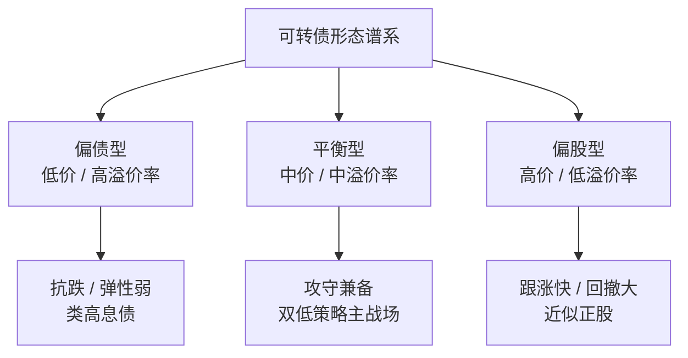
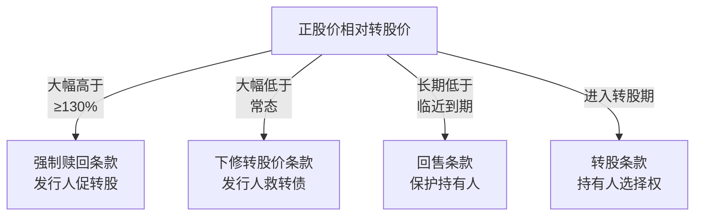
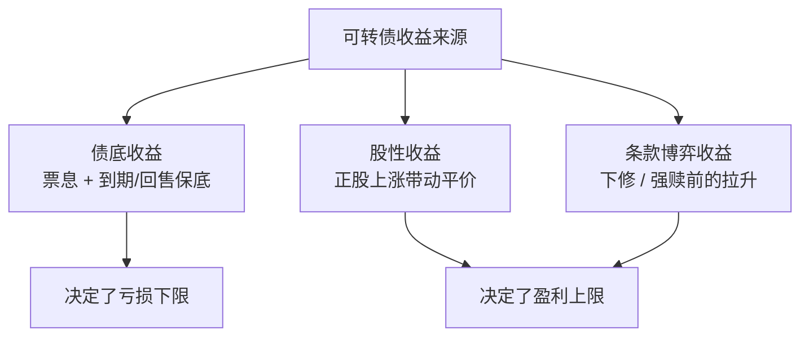

# 可转债核心概念

> [!note] 一句话定义
> 可转债（可转换公司债券）是一种"债券 + 看涨期权"的复合证券：本质是公司发行的债券，但赋予持有人在约定期限内、按约定价格把债券转换成发行公司股票的权利。因此它**同时具有债性（债底保底）与股性（可转股增值）**，是少数"下有保底、上不封顶"的非对称工具。

可转债的魅力，几乎全部来自它的**非对称收益结构**：

理解可转债，要先把"它到底值多少钱"和"它有哪些条款博弈"两条主线分别打通。本文是可转债的总论，后续策略（[[投资策略核心逻辑]]、[[双低策略详解]]、[[强赎条款与投资机会]]）都建立在这些概念之上。

---

## 一、债性与股性：可转债的两个"灵魂"

可转债价格在任意时刻，都可以理解为受两条"地板线 / 弹簧"共同作用：

| 维度 | 来源 | 作用 | 决定性变量 |
| --- | --- | --- | --- |
| **债性（债底）** | 这是一张债券，到期还本付息 | 提供**下方保护**，价格越低债性越强 | 票面利率、剩余期限、信用评级、市场利率 |
| **股性（转股期权）** | 可按转股价换成正股 | 提供**上方弹性**，正股涨则跟涨 | 正股价格、转股价、剩余期限、正股波动率 |

> [!tip] 直觉理解
> - 转债价格**越接近债底**（如 100~110 元），越像"债券"——抗跌、弹性弱，称为**偏债型**。
> - 转债价格**越高、溢价率越低**，越像"股票"——跟涨快、波动大，称为**偏股型**。
> - 介于两者之间、攻守兼备的，称为**平衡型**。

---

## 二、核心计算公式（必须吃透）

这是阅读后续所有策略的"乘法口诀"。

### 1. 转股价值（平价）

把转债"立即转股"后能拿到的股票市值。可转债面值统一为 **100 元**。

$$
\text{转股价值（平价）} = \frac{100}{\text{转股价}} \times \text{正股价格}
$$

> [!example] 示例（数字为假设）
> 转股价 = 10 元，正股现价 = 12 元。
> 每张转债可转 $100 / 10 = 10$ 股，转股价值 $= 10 \times 12 = 120$ 元。
> 也可直接用公式：$\dfrac{100}{10}\times 12 = 120$ 元。

### 2. 转股溢价率

转债**市场价格**相对**转股价值**贵出多少。它是衡量"股性强弱"的核心。

$$
\text{转股溢价率} = \left(\frac{\text{转债价格}}{\text{转股价值}} - 1\right)\times 100\%
$$

> [!example] 示例（数字为假设）
> 转债价 = 132 元，转股价值 = 120 元，则溢价率 $=(132/120-1)\times100\% = 10\%$。
> 溢价率越低 → 越贴近正股 → 股性越强、跟涨越快。

### 3. 纯债价值（债底）与到期收益率（YTM）

- **纯债价值（债底）**：把转债当成普通债券，将未来所有票息和到期本金（含可能的补偿利息）按市场利率折现求和。它是价格的"理论地板"。

$$
\text{纯债价值} = \sum_{t=1}^{n}\frac{C_t}{(1+r)^{t}} + \frac{F}{(1+r)^{n}}
$$

其中 $C_t$ 为第 $t$ 期票息，$F$ 为到期赎回金额，$r$ 为折现率（与同评级债券收益率相关），$n$ 为剩余期数。

- **到期收益率（YTM）**：以**当前市价**买入并持有到期的年化回报率。

> [!important] YTM 的实战含义
> YTM > 0 意味着按当前价格买入、持有到期理论上不亏本金（须假设不违约）；YTM 越高，债性保护越厚。固收资金常把 YTM 较高的转债当"高息债"持有（详见[[投资策略核心逻辑]]的惰性债/强赎防守思路）。

### 4. 双低值

把"价格"和"溢价率"合成一个排序分数，兼顾债性保护与股性弹性（详见[[双低策略详解]]）。

$$
\text{双低值} = \text{转债价格} + \text{转股溢价率（百分数）} \times 100
$$

> [!example] 示例（数字为假设）
> 转债价 105 元、溢价率 8%（即 0.08），双低值 $= 105 + 0.08\times100 = 113$。数值越小，性价比越高。

| 指标 | 公式 | 一句话说明 |
| --- | --- | --- |
| **转股价值（平价）** | $\frac{100}{\text{转股价}}\times\text{正股价}$ | 立即转股的股票市值 |
| **转股溢价率** | $(\frac{\text{转债价}}{\text{转股价值}}-1)\times100\%$ | 越低股性越强 |
| **纯债价值（债底）** | 未来本息折现求和 | 价格的理论地板 |
| **到期收益率 YTM** | 持有到期的年化回报 | >0 理论不亏本（假设不违约） |
| **双低值** | $\text{价格}+\text{溢价率}\times100$ | 综合性价比排序，越小越好 |

---

## 三、四大核心条款（博弈的战场）

可转债真正"好玩"的地方在条款。它本质是发行人与持有人之间的一组期权博弈：发行人想**促使转股**（这样债务变股权、不用还钱），持有人想**低风险吃到上涨**。

### 1. 强制赎回（强赎）—— 发行人的"催转"利器

| 要素 | 典型设定（以条款为准） |
| --- | --- |
| 触发条件 | 连续 30 个交易日中，≥15 个交易日正股收盘价 ≥ 转股价的 **130%** |
| 赎回价 | 通常 100~103 元（面值 + 当期利息附近） |
| 发行人意图 | 价格已远高于面值，赎回价极低 → **逼持有人在赎回登记日前转股** |

> [!warning] 强赎是最大的"价格天花板"风险
> 一旦公告强赎，转债价格通常会向转股价值（甚至略低）回落，并可能跌去几个点。**绝不能持有已公告强赎的转债到登记日之后**——否则可能被以约 100 元赎回，而你也许是 130 元买的。详见[[强赎条款与投资机会]]。

### 2. 下修转股价 —— 发行人的"自救"工具

| 要素 | 典型设定（以条款为准） |
| --- | --- |
| 触发条件 | 正股价在一段时间内持续低于转股价的某比例（常见 **70%~90%**） |
| 操作 | 发行人有权（非义务）下调转股价 |
| 博弈核心 | 转股价下调 → **转股价值跳升** → 转债价格上涨（下修博弈机会） |
| 重要约束 | 下修后转股价**一般不得低于每股净资产**（PB<1 时下修空间受限） |

> [!example] 下修的算术（数字为假设）
> 转股价从 10 元下修到 8 元，正股价 7 元不变。
> 转股价值从 $\frac{100}{10}\times7 = 70$ 元，跃升到 $\frac{100}{8}\times7 = 87.5$ 元。
> 平价抬升后，转债价格往往随之走高——这就是"下修博弈"的收益来源。

### 3. 回售 —— 持有人的"保护伞"

| 要素 | 典型设定（以条款为准） |
| --- | --- |
| 触发条件 | 进入最后两个计息年度，正股价持续低于转股价的某比例（常见 70%） |
| 持有人权利 | 有权将转债以**面值 + 当期利息**卖回给发行人 |
| 作用 | 给价格再加一道"软地板"，也反向逼发行人考虑下修 |

### 4. 转股条款 —— 持有人的"主动权"

- 进入转股期后，持有人可随时按转股价把债券换成正股。
- **实务提醒**：当转债价格高于转股价值（有正溢价）时，**直接卖转债通常比转股更划算**；只有溢价率为负（折价）时，转股 + 卖股才有套利空间（详见[[QMT折溢价套利]]）。

> [!note] 四大条款的"立场速记"
> - 强赎、下修 → **发行人**主导，目的都是"让你转股、它不用还钱"。
> - 回售 → **持有人**主导，是保护性条款。
> - 转股 → **持有人**的核心选择权。

---

## 四、收益来源与非对称性

可转债的收益可以拆成三块：

| 收益来源 | 触发情形 | 风险特征 |
| --- | --- | --- |
| 债底（票息 + 保底） | 正股低迷时 | 有限亏损，靠债底兜底 |
| 股性（平价上涨） | 正股上涨时 | 跟涨，溢价率越低越敏感 |
| 条款博弈（下修/强赎前） | 触发或预期触发 | 弹性大，需把握节奏 |

> [!important] 非对称性的本质
> 理论上，转债价格的**下限约等于债底**（最坏情况持有到期拿回本息，前提是不违约），而上方**没有硬性上限**（正股翻倍，转债大体跟随）。这就是"亏损有限、收益开放"的非对称结构——**前提是买入价不能太贵**（价格离债底太远，债底就保护不到你）。

---

## 五、常见误区与风险

> [!warning] 误区一：把"下有保底"当成"绝对不亏"
> 债底保护的前提是**不违约**且**买入价不远高于债底**。若以 140 元买入一只债底只有 90 元的高价转债，正股下跌时它一样可以跌 30%+。保底保的是"债底"，不是"你的买入价"。

> [!warning] 误区二：忽视强赎，把高价转债当股票长拿
> 高价（如 >130 元）且满足强赎条件的转债，随时可能被强赎砸盘。**看到强赎公告/感叹号标识，先想退出，而不是加仓。**

> [!warning] 误区三：信用风险被低估
> 转债也可能违约或被下调评级。低评级（如 A 及以下）、正股基本面恶化、临近到期且 YTM 异常高的标的，要警惕"高 YTM 是市场在定价违约风险"。债性保护应建立在信用可控之上（参见[[转债信用风险可控]]）。

> [!warning] 误区四：误解溢价率方向
> 溢价率**高**=股性弱（贵、跟涨慢），溢价率**低甚至为负**=股性强（接近正股、可能存在折价套利）。不要把"高溢价"误当成"安全"。

> [!tip] 一张"体检表"快速判断一只转债
> 1. 价格离债底多远？（衡量下方风险）
> 2. 溢价率多高？（衡量跟涨能力）
> 3. YTM 是否为正？（衡量持有到期的安全垫）
> 4. 是否临近/已触发强赎？（衡量天花板风险）
> 5. 信用评级与正股基本面如何？（衡量违约风险）
> 6. 剩余规模与期限？（衡量流动性与博弈空间）

---

## 六、与后续策略的衔接

| 你想做什么 | 用到的概念 | 对应专题 |
| --- | --- | --- |
| 选"攻守兼备"的标的 | 双低值、债底、溢价率 | [[双低策略详解]] |
| 系统化定期换仓 | 双低排名、再平衡 | [[双低轮动策略]] |
| 吃下修/强赎的博弈钱 | 下修、强赎、回售条款 | [[强赎条款与投资机会]] |
| 厘清六大打法全景 | 全部概念 | [[投资策略核心逻辑]] |

> [!note] 学习路径建议
> 本篇（概念）→ [[投资策略核心逻辑]]（全景）→ [[双低策略详解]]（核心打法）→ [[双低轮动策略]]（实操）→ [[强赎条款与投资机会]]（条款博弈）。

## 相关链接
- [[双低策略详解]]
- [[投资策略核心逻辑]]
- [[可转债条款解析]]
