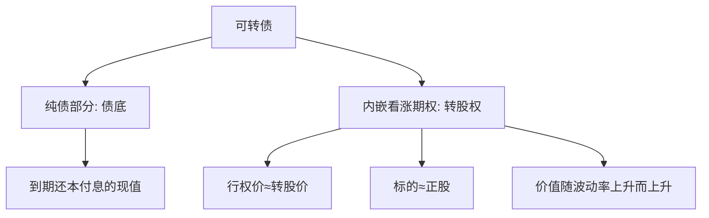
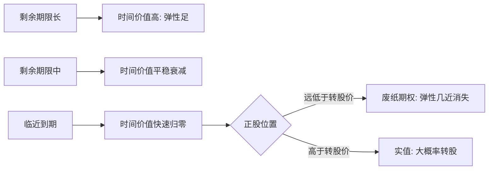

# 可转债2025年投资策略：期权价值回归，波动创造机遇

> [!note] 核心观点
> 可转债 = 纯债 + 一份内嵌的**看涨期权（转股权）**。从期权视角看，转债的价值不仅来自正股涨跌，还来自这份期权的"时间价值"与"波动价值"。当转股溢价率回到适中水平时，相当于这份看涨期权变得"便宜"，配置性价比凸显。本篇用期权框架重新理解转债，并以情景分析展望，不做点位预测，文中数字均为帮助理解的**示例**。

## 一、把转债拆成"债券 + 看涨期权"

| 组成部分 | 对应金融工具 | 价值来源 | 直觉理解 |
| --- | --- | --- | --- |
| 纯债部分 | 一张普通信用债 | 票息 + 到期还本（折现） | 价格的"地板"——债底 |
| 内嵌期权 | 一份看涨期权 | 正股上行的可能性 | 价格的"弹性"——能涨多高 |

> [!important] 价值分解（示意）
> $$\text{转债价值} \approx \underbrace{\text{债底}}_{\text{纯债部分}} + \underbrace{\text{期权价值}}_{\text{看涨期权}}$$
> "下有保底、上不封顶"的非对称收益结构，本质就来自这份内嵌看涨期权：正股跌，债底托住；正股涨，期权放大收益。

## 二、期权价值的驱动因素：波动率是关键

期权定价的经典直觉（参见 [[衍生品与期权进阶]]、[[波动率]]）告诉我们，看涨期权的价值受以下因素影响：

| 因素 | 变动方向 | 对内嵌看涨期权价值的影响 | 在转债上的体现 |
| --- | --- | --- | --- |
| 正股价格 | ↑ | 价值↑ | 平价提升，期权变实值 |
| 正股波动率 | ↑ | 价值↑（核心） | 波动越大，"涨上去"的可能越高 |
| 剩余期限 | 越长 | 时间价值↑ | 临近到期的转债期权价值衰减 |
| 行权价（转股价） | 下修↓ | 价值↑ | 下修相当于降低行权价 |
| 无风险利率 | ↑ | 看涨期权理论价值↑* | 实际还需结合债底变化综合看 |

> [!note] 为什么"波动创造机遇"
> 看涨期权多头是**做多波动率**的：正股波动越剧烈，转债内嵌期权越值钱。因此在转债上，"高波动"未必是坏事——它恰恰是期权价值的来源。这也解释了"高换手做多波动率"类策略的逻辑。

## 三、转股溢价率 ≈ 期权的"价格标签"

转股溢价率衡量的就是市场愿意为这份内嵌看涨期权额外支付多少。

> [!tip] 低溢价 ≈ 便宜的期权
> - **溢价率高**：相当于期权"贵"，要为上行潜力付出较高代价；
> - **溢价率低**：相当于期权"便宜"，用较小代价获取正股上行弹性。
> 当全市场加权转股溢价率从高位回落到适中水平，等于市场在"打折出售看涨期权"——这正是"期权价值回归"的含义。

| 溢价率水平 | 期权视角解读 | 隐含的风险收益特征 |
| --- | --- | --- |
| 偏高 | 期权偏贵，透支上行 | 估值回撤风险大（参见 [[2025年转债估值双击]]的"双杀"） |
| 适中 | 期权定价合理 | 攻守相对均衡，配置性价比较好 |
| 偏低 | 期权便宜 | 上行弹性性价比高，但需甄别是否因正股弱/信用瑕疵 |

> [!warning] 便宜不等于"白捡"
> 低溢价可能是市场给出的合理折价（正股缺乏弹性、信用资质偏弱、临近到期时间价值衰减）。买"便宜期权"的前提是判断这份期权**还有行权的可能**，而非已沦为"废纸期权"。

## 四、情景分析：期权价值如何演绎

> [!note] 框架说明
> 按**乐观/中性/悲观**三种情景，从"正股弹性 × 波动率 × 估值"三个维度展望期权价值的演绎方向。仅作分析框架，不预测点位与时间，"2025"视为示例年份语境。

| 情景 | 正股弹性 | 波动率 | 溢价率（期权价格） | 期权价值演绎 |
| --- | --- | --- | --- | --- |
| 乐观 | 强，结构性行情扩散 | 上升 | 适中→走扩 | 期权价值回升，攻守兼备 |
| 中性 | 分化，板块轮动 | 平稳 | 中枢震荡 | 个券期权价值分化，重选股 |
| 悲观 | 弱，权益调整 | 先升后降 | 压缩 | 期权价值受损，偏债品种相对抗跌 |

### 关键驱动因素

- **波动率环境**：权益市场波动率中枢的高低，直接决定内嵌期权的"含金量"；
- **估值起点**：起始溢价率越低，期权越便宜，安全边际越高；
- **供需结构**：净供给收缩 + 配置资金流入，可阶段性抬升估值（详见 [[市场挑战与甜蜜烦恼]]）；
- **正股基本面**：期权能否"行权"最终取决于正股能否上行；
- **条款催化**：下修（降低行权价）可修复期权价值，强赎（强制行权）则封顶期权上行。

## 五、从期权视角衍生的策略思路

| 策略思路 | 期权逻辑 | 适用情景 |
| --- | --- | --- |
| 低溢价"买便宜期权" | 用较低代价获取正股上行弹性 | 估值偏低、正股有催化 |
| 做多波动率 | 看涨期权多头受益于波动放大 | 预期波动率上升 |
| 偏债型"类债打底" | 期权价值小、债底保护强 | 防御、震荡市 |
| 双低（低价+低溢价） | 同时获得债底保护与便宜期权 | 攻守平衡的经典思路 |

> [!example] 双低策略的期权直觉（示例）
> "双低"= 低价格 + 低溢价率：低价意味着**离债底近、保护厚**，低溢价意味着**期权便宜**。等于花较小的钱，买到一份"下有保底、期权便宜"的资产——这正是期权视角下攻守平衡的体现。

## 六、时间价值衰减与"废纸期权"

内嵌期权和场内期权一样，存在**时间价值衰减（Theta）**：随着到期日临近，期权的时间价值加速流失。

| 转债状态 | 期权含义 | 价格主导因素 | 提示 |
| --- | --- | --- | --- |
| 深度实值（平价远高于面值） | 期权已深度实值 | 几乎完全跟随正股 | 类正股，关注强赎封顶 |
| 平值附近 | 期权时间价值最饱满 | 股性 + 估值并重 | 弹性与博弈空间最大 |
| 深度虚值 + 临近到期 | "废纸期权" | 债底主导 | 上行弹性几乎丧失 |

> [!warning] 警惕"低溢价陷阱"
> 临近到期、正股远低于转股价的深度虚值转债，溢价率也可能很低——但此时低溢价**不代表便宜的好期权**，而是市场认定其"几乎不可能行权"。买这类券，买到的是接近纯债的现金流，而非正股上行弹性。判断"便宜期权"必须结合**剩余期限**与**正股距转股价的距离**。

## 七、量化策略：从期权视角的再理解

| 策略思路 | 期权语言重述 | 关键风险 |
| --- | --- | --- |
| 低价/低溢价等权 | 批量买入"便宜期权 + 厚债底" | 信用尾部风险 |
| 指数增强 | 在基准期权组合上做主动偏离 | 跟踪误差 |
| 高换手做多波动率 | 反复兑现期权的波动价值 | 交易成本、波动率回落 |
| 转债套利 | 利用转股/赎回的定价偏差 | 条款与流动性约束 |

> [!tip] 做多波动率的边界
> "做多波动率"在波动率上行期收益可观，但波动率具有**均值回归**特征：当波动率回到低位，内嵌期权的时间价值与波动价值同步收缩，策略收益会显著走弱。任何"做多波动率"都不是单边免费的午餐。

## 八、常见误区与风险

> [!danger] 期权视角下的常见误区
> 1. **只看正股不看波动率**：忽视了内嵌期权"做多波动率"这一核心价值来源；
> 2. **把低溢价当无脑买入信号**：未甄别是"便宜期权"还是"废纸期权"（正股无弹性/信用瑕疵）；
> 3. **无视时间价值衰减**：临近到期的转债，期权时间价值快速流失，弹性下降；
> 4. **忽略强赎封顶**：强赎相当于发行人强制行权，会提前终结期权的上行空间；
> 5. **混淆债底与买入价**：债底是估算的价值下限，并非买入价的保证，信用恶化时债底本身也会下移。

> [!warning] 风险提示
> - **信用风险**：债底依赖发行人信用，资质恶化会同时削弱"债底 + 期权"两部分价值；
> - **波动率风险**：波动率不会单边上升，回落期内嵌期权价值同样收缩；
> - **流动性风险**：小余额品种买卖价差大，期权价值难以兑现。
> 本篇所有数字均为帮助理解机制的**示例**，不构成对任何具体标的或年度行情的预测与投资建议。

## 相关链接
- [[2025年转债估值双击]]
- [[量化择时与轮动策略]]
- [[可转债核心概念]]
- [[投资策略核心逻辑]]
- [[期权策略]]
- [[衍生品与期权进阶]]
- [[波动率]]
- [[市场挑战与甜蜜烦恼]]
- [[风险管理框架]]

## 实战掌握清单

> [!tip] 交易者视角
> 可转债2025年投资策略：期权价值回归，波动创造机遇 的学习重点不是记住术语，而是把它放进研究、组合、执行和复盘的闭环。可转债同时含债性、股性、期权性和条款博弈，必须把价格、溢价率、评级、正股和流动性一起看。

### 关键判断

- 先拆分债底、转股价值、转股溢价率和到期收益率。
- 检查强赎、回售、下修、赎回价格和剩余期限。
- 用正股基本面和信用风险解释转债波动。

### 落地动作

1. 双低策略要同时看价格、溢价率、规模和成交。
2. 量化选债要记录停牌、强赎公告和流动性过滤。
3. 组合中限制低评级、临近强赎和小规模券暴露。

### 失效边界

- 只看低价忽略信用风险。
- 只看低溢价忽略正股下跌。
- 强赎风险未及时处理。

### 复盘问题

- 这项知识改变了哪一个具体决策：标的、方向、仓位、退出、对冲还是不交易？
- 如果判断相反，最大亏损、最长恢复期和退出触发条件是什么？
- 有没有一个更简单的基准方法可以取得相近结果？
