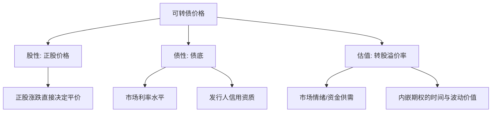
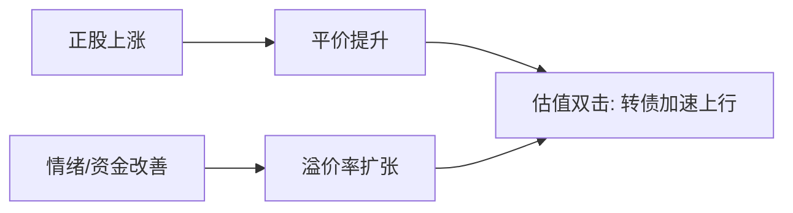

# 2025年可转债期待估值双击

> [!note] 核心观点
> "估值双击"是可转债区别于普通股票、普通债券的核心魅力所在：当**正股上涨（平价提升）**与**转股溢价率扩张（估值抬升）**同时发生时，两股力量叠加，可推动转债价格以超越正股的幅度上行。但同样的机制反向运行就是"估值双杀"。本篇用机制拆解 + 情景分析框架，讲清双击何时可能发生、何时可能逆转，不做具体点位预测，文中数字均为帮助理解的**示例**。

## 一、先理解：转债价格的三因素驱动

要理解"双击/双杀"，必须先把转债价格拆成三个相互独立又彼此影响的来源。

| 驱动因素 | 经济含义 | 主要影响变量 | 对转债价格的作用 |
| --- | --- | --- | --- |
| 正股价格（股性） | 转股权对应的内在价值 | 正股涨跌、行业景气 | 正股涨→平价升→转债涨 |
| 债底（债性） | 把转债当纯债的价值下限 | 无风险利率、信用利差 | 利率降/信用改善→债底抬升 |
| 转股溢价率（估值） | 市场愿为"看涨期权"多付的钱 | 资金供需、波动率、情绪 | 溢价率扩张→同等平价下转债更贵 |

> [!important] 关键恒等式（示意）
> $$\text{转债价格} \approx \text{平价} \times (1 + \text{转股溢价率})$$
> 其中 $\text{平价}=\dfrac{100}{\text{转股价}}\times\text{正股价}$。这意味着转债涨跌可以分解为"平价变动"与"溢价率变动"两部分——双击/双杀正是这两部分**同向叠加**的结果。

## 二、机制拆解：什么是"估值双击"

### 1. 双击 = 平价↑ 与 溢价率↑ 共振

当正股上涨时，平价随之提升；如果此时市场情绪、资金供需同步改善，溢价率不降反升，转债价格的涨幅就会**大于**单纯由正股带来的涨幅。

> [!example] 示例（仅作机制演示，非预测）
> 假设某转债初始平价 90 元、转股溢价率 20%，价格约 108 元。
> - 正股上涨 10% → 平价升至 99 元；
> - 同时市场转暖，溢价率扩张到 25%；
> - 新价格 ≈ 99 ×（1+25%）= 123.75 元，涨幅约 **14.6%**，明显超过正股的 10%。
> 多出来的部分，就是溢价率扩张贡献的"第二击"。

### 2. 双击的归因分解

| 涨幅来源 | 本例贡献（示例） | 说明 |
| --- | --- | --- |
| 平价提升（股性） | 约 +10% | 正股驱动，第一击 |
| 溢价率扩张（估值） | 约 +4.6% | 情绪/资金驱动，第二击 |
| 合计 | 约 +14.6% | 两击叠加 |

## 三、镜像风险：什么是"估值双杀"

双击的机制是对称的。当正股下跌、市场情绪同时转冷，**平价↓ 与 溢价率↓ 同向收缩**，转债跌幅会被放大，这就是"双杀"。

> [!warning] 双杀的两种典型触发
> 1. **正股下跌 + 情绪退潮**：股价回落使平价下降，同时资金撤离压缩溢价率，跌幅叠加；
> 2. **高价高溢价品种**：价格已大幅偏离债底，债性保护薄弱，溢价率一旦松动，缺乏缓冲。

| 阶段 | 平价（股性） | 溢价率（估值） | 转债表现 |
| --- | --- | --- | --- |
| 双击 | ↑ | ↑ | 涨幅放大（>正股） |
| 单边 | ↑ | ↓ | 涨幅被溢价压缩抵消 |
| 钝化 | ↓ | ↑ | 跌幅被债底/估值缓冲 |
| 双杀 | ↓ | ↓ | 跌幅放大（>正股） |

> [!tip] 债底的"安全垫"作用
> 当转债价格接近债底时，溢价率往往会被动走阔（价格跌不动，平价继续跌），形成估值缓冲；反之，**远离债底的高价券缺少这层保护**，最容易遭遇双杀。

## 四、情景分析：何时可能双击，何时可能双杀

> [!note] 框架说明
> 以下按**乐观/中性/悲观**三种情景，从"正股方向 × 溢价率方向"两个维度组合判断，仅作分析框架，不预测具体点位或时间。把"2025"理解为示例年份语境。

| 情景 | 正股驱动 | 估值（溢价率）驱动 | 可能结果 | 主要驱动因素 |
| --- | --- | --- | --- | --- |
| 乐观 | 权益市场回暖，正股普涨 | 供给收缩 + 资金流入 → 溢价率扩张 | 倾向**估值双击** | 利率下行、增量资金、风险偏好回升 |
| 中性 | 正股震荡分化 | 溢价率维持中枢、个券分化 | 结构性机会，整体平淡 | 资金面平稳、个券基本面主导 |
| 悲观 | 权益市场调整 | 风险事件/赎回压力 → 溢价率压缩 | 警惕**估值双杀** | 信用风险、流动性收紧、情绪退潮 |

### 关键驱动因素清单

- **利率与债底**：无风险利率下行抬升债底，降低持有转债的机会成本，利于估值；
- **供需结构**：净供给收缩（到期、强赎多于新发）在需求稳定时支撑溢价率（详见 [[市场挑战与甜蜜烦恼]]）；
- **增量资金**：转债 ETF、理财等配置型资金的流入方向；
- **正股波动率**：波动率上升提升内嵌期权价值，利于估值（详见 [[2025年投资策略-期权价值]]）；
- **风险事件**：信用瑕疵、强赎潮、下修不及预期等都会冲击溢价率。

## 五、敏感性视角：转债涨跌的两个"放大器"

把转债涨跌做一阶近似分解，可以看清两个驱动因素各自的"放大器"作用：

> [!important] 涨跌分解（示意）
> $$\Delta\text{转债} \approx \underbrace{(1+\text{溢价率})\times\Delta\text{平价}}_{\text{股性贡献}} + \underbrace{\text{平价}\times\Delta\text{溢价率}}_{\text{估值贡献}}$$
> - 第一项说明：**溢价率越高，正股每涨 1% 带动转债涨得越多**（股性放大）；
> - 第二项说明：**平价越高，溢价率每变动 1 个百分点对价格的冲击越大**（估值放大）。

| 起始状态 | 股性弹性（对正股敏感） | 估值弹性（对溢价率敏感） | 风险收益直觉 |
| --- | --- | --- | --- |
| 低平价 + 低溢价（偏债） | 弱 | 弱 | 防御为主，双击/双杀都不显著 |
| 高平价 + 低溢价（偏股） | 强 | 中 | 跟随正股，弹性大、保护弱 |
| 高平价 + 高溢价（双高） | 强 | 强 | 双击爆发力最大，双杀风险也最大 |

> [!tip] 双击最容易在哪类券上爆发？
> 从弹性表可见，**平价已抬升、又恰逢溢价率从低位扩张**的品种，最容易出现剧烈双击；但同样的高弹性意味着，一旦逆转，"双高"品种的双杀也最惨烈。攻守是一体两面。

## 六、四阶段案例：一轮双击如何走向双杀（示例）

> [!example] 完整周期推演（数字均为示例，仅演示机制）
> 1. **启动期**：正股见底回升，平价从 85→95；溢价率仍低（约 8%），转债温和上行；
> 2. **加速期（双击）**：正股延续上涨，平价 95→110；情绪转暖、资金流入，溢价率 8%→18%，转债加速、涨幅远超正股；
> 3. **过热期**：价格冲高至"双高"区间，临近强赎线，溢价率被透支；
> 4. **逆转期（双杀）**：正股回落，平价 110→95；情绪退潮 + 强赎担忧，溢价率 18%→8%，转债跌幅被放大。
> 这条路径说明：**双击的终点往往埋着双杀的起点**——估值越被推高，回撤的势能越大。

## 七、下修与强赎：影响双击节奏的两个条款

| 条款 | 对平价的影响 | 对溢价率的影响 | 综合提示 |
| --- | --- | --- | --- |
| 下修转股价 | 转股价下调→平价被动提升 | 若正股配合，估值修复 | 是估值修复的潜在催化，但需正股配合 |
| 强制赎回 | 触发时通常正股已大涨 | 高溢价被强行收敛至接近平价 | 临近强赎的高溢价券，双击空间被封顶 |

> [!tip] 下修的双刃性
> 下修提升平价，理论上利于"补一击"；但若**正股疲软或剩余期限过短**，估值修复有限，市场反而可能因预期落空而回落。下修是"潜在催化"，不是"必然双击"。

## 八、常见误区与风险

> [!danger] 五大常见误区
> 1. **把双击当必然**：双击需要正股与溢价率"同向且同时"，单靠任一方都不构成双击；
> 2. **追高高溢价券**：价格远离债底、溢价率高企的品种，双杀风险与下行弹性最大；
> 3. **忽视债底位置**：不看债底就谈估值，等于忽略了最重要的安全垫；
> 4. **用历史涨幅外推**：某一年的双击行情依赖特定利率与供需环境，不可简单线性外推到下一年；
> 5. **混淆"便宜"与"低价"**：低价不等于低估，要结合溢价率、债底、信用资质综合判断（参见 [[2025年投资策略-期权价值]]）。

> [!warning] 风险提示
> - **信用风险**：发行人资质恶化会同时打穿债底与估值，是双杀的极端形态；
> - **流动性风险**：小余额品种在情绪退潮时溢价率波动剧烈；
> - **条款风险**：强赎是悬在高价券头上的"达摩克利斯之剑"，可瞬间收敛溢价。
> 本篇所有数字均为帮助理解机制的**示例**，不构成对任何具体标的或年度行情的预测与投资建议。

## 相关链接
- [[2025年投资策略-期权价值]]
- [[市场挑战与甜蜜烦恼]]
- [[强赎条款与投资机会]]
- [[可转债核心概念]]
- [[投资策略核心逻辑]]
- [[2025年转债信用风险展望]]
- [[固定收益与利率]]
- [[风险管理框架]]

## 实战掌握清单

> [!tip] 交易者视角
> 2025年可转债期待估值双击 的学习重点不是记住术语，而是把它放进研究、组合、执行和复盘的闭环。可转债同时含债性、股性、期权性和条款博弈，必须把价格、溢价率、评级、正股和流动性一起看。

### 关键判断

- 先拆分债底、转股价值、转股溢价率和到期收益率。
- 检查强赎、回售、下修、赎回价格和剩余期限。
- 用正股基本面和信用风险解释转债波动。

### 落地动作

1. 双低策略要同时看价格、溢价率、规模和成交。
2. 量化选债要记录停牌、强赎公告和流动性过滤。
3. 组合中限制低评级、临近强赎和小规模券暴露。

### 失效边界

- 只看低价忽略信用风险。
- 只看低溢价忽略正股下跌。
- 强赎风险未及时处理。

### 复盘问题

- 这项知识改变了哪一个具体决策：标的、方向、仓位、退出、对冲还是不交易？
- 如果判断相反，最大亏损、最长恢复期和退出触发条件是什么？
- 有没有一个更简单的基准方法可以取得相近结果？
