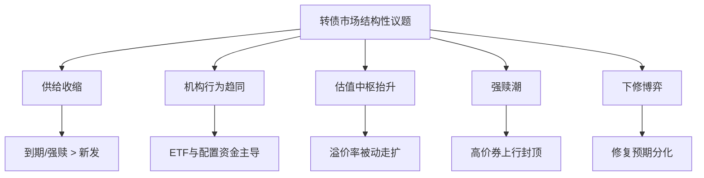
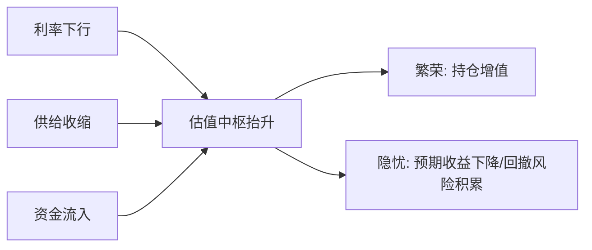
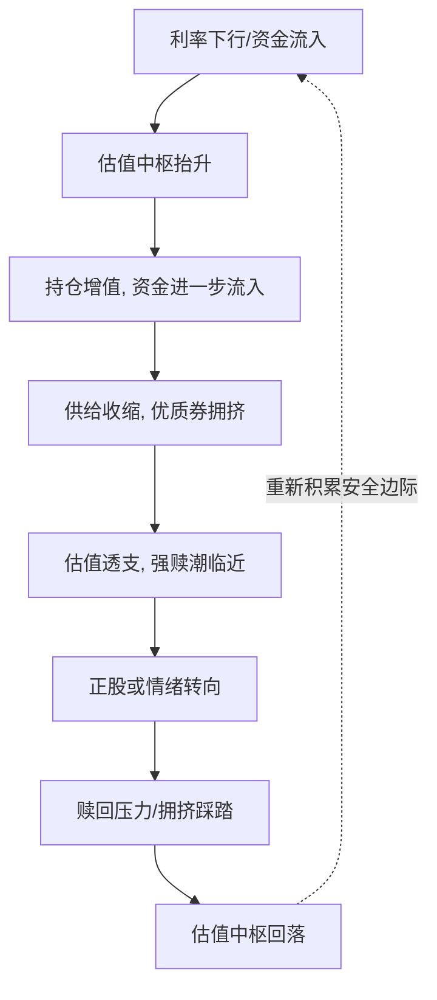

# 可转债市场"甜蜜烦恼"：股债双舞下的强赎暗涌与下修博弈

> [!note] 核心观点
> "甜蜜的烦恼"，指的是转债在行情走好、估值抬升的同时，伴生出一系列结构性议题：净供给收缩、机构行为趋同、估值中枢抬升、强赎潮临近、下修博弈分化。这些既是市场繁荣的副产品，也是潜在的风险来源。本篇用机制与情景分析梳理这些议题，不做断言式预测，文中数字均为帮助理解的**示例**。

## 一、议题地图：五个"甜蜜的烦恼"

## 二、供给收缩：稀缺是把双刃剑

净供给 = 新发行规模 − 到期及强赎退市规模。当存量品种因到期或触发强赎而退出，而新券发行节奏放缓时，市场净供给收缩。

| 维度 | 机制 | "甜蜜"一面 | "烦恼"一面 |
| --- | --- | --- | --- |
| 供给端 | 到期 + 强赎退市 | 稀缺性支撑估值 | 可选标的减少，"资产荒" |
| 需求端 | 配置资金稳定流入 | 供需偏紧推升溢价率 | 优质券被哄抢，定价透支 |

> [!tip] 供需与估值的传导
> 在需求稳定的前提下，净供给收缩往往使转股溢价率被动走扩——这是"估值中枢抬升"的供给侧原因之一。但**稀缺带来的估值溢价，会侵蚀未来的预期收益**：买得越贵，留给后续的空间越小（参见 [[2025年转债估值双击]]中"双杀"的风险）。

## 三、机构行为趋同：ETF 与配置资金的"顺周期"

转债 ETF、银行理财等配置型资金的兴起，改变了市场的微观结构。

| 机构行为特征 | 机制 | 潜在影响 |
| --- | --- | --- |
| 指数化/被动配置 | 按权重买入，规模驱动 | 阶段性估值红利，但放大同涨同跌 |
| 资金顺周期流动 | 行情好→流入，行情差→赎回 | 助涨助跌，加剧波动 |
| 持仓趋同 | 偏好同类"优质券" | 拥挤交易，回撤时踩踏风险 |

> [!warning] 拥挤交易的风险
> 当大量资金涌向同一类"低风险优质券"，会推高其估值、压低预期收益；而一旦情绪逆转、出现赎回，**集中持仓可能引发流动性踩踏**，溢价率快速收缩。机构行为的趋同，是"甜蜜"在繁荣期、"烦恼"在退潮期。

## 四、估值中枢抬升：是机会还是透支？

估值中枢（全市场加权转股溢价率的中位水平）抬升，意味着同等平价下转债更贵。

> [!important] 中枢抬升的两面性
> - **正面**：利率下行、供给收缩、资金流入共同推升估值，存量持仓受益；
> - **隐忧**：中枢越高，越透支未来收益，对正股的依赖越强——一旦正股或情绪转向，高估值缺乏缓冲，易触发回撤。

## 五、强赎潮：高价券头上的"达摩克利斯之剑"

强制赎回（强赎）是指正股价格在约定区间内持续高于强赎触发价时，发行人有权按面值附近价格强制赎回转债，促使投资者转股。详见 [[强赎条款与投资机会]]。

| 强赎状态 | 含义 | 对投资者的提示 |
| --- | --- | --- |
| 已触发未公告 | 发行人尚在决策窗口 | 政策/意图不确定，需密切跟踪 |
| 接近触发线 | 正股接近强赎区间 | 高溢价部分面临收敛压力 |
| 宣布提前赎回 | 强制收敛溢价 | 须在赎回登记日前转股或卖出 |
| 公告不赎回 | 阶段性解除压力 | 估值压力暂缓，但条款仍在 |

> [!danger] 强赎的"烦恼"
> 对持有高溢价券的投资者，强赎是最直接的风险：一旦发行人宣布赎回，**高出平价的溢价部分会被强行收敛**，若未及时转股或卖出，可能被按接近面值的价格赎回，造成损失。强赎潮临近时，高价高溢价品种的上行空间被封顶。

## 六、下修博弈：修复预期的分化

下修转股价（降低行权价）会被动提升平价，理论上利于估值修复，但市场反应高度依赖正股配合与剩余期限。

| 下修情形 | 平价影响 | 市场反应倾向 | 原因 |
| --- | --- | --- | --- |
| 下修 + 正股配合 | 平价明显提升 | 偏正面 | 修复有正股弹性兑现 |
| 下修 + 正股疲软 | 平价提升有限 | 偏中性/平淡 | 缺乏上行动能 |
| 下修不及预期 | 修复幅度低于预期 | 偏负面 | 预期落空，资金离场 |
| 临近到期下修 | 时间价值已衰减 | 修复受限 | 期权所剩时间不足 |

> [!tip] 下修是"潜在催化"，非"必然利好"
> 把下修当成无条件利好是常见误区。下修能否兑现为估值修复，取决于**正股是否给力、剩余期限是否充足**（呼应 [[2025年投资策略-期权价值]]中"行权价下调"的期权逻辑）。

## 七、情景分析：议题如何演绎

> [!note] 框架说明
> 按**乐观/中性/悲观**三种情景，看上述结构性议题的合力方向。仅作分析框架，不预测点位与时间，"2025"视为示例年份语境。

| 情景 | 供给/需求 | 估值中枢 | 强赎/下修 | 综合演绎 |
| --- | --- | --- | --- | --- |
| 乐观 | 供给收缩 + 资金流入 | 抬升 | 下修修复多、强赎可控 | 繁荣延续，但需防透支 |
| 中性 | 供需大致平衡 | 中枢震荡 | 个券分化 | 结构性机会，重个券甄别 |
| 悲观 | 资金赎回 + 情绪退潮 | 压缩 | 强赎潮 + 下修不及预期 | 拥挤交易反转，警惕踩踏 |

### 关键驱动因素

- **利率环境**：决定债底与机会成本；
- **资金流向**：ETF/理财的申赎方向决定边际定价权；
- **正股行情**：决定下修能否兑现、强赎是否触发；
- **条款节奏**：强赎潮与下修潮的时点与密度；
- **信用环境**：信用事件会同时冲击债底与估值（详见 [[2025年转债信用风险展望]]）。

## 八、"繁荣—退潮"周期：甜蜜与烦恼的轮转

把上述议题串起来看，它们往往沿着一个自我强化又自我反转的周期演绎：

| 周期阶段 | 主导议题 | "甜蜜"还是"烦恼" |
| --- | --- | --- |
| 扩张前段 | 资金流入、估值修复 | 甜蜜：攻守兼备 |
| 扩张后段 | 供给稀缺、拥挤、强赎潮 | 隐忧：收益透支 |
| 退潮段 | 赎回、踩踏、估值压缩 | 烦恼：双杀风险 |
| 出清段 | 安全边际重建 | 机会孕育 |

> [!important] 周期视角的启示
> "甜蜜的烦恼"本质是**同一组结构性力量在周期不同阶段的两面**：扩张段带来的稀缺与估值红利，到了退潮段就转化为拥挤与回撤压力。理解自己处在周期的哪个位置，比预测点位更重要。

## 九、投资者自查清单

> [!tip] 面对结构性议题的几个自查问题
> - 我持有的券，价格离债底有多远？强赎风险有多大？
> - 当前估值中枢处于历史什么位置？我是在"修复期"还是"透支期"买入？
> - 我的持仓是否与市场主流拥挤在同一类券上？
> - 我赌的下修，有没有正股弹性与充足剩余期限来兑现？
> - 一旦资金退潮，我的品种流动性是否足以从容退出？

## 十、常见误区与风险

> [!danger] 常见误区
> 1. **把"稀缺"等同于"上涨"**：供给收缩支撑估值，但买得太贵会透支收益；
> 2. **把下修当无脑利好**：缺乏正股配合的下修，修复有限甚至落空；
> 3. **无视强赎风险持有高溢价券**：强赎可瞬间收敛溢价，是高价券的核心风险；
> 4. **忽视机构拥挤**：持仓趋同在退潮期可能引发流动性踩踏；
> 5. **用繁荣期逻辑外推**：估值中枢抬升的环境依赖特定利率与资金条件，不可线性外推。

> [!warning] 风险提示
> - **强赎风险**：未及时处理的高溢价券，可能被按接近面值赎回；
> - **流动性风险**：拥挤交易与小余额品种，在情绪逆转时溢价率波动剧烈；
> - **信用风险**：发行人资质恶化会击穿债底，是结构性议题中的尾部风险。
> 本篇所有数字均为帮助理解机制的**示例**，不构成对任何具体标的或年度行情的预测与投资建议。

## 相关链接
- [[强赎条款与投资机会]]
- [[2025年投资策略-期权价值]]
- [[转债评级下调分析]]
- [[2025年转债估值双击]]
- [[可转债核心概念]]
- [[2025年转债信用风险展望]]
- [[风险管理框架]]

## 课程化学习补充

> [!important] 学习定位
> 可转债同时有债性、股性和条款博弈，分析必须把债底、转股价值、溢价率、信用风险和强赎风险放在一起。本文仅用于学习、研究与复盘，不构成任何投资建议。

### 必须掌握的问题

- 债底和 YTM 是否合理
- 转股溢价率是否过高
- 正股弹性和信用质量如何
- 强赎/回售/下修条款是否触发临界

### 实战应用流程

1. 先写清楚你的投资假设：为什么这个信号、资产或方法应该产生收益。
2. 明确数据口径：样本范围、更新时间、复权/分红/停牌处理和交易日历。
3. 做最小可行验证：先用简单规则验证方向，再逐步加入复杂模型。
4. 把成本和约束前置：手续费、滑点、冲击成本、保证金、流动性和容量都要进入测算。
5. 上线后持续复盘：记录信号、下单、成交、持仓、回撤和失效原因。

### 风险与失效条件

- 信用下沉
- 高价高溢价双杀
- 流动性薄导致滑点
- 强赎前追高

### 复盘问题

- 这笔交易或这套模型赚的是什么钱：风险补偿、行为偏差、流动性溢价，还是偶然噪音？
- 如果市场环境反过来，最大亏损和最长恢复期会是多少？
- 当前结论是否依赖某个不可持续假设，例如低利率、低波动、充裕流动性或监管套利？
- 有没有一个更简单的基准策略能取得接近效果？

### 延伸学习

- [[可转债核心概念]]
- [[固定收益与利率]]
- [[市场微观结构与交易执行]]
- [[风险度量指标]]

## 跨领域进阶扩展

> [!tip] 交易者视角
> 学到 `可转债市场"甜蜜烦恼"：股债双舞下的强赎暗涌与下修博弈` 时，不要只把它当成孤立知识点。把可转债拆成债底、股性、条款和流动性四个维度。优秀投资交易者会把它放入“宏观背景 - 资产选择 - 估值/信号 - 组合风险 - 交易执行 - 复盘反馈”的闭环。

### 与其他知识的连接

- 正股基本面和波动率
- 转股溢价率、YTM 和债底
- 强赎、回售、下修和信用风险
- 盘口流动性和交易制度

### 进阶训练

1. 给一只转债画出债底-转股价值-溢价率图
2. 列出条款触发条件
3. 测算强赎风险和流动性退出成本

### 能力验收

- 能否说清楚这个主题影响的是收益来源、风险来源、交易成本、流动性还是心理纪律？
- 能否指出它在什么市场环境、资产类别或交易周期中更有效？
- 能否把它写成一条可复盘的研究或交易规则？
- 能否说明如果判断错误，组合最大损失和退出机制是什么？

### 全局关联

- [[综合金融知识体系/金融投资全知识地图|金融投资全知识地图]]
- [[综合金融知识体系/优秀投资交易者能力地图|优秀投资交易者能力地图]]
- [[综合金融知识体系/一次性学习路线与复盘模板|一次性学习路线与复盘模板]]
