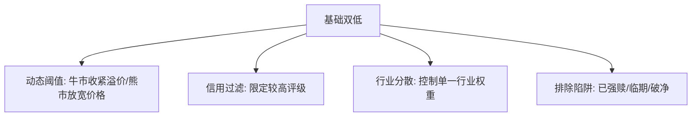

# 可转债「双低策略」的原理、回测与优化

> [!note] 核心结论
> 双低策略（低价格 + 低转股溢价率）在历史多数时段都能取得不错的风险调整收益，长期跑赢宽基指数是常见结果。但**收益数字随回测区间、参数、成本假设差异巨大**——下面出现的所有百分比都是**示意**，重点在理解"为什么有效"和"何时失效"，而不是记住某个年化数字。

## 一、为什么"双低"有效

双低同时要求两个条件：

| 条件 | 作用 |
|---|---|
| **低价格**（接近债底） | 提供**债性保护**，跌幅有限 |
| **低溢价率**（接近转股价值） | 提供**股性弹性**，正股涨能跟上 |

$$
\text{转股价值} = \frac{100}{\text{转股价}} \times \text{正股价}, \qquad
\text{溢价率} = \frac{\text{转债价格} - \text{转股价值}}{\text{转股价值}}
$$

> [!tip] 一句话直觉
> 双低就是在找"**便宜的保险 + 不贵的彩票**"：跌有债底兜，涨能跟正股。高价高溢价则相反——保护没了，弹性也贵。

## 二、双低值打分

最常用的合成打分（数值越小越好）：

$$
\text{双低值} = \text{转债价格} + \text{转股溢价率(\%)} \times 100
$$

例如（示例）：价格 115、溢价率 8% → 双低值 = 115 + 8 = 123；价格 108、溢价率 15% → 双低值 = 108 + 15 = 123。两者打分相同，体现"价格与溢价的权衡"。

## 三、历史表现的正确读法

| 指标 | 双低策略（示意） | 宽基指数（示意） |
|---|---|---|
| 长期年化 | 明显更高 | 基准 |
| 最大回撤 | 中等 | 取决于市场 |
| 收益来源 | 债底保护 + 股性参与 + 低溢价修复 | 市场 beta |

> [!warning] 别迷信回测年化
> 同样"双低"，把回测起止年份挪两年、把成本从 0 提到双边千分之三、把样本限定在某评级以上，年化可能天差地别。回测只能证明逻辑曾经有效，不能保证未来。回测陷阱见 [[回测方法论]]。

## 四、优化方向

| 优化措施 | 目的 |
|---|---|
| 动态阈值 | 适应牛熊，规避高波动或挖掘错杀 |
| 信用评级过滤 | 降低踩雷概率（[[转债信用风险可控]]） |
| 行业加权/分散 | 收窄最大回撤 |
| 排除强赎/临期/破净 | 避开无下修空间和被动赎回 |

> [!important] 优化的边界
> 加的条件越多，越容易在历史上"调"出漂亮曲线（过拟合）。每个过滤都要有逻辑，且必须样本外验证。

## 五、操作要点

- **持仓数量**：10-20 只，分散行业与个券风险；
- **轮动周期**：通常每月一次，市场剧烈时可缩短；
- **排除条件**：已公告强赎、剩余期限 < 1 年、破净（PB<1，无下修空间）；
- 具体轮动规则见 [[双低轮动策略]]。

## 常见误区

| 误区 | 更好的理解 |
|---|---|
| 双低=稳赚 | 系统性下跌时同样会亏，只是相对抗跌 |
| 只看价格不看溢价 | 低价高溢价没弹性，是"伪双低" |
| 回测年化能复制 | 高度依赖区间、成本、样本 |
| 不做信用过滤 | 低价里混着信用陷阱 |
| 持仓太集中 | 单券/单行业暴雷会重伤组合 |

## 相关链接
- [[双低轮动策略]]
- [[可转债核心概念]]
- [[投资策略核心逻辑]]
- [[回测方法论]]
- [[转债信用风险可控]]
