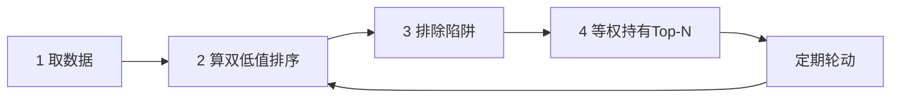

# 双低轮动策略

> [!note] 策略定义
> 双低轮动是把 [[双低策略详解]] 系统化、纪律化：定期按"双低值"排名，持有排名靠前的一篮子转债，到期换出掉出排名的、换入新上榜的。它用机械规则替代主观判断，靠的是纪律和分散，而不是预测。

## 一、双低值计算

$$
\text{双低值} = \text{转债价格} + \text{转股溢价率(\%)} \times 100
$$
$$
\text{转股溢价率} = \left(\frac{\text{转债价格}}{\text{转股价值}} - 1\right)\times 100\%, \quad
\text{转股价值} = \frac{100}{\text{转股价}} \times \text{正股价}
$$

双低值越小，越"又便宜又不贵"。排序取最小的一批。

## 二、操作四步



### 1. 取数据
集思录、宁稳网等可获取转债价格、转股价值、溢价率、评级、剩余规模等。

### 2. 排序
按双低值升序排列。

### 3. 排除陷阱（关键）

| 排除项 | 原因 |
|---|---|
| 已公告强赎 | 即将退出，继续持有可能被动赎回亏损 |
| 剩余期限 < 1 年 | 期权时间价值低，弹性差 |
| 破净（PB < 1） | 下修受净资产限制，下修空间小 |
| 可交换债（EB） | 条款不同，不适用同一逻辑 |
| 信用评级过低 | 信用陷阱（见 [[转债信用风险可控]]） |

### 4. 构建组合（按市场转债数量调持仓数）

| 全市场转债数（示例） | 持仓数 | 单券权重 |
|---|---|---|
| < 100 只 | 5 | 20% |
| 100–200 只 | 10 | 10% |
| > 300 只 | 20 | 5% |

## 三、轮动与再平衡

- **周期**：通常每月一次；市场剧烈波动时可缩短至半月。
- **规则**：卖出已掉出双低排名的持仓，买入新进入排名的；其余不动。
- **再平衡**：顺带把权重拉回等权，天然实现"高抛低吸"。

> [!tip] 轮动频率的权衡
> 太频繁 → 交易成本与冲击吃掉收益；太慢 → 跟不上排名变化。月度是常见折中。成本影响见 [[市场微观结构与交易执行]]。

## 四、简易实现思路（伪代码）

```python
# 示例：双低轮动选债（伪代码，字段名以实际数据源为准）
df["双低值"] = df["price"] + df["premium_pct"] * 100
mask = (~df["已强赎"]) & (df["剩余年限"] >= 1) & (df["pb"] >= 1) & (df["评级"] >= "AA-")
pool = df[mask].sort_values("双低值")
topN = pool.head(N)                 # N 按市场规模定
weights = {code: 1/N for code in topN["code"]}   # 等权
```

## 五、风控措施

- 单只持仓金额设上限（防低流动性转债冲击成本）；
- 分散行业，避免正股集中在同一板块；
- 跟踪信用评级变化，评级下调及时剔除；
- 整体估值过高（全市场双低中枢抬升）时降低仓位（见 [[量化择时与轮动策略]]）。

## 常见误区

| 误区 | 更好的理解 |
|---|---|
| 双低轮动稳赚不赔 | 系统性下跌时整体仍会回撤 |
| 持仓越少收益越高 | 也越容易被单券暴雷重伤 |
| 不排除强赎/破净 | 会持有"伪双低"和将退市标的 |
| 轮动越勤越好 | 成本会侵蚀收益 |
| 忽略信用 | 低价里藏着信用陷阱 |

## 相关链接
- [[双低策略详解]]
- [[可转债核心概念]]
- [[量化择时与轮动策略]]
- [[投资策略核心逻辑]]
- [[市场微观结构与交易执行]]

## 课程化学习补充

> [!important] 学习定位
> 可转债同时有债性、股性和条款博弈，分析必须把债底、转股价值、溢价率、信用风险和强赎风险放在一起。本文仅用于学习、研究与复盘，不构成任何投资建议。

### 必须掌握的问题

- 债底和 YTM 是否合理
- 转股溢价率是否过高
- 正股弹性和信用质量如何
- 强赎/回售/下修条款是否触发临界

### 实战应用流程

1. 先写清楚你的投资假设：为什么这个信号、资产或方法应该产生收益。
2. 明确数据口径：样本范围、更新时间、复权/分红/停牌处理和交易日历。
3. 做最小可行验证：先用简单规则验证方向，再逐步加入复杂模型。
4. 把成本和约束前置：手续费、滑点、冲击成本、保证金、流动性和容量都要进入测算。
5. 上线后持续复盘：记录信号、下单、成交、持仓、回撤和失效原因。

### 风险与失效条件

- 信用下沉
- 高价高溢价双杀
- 流动性薄导致滑点
- 强赎前追高

### 复盘问题

- 这笔交易或这套模型赚的是什么钱：风险补偿、行为偏差、流动性溢价，还是偶然噪音？
- 如果市场环境反过来，最大亏损和最长恢复期会是多少？
- 当前结论是否依赖某个不可持续假设，例如低利率、低波动、充裕流动性或监管套利？
- 有没有一个更简单的基准策略能取得接近效果？

### 延伸学习

- [[可转债核心概念]]
- [[固定收益与利率]]
- [[市场微观结构与交易执行]]
- [[风险度量指标]]

## 跨领域进阶扩展

> [!tip] 交易者视角
> 学到 `双低轮动策略` 时，不要只把它当成孤立知识点。把可转债拆成债底、股性、条款和流动性四个维度。优秀投资交易者会把它放入“宏观背景 - 资产选择 - 估值/信号 - 组合风险 - 交易执行 - 复盘反馈”的闭环。

### 与其他知识的连接

- 正股基本面和波动率
- 转股溢价率、YTM 和债底
- 强赎、回售、下修和信用风险
- 盘口流动性和交易制度

### 进阶训练

1. 给一只转债画出债底-转股价值-溢价率图
2. 列出条款触发条件
3. 测算强赎风险和流动性退出成本

### 能力验收

- 能否说清楚这个主题影响的是收益来源、风险来源、交易成本、流动性还是心理纪律？
- 能否指出它在什么市场环境、资产类别或交易周期中更有效？
- 能否把它写成一条可复盘的研究或交易规则？
- 能否说明如果判断错误，组合最大损失和退出机制是什么？

### 全局关联

- [[综合金融知识体系/金融投资全知识地图|金融投资全知识地图]]
- [[综合金融知识体系/优秀投资交易者能力地图|优秀投资交易者能力地图]]
- [[综合金融知识体系/一次性学习路线与复盘模板|一次性学习路线与复盘模板]]
