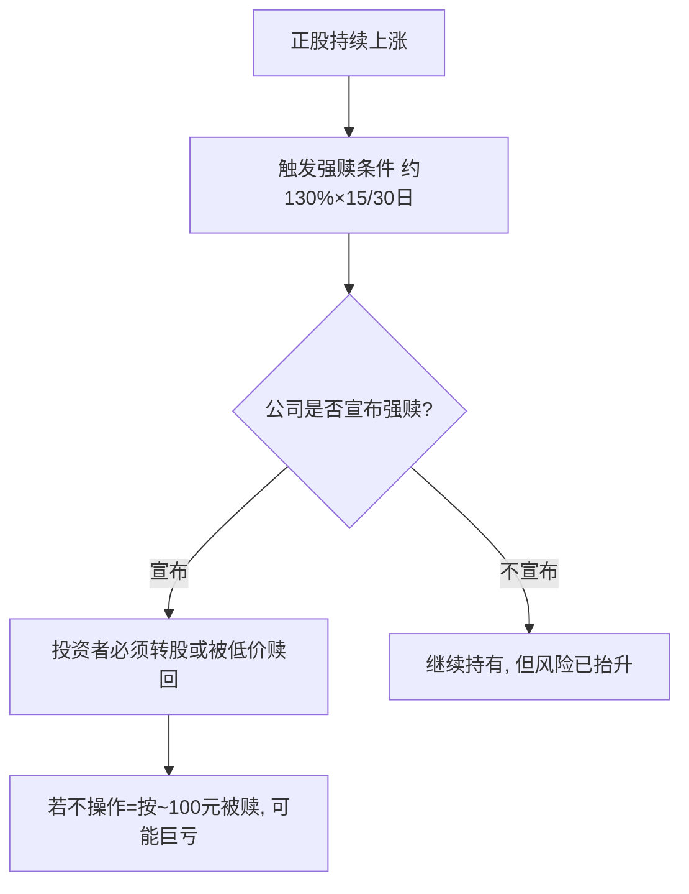

# 转债强赎条款与投资机会

> [!note] 为什么强赎重要
> 强制赎回（强赎）是可转债最容易被新手忽视、却最可能造成"莫名亏损"的条款。理解它既能避坑，也能在公司有强烈促转股意愿时抓住机会。**本篇所有数字均为示意性经验描述，非精确统计**，重点在机制与判断逻辑。

## 一、强赎条款机制

典型条款：正股价在连续 30 个交易日中，有至少 15 个交易日收盘价 ≥ 转股价的 **130%**，公司有权按约定价格（通常面值附近，约 100–101 元）强制赎回。

> [!warning] 强赎是最常见的"被动亏损"来源
> 若转债市价已涨到 130+，而你忘记在赎回登记日前卖出或转股，会被按约 100 元赎回——凭空亏掉几十个点。**看到持仓转债带强赎标记，务必第一时间处理。**

## 二、公司为什么要强赎

强赎的本质是**逼投资者转股**，从而免除还本付息压力、把负债变成股本。所以以下公司促转股（强赎）意愿更强：

| 维度 | 促转股意愿强的特征（经验，非精确） |
|---|---|
| 负债压力 | 资产负债率高、还债压力大 |
| 历史行为 | 曾下修转股价（释放促转股信号） |
| 未转股比例 | 偏低（大部分已转，临门一脚） |
| 剩余期限 | 临近到期，还债压力迫近 |
| 余额规模 | 偏小，赎回/转股推进更容易 |

> [!note] 数据是"倾向"不是"定律"
> 坊间研究常给出"强赎组未转股比例更低、评级更低、市值更小"等统计倾向。方向可参考，但具体百分比口径不一，**不要当成精确预测公式**。

## 三、两类机会

### 机会 A：促转股上行（强赎前）
若判断公司有强烈促转股意愿、正股有上行动力，转债可能在触发强赎前跟随正股上涨。提前布局、在强赎公告前后择机退出，是一种博弈。**风险**：判断错误、正股下跌、强赎落空。

### 机会 B：下修博弈
公司为推动转股，可能**下修转股价**，下修后转股价值跳升、转债上涨。关注有下修动机（大股东持债、临近回售）的标的。**风险**：下修需股东大会通过，可能失败。

## 四、强赎博弈的实操判断

> [!tip] 提高胜率的关注点（经验清单）
> - 未转股比例较低（促转股临门一脚）
> - 股权稀释率不高（公司更愿促转股）
> - 大股东/管理层尚未减持完毕
> - 余额较小、临近到期
> - 正股有题材或上行动力
>
> 满足越多，促转股（强赎）概率经验上越高。

> [!warning] 退出时点风险
> 强赎公告**次日**转债常因"赎回价 ≈ 面值"而下跌（经验上跌幅可观）。博弈强赎要预设退出纪律，别等公告后才反应。

## 五、强赎 vs 到期赎回 vs 回售

| 条款 | 谁主动 | 触发 | 对投资者 |
|---|---|---|---|
| 强制赎回 | 公司 | 正股大涨 | 逼你转股，忘操作会亏 |
| 到期赎回 | 公司 | 到期 | 按约定本息兑付 |
| 回售 | 投资者 | 正股长期低迷等 | 你有权把债卖回公司，保护下限 |

## 常见误区

| 误区 | 更好的理解 |
|---|---|
| 强赎=利好 | 对忘记操作的人是利空（被低价赎回） |
| 触发条件=一定强赎 | 公司"有权"不等于"一定"赎回 |
| 下修一定成功 | 需股东会通过，可能失败 |
| 强赎公告后还能拿 | 通常下跌，且有赎回登记截止日 |
| 临期高价债很安全 | 强赎/到期临近，时间价值快速衰减 |

## 相关链接
- [[投资策略核心逻辑]]
- [[2025年转债估值双击]]
- [[可转债核心概念]]
- [[转债信用风险可控]]

## 实战掌握清单

> [!tip] 交易者视角
> 转债强赎条款与投资机会 的学习重点不是记住术语，而是把它放进研究、组合、执行和复盘的闭环。可转债同时含债性、股性、期权性和条款博弈，必须把价格、溢价率、评级、正股和流动性一起看。

### 关键判断

- 先拆分债底、转股价值、转股溢价率和到期收益率。
- 检查强赎、回售、下修、赎回价格和剩余期限。
- 用正股基本面和信用风险解释转债波动。

### 落地动作

1. 双低策略要同时看价格、溢价率、规模和成交。
2. 量化选债要记录停牌、强赎公告和流动性过滤。
3. 组合中限制低评级、临近强赎和小规模券暴露。

### 失效边界

- 只看低价忽略信用风险。
- 只看低溢价忽略正股下跌。
- 强赎风险未及时处理。

### 复盘问题

- 这项知识改变了哪一个具体决策：标的、方向、仓位、退出、对冲还是不交易？
- 如果判断相反，最大亏损、最长恢复期和退出触发条件是什么？
- 有没有一个更简单的基准方法可以取得相近结果？
