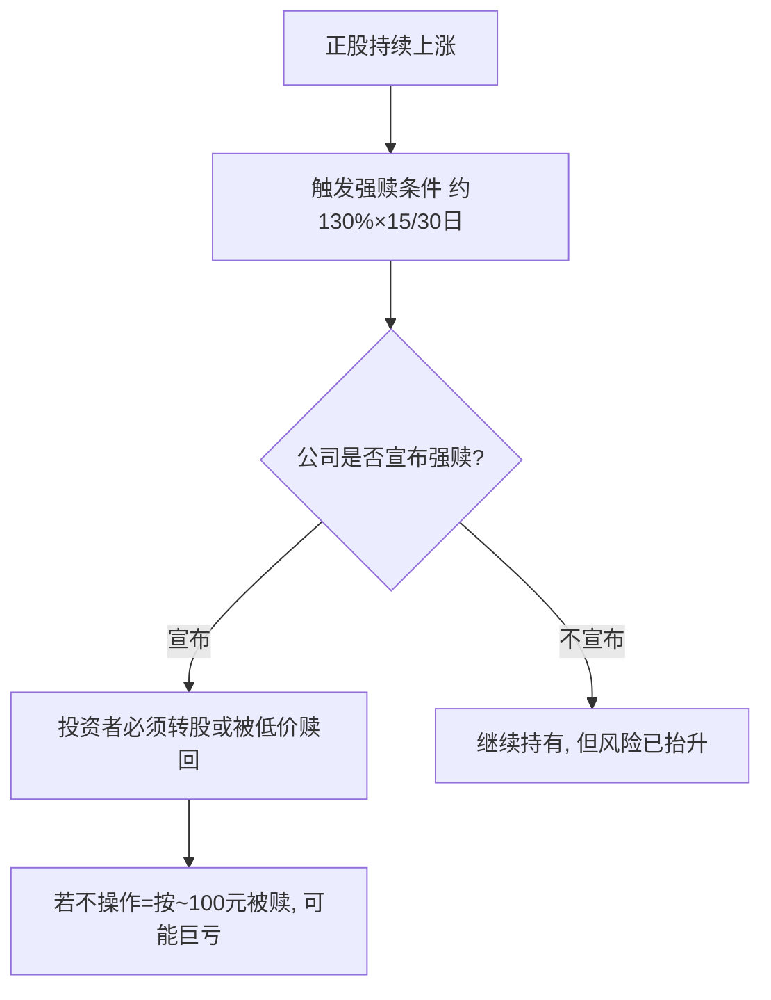

# 转债强赎条款与投资机会

> [!note] 为什么强赎重要
> 强制赎回（强赎）是可转债最容易被新手忽视、却最可能造成"莫名亏损"的条款。理解它既能避坑，也能在公司有强烈促转股意愿时抓住机会。**本篇所有数字均为示意性经验描述，非精确统计**，重点在机制与判断逻辑。

## 一、强赎条款机制

典型条款：正股价在连续 30 个交易日中，有至少 15 个交易日收盘价 ≥ 转股价的 **130%**，公司有权按约定价格（通常面值附近，约 100–101 元）强制赎回。

> [!warning] 强赎是最常见的"被动亏损"来源
> 若转债市价已涨到 130+，而你忘记在赎回登记日前卖出或转股，会被按约 100 元赎回——凭空亏掉几十个点。**看到持仓转债带强赎标记，务必第一时间处理。**

## 二、公司为什么要强赎

强赎的本质是**逼投资者转股**，从而免除还本付息压力、把负债变成股本。所以以下公司促转股（强赎）意愿更强：

| 维度 | 促转股意愿强的特征（经验，非精确） |
|---|---|
| 负债压力 | 资产负债率高、还债压力大 |
| 历史行为 | 曾下修转股价（释放促转股信号） |
| 未转股比例 | 偏低（大部分已转，临门一脚） |
| 剩余期限 | 临近到期，还债压力迫近 |
| 余额规模 | 偏小，赎回/转股推进更容易 |

> [!note] 数据是"倾向"不是"定律"
> 坊间研究常给出"强赎组未转股比例更低、评级更低、市值更小"等统计倾向。方向可参考，但具体百分比口径不一，**不要当成精确预测公式**。

## 三、两类机会

### 机会 A：促转股上行（强赎前）
若判断公司有强烈促转股意愿、正股有上行动力，转债可能在触发强赎前跟随正股上涨。提前布局、在强赎公告前后择机退出，是一种博弈。**风险**：判断错误、正股下跌、强赎落空。

### 机会 B：下修博弈
公司为推动转股，可能**下修转股价**，下修后转股价值跳升、转债上涨。关注有下修动机（大股东持债、临近回售）的标的。**风险**：下修需股东大会通过，可能失败。

## 四、强赎博弈的实操判断

> [!tip] 提高胜率的关注点（经验清单）
> - 未转股比例较低（促转股临门一脚）
> - 股权稀释率不高（公司更愿促转股）
> - 大股东/管理层尚未减持完毕
> - 余额较小、临近到期
> - 正股有题材或上行动力
>
> 满足越多，促转股（强赎）概率经验上越高。

> [!warning] 退出时点风险
> 强赎公告**次日**转债常因"赎回价 ≈ 面值"而下跌（经验上跌幅可观）。博弈强赎要预设退出纪律，别等公告后才反应。

## 五、强赎 vs 到期赎回 vs 回售

| 条款 | 谁主动 | 触发 | 对投资者 |
|---|---|---|---|
| 强制赎回 | 公司 | 正股大涨 | 逼你转股，忘操作会亏 |
| 到期赎回 | 公司 | 到期 | 按约定本息兑付 |
| 回售 | 投资者 | 正股长期低迷等 | 你有权把债卖回公司，保护下限 |

## 常见误区

| 误区 | 更好的理解 |
|---|---|
| 强赎=利好 | 对忘记操作的人是利空（被低价赎回） |
| 触发条件=一定强赎 | 公司"有权"不等于"一定"赎回 |
| 下修一定成功 | 需股东会通过，可能失败 |
| 强赎公告后还能拿 | 通常下跌，且有赎回登记截止日 |
| 临期高价债很安全 | 强赎/到期临近，时间价值快速衰减 |

## 相关链接
- [[投资策略核心逻辑]]
- [[2025年转债估值双击]]
- [[可转债核心概念]]
- [[转债信用风险可控]]

## 课程化学习补充

> [!important] 学习定位
> 可转债同时有债性、股性和条款博弈，分析必须把债底、转股价值、溢价率、信用风险和强赎风险放在一起。本文仅用于学习、研究与复盘，不构成任何投资建议。

### 必须掌握的问题

- 债底和 YTM 是否合理
- 转股溢价率是否过高
- 正股弹性和信用质量如何
- 强赎/回售/下修条款是否触发临界

### 实战应用流程

1. 先写清楚你的投资假设：为什么这个信号、资产或方法应该产生收益。
2. 明确数据口径：样本范围、更新时间、复权/分红/停牌处理和交易日历。
3. 做最小可行验证：先用简单规则验证方向，再逐步加入复杂模型。
4. 把成本和约束前置：手续费、滑点、冲击成本、保证金、流动性和容量都要进入测算。
5. 上线后持续复盘：记录信号、下单、成交、持仓、回撤和失效原因。

### 风险与失效条件

- 信用下沉
- 高价高溢价双杀
- 流动性薄导致滑点
- 强赎前追高

### 复盘问题

- 这笔交易或这套模型赚的是什么钱：风险补偿、行为偏差、流动性溢价，还是偶然噪音？
- 如果市场环境反过来，最大亏损和最长恢复期会是多少？
- 当前结论是否依赖某个不可持续假设，例如低利率、低波动、充裕流动性或监管套利？
- 有没有一个更简单的基准策略能取得接近效果？

### 延伸学习

- [[可转债核心概念]]
- [[固定收益与利率]]
- [[市场微观结构与交易执行]]
- [[风险度量指标]]

## 跨领域进阶扩展

> [!tip] 交易者视角
> 学到 `转债强赎条款与投资机会` 时，不要只把它当成孤立知识点。把可转债拆成债底、股性、条款和流动性四个维度。优秀投资交易者会把它放入“宏观背景 - 资产选择 - 估值/信号 - 组合风险 - 交易执行 - 复盘反馈”的闭环。

### 与其他知识的连接

- 正股基本面和波动率
- 转股溢价率、YTM 和债底
- 强赎、回售、下修和信用风险
- 盘口流动性和交易制度

### 进阶训练

1. 给一只转债画出债底-转股价值-溢价率图
2. 列出条款触发条件
3. 测算强赎风险和流动性退出成本

### 能力验收

- 能否说清楚这个主题影响的是收益来源、风险来源、交易成本、流动性还是心理纪律？
- 能否指出它在什么市场环境、资产类别或交易周期中更有效？
- 能否把它写成一条可复盘的研究或交易规则？
- 能否说明如果判断错误，组合最大损失和退出机制是什么？

### 全局关联

- [[综合金融知识体系/金融投资全知识地图|金融投资全知识地图]]
- [[综合金融知识体系/优秀投资交易者能力地图|优秀投资交易者能力地图]]
- [[综合金融知识体系/一次性学习路线与复盘模板|一次性学习路线与复盘模板]]
