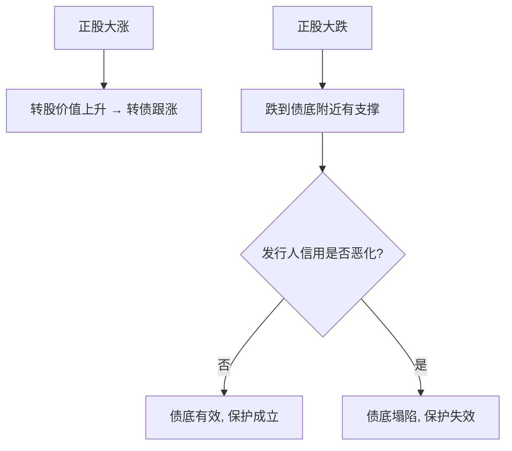

# 可转债投资策略核心逻辑与实操要点

> [!note] 一个核心、六个打法
> 可转债之所以值得单独研究，是因为它**下有债底保护、上享股票弹性**的非对称结构。理解这个核心，再去看六种常见打法（下修博弈、强赎防守、热门题材、惰性债、双低、小规模妖债）就有了统一的底层逻辑。本篇所有具体数字均为**示例**，用于说明逻辑，不代表精确统计或推荐个券。

## 一、核心逻辑：非对称的攻守结构

可转债价格由三块支撑（详见 [[可转债核心概念]]）：

$$
\text{转债价格} \approx \max(\underbrace{\text{纯债价值}}_{\text{债底，保底}},\ \underbrace{\text{转股价值}}_{\text{股性}}) + \text{期权时间价值}
$$

- **下有底**：只要发行人不违约，纯债价值提供保底；
- **上不封顶**：正股大涨时，转股价值随之上行，转债跟涨；
- **代价**：你为这份"保险"付出了溢价率（买得比转股价值贵）。

> [!warning] "保底"是有条件的
> 债底依赖发行人偿债能力。一旦信用恶化、评级下调，债底会下移甚至失效（见 [[转债信用风险可控]]）。"下有保底"不等于"绝对安全"。

## 二、按价位区间选策略

不同价位的转债，债性/股性占比不同，适合的打法不同：

| 价位区间（示例） | 类型 | 特征 | 适合 |
|---|---|---|---|
| 偏低（接近债底） | 债性 | 跌不动、涨得慢 | 防守、收息、博下修 |
| 中间 | 平衡型 | 攻守兼备 | 双低轮动主战场 |
| 偏高（深度实值） | 偏股 | 跟随正股、溢价低 | 看好正股的进攻 |

> [!tip] 选债先看"我要它的债性还是股性"
> 想要保护就买偏债性、低溢价的；想要弹性就买偏股性的。最怕"高价格+高溢价"——既没保护又没弹性。

## 三、六大打法速览

### 1. 下修博弈 📉
买价格低、债底扎实的转债，博公司下修转股价（下修后转股价值跳升、转债上涨）。关注大股东持债比例高、有促转股动机的标的。**风险**：下修需股东大会通过，可能失败或不及预期。

### 2. 强赎防守 🔐
高负债、历史上下修过的公司促转股意愿强。回避临近到期、强赎价极低的标的。详见 [[强赎条款与投资机会]]。

### 3. 热门题材 🚀
热门板块（如 AI、半导体）的转债在 YTM 仍为正时，兼具"防守+进攻"。**风险**：题材退潮时溢价率会快速压缩。

### 4. 惰性债 💤
利率下行期，固收资金追逐高息资产。挑基本面安全、纯债 YTM 较高的"躺着收息"标的，下修是意外彩蛋。**风险**：弱资质（低评级）债的高 YTM 是信用风险补偿，不是免费午餐。

### 5. 双低策略 ⚖️
低价格 + 低溢价率，兼顾债性保护与股性弹性。这是个人最实用的系统化打法，详见 [[双低策略详解]]、[[双低轮动策略]]。

### 6. 小规模妖债 🎭
余额小的转债易被游资炒作。**风险极高**：波动剧烈、流动性差、强赎/退市风险，纯属投机，仓位务必极小。

## 四、六大打法对比

| 打法 | 收益来源 | 主要风险 | 难度 |
|---|---|---|---|
| 下修博弈 | 转股价下修 | 下修失败/落空 | 中 |
| 强赎防守 | 促转股上行 | 误判、退出时点 | 中 |
| 热门题材 | 正股+情绪 | 题材退潮、杀溢价 | 中高 |
| 惰性债 | 票息+下修彩蛋 | 信用风险 | 低 |
| 双低 | 债性保护+股性弹性 | 系统性下跌 | 低（推荐起步） |
| 小妖债 | 游资炒作 | 暴跌、流动性、退市 | 极高（投机） |

## 常见误区

| 误区 | 更好的理解 |
|---|---|
| 可转债=保本理财 | 债底依赖信用，会塌；还有强赎风险 |
| 高价高溢价也能买 | 既无保护又无弹性，最差组合 |
| 妖债涨得快值得追 | 投机，极易接盘在最高点 |
| 下修一定会发生 | 需股东会通过，可能失败 |
| 不看强赎条款 | 强赎公告后转债常下跌，可能被动割肉 |

## 相关链接
- [[双低策略详解]]
- [[强赎条款与投资机会]]
- [[QMT折溢价套利]]
- [[可转债核心概念]]
- [[固定收益与利率]]
- [[风险管理框架]]

## 实战掌握清单

> [!tip] 交易者视角
> 可转债投资策略核心逻辑与实操要点 的学习重点不是记住术语，而是把它放进研究、组合、执行和复盘的闭环。可转债同时含债性、股性、期权性和条款博弈，必须把价格、溢价率、评级、正股和流动性一起看。

### 关键判断

- 先拆分债底、转股价值、转股溢价率和到期收益率。
- 检查强赎、回售、下修、赎回价格和剩余期限。
- 用正股基本面和信用风险解释转债波动。

### 落地动作

1. 双低策略要同时看价格、溢价率、规模和成交。
2. 量化选债要记录停牌、强赎公告和流动性过滤。
3. 组合中限制低评级、临近强赎和小规模券暴露。

### 失效边界

- 只看低价忽略信用风险。
- 只看低溢价忽略正股下跌。
- 强赎风险未及时处理。

### 复盘问题

- 这项知识改变了哪一个具体决策：标的、方向、仓位、退出、对冲还是不交易？
- 如果判断相反，最大亏损、最长恢复期和退出触发条件是什么？
- 有没有一个更简单的基准方法可以取得相近结果？
