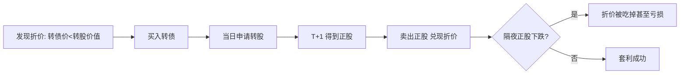

# QMT量化实战：可转债折溢价套利策略

> [!note] 本篇定位
> 讲清两类可转债套利——**折价套利**（买债转股卖股）和**双低轮动**（统计套利）的原理，以及在 QMT/miniQMT 实盘落地时的工程细节与陷阱。重点：折价套利看着"无风险"，实则受 T+1、停牌、规模等约束，真正能稳定做的是带风控的双低轮动。

## 一、两类套利对比

| 类型 | 操作 | 风险等级 | 难点 |
|---|---|---|---|
| 折价套利 | 转债价 < 转股价值 → 买转债 → 转股 → 次日卖正股 | 看似低，实则有隔夜风险 | T+1、停牌、折价稍纵即逝 |
| 双低轮动 | 买"低价+低溢价"转债，博估值修复 | 统计套利（系统性风险） | 选债与轮动纪律 |

## 二、折价套利的数学

$$
\text{转股价值}=\frac{100}{\text{转股价}}\times\text{正股价},\qquad
\text{折价率}=\frac{\text{转股价值}-\text{转债价格}}{\text{转债价格}}
$$

当折价率 > 0（转债比转股后价值便宜）时，理论上：买入转债 → 当日转股 → 得到正股 → **次日**卖出正股，赚折价。



> [!warning] 折价套利没有想象中"无风险"
> 转股得到的正股 **T+1 才能卖**，隔夜正股若下跌，可能吃掉甚至超过折价收益。此外：折价转债往往规模小、流动性差、可能临近停牌或强赎。**这是带方向风险的套利，不是无风险套利。**

## 三、双低轮动（更现实的选择）

$$
\text{溢价率}=\frac{\text{转债价}-\text{转股价值}}{\text{转股价值}},\quad
\text{双低值}=\text{转债价}+\text{溢价率}(\%)\times100
$$

选债逻辑：
1. 取双低值最小的前 N 只；
2. 过滤剩余规模过小（流动性）、价格过高（强赎风险）、低评级（信用）；
3. 等权持有，定期轮动（见 [[双低轮动策略]]）。

## 四、QMT 实盘工程要点

| 环节 | 注意事项 |
|---|---|
| 数据 | 转股价等历史数据标准行情 API 常不直接提供，需 F10/财务数据包 |
| 转股动作 | 回测引擎通常**不支持模拟 T+1 转股**，需自行处理 |
| 下单 | 转债 T+0、正股 T+1，套利两腿规则不同 |
| 撮合/滑点 | 小规模转债盘口薄，市价单冲击大，优先限价 |
| 风控 | 单券上限、停牌/强赎前剔除、隔夜敞口控制 |

```python
# 双低轮动选债（QMT 思路伪代码）
def select_double_low(df, n=20):
    df["转股价值"] = 100 / df["转股价"] * df["正股价"]
    df["溢价率"] = (df["现价"] / df["转股价值"] - 1) * 100
    df["双低值"] = df["现价"] + df["溢价率"]
    pool = df[(df["余额"] >= 2) & (df["现价"] <= 130) & (~df["已强赎"])]
    return pool.nsmallest(n, "双低值")
```

## 常见误区

| 误区 | 更好的理解 |
|---|---|
| 折价套利无风险 | T+1 隔夜+流动性+停牌风险，是方向性套利 |
| 折价越大越好 | 大折价往往伴随停牌/退市/流动性风险 |
| 回测能模拟转股 | 多数引擎不支持，需自行建模 |
| 小规模债容量无限 | 盘口薄，资金稍大就打满冲击成本 |
| 双低轮动=套利无风险 | 它是统计套利，系统性下跌仍亏 |

## 相关链接
- [[量化选债系统]]
- [[量化择时与轮动策略]]
- [[双低策略详解]]
- [[双低轮动策略]]
- [[市场微观结构与交易执行]]

## 课程化学习补充

> [!important] 学习定位
> 可转债同时有债性、股性和条款博弈，分析必须把债底、转股价值、溢价率、信用风险和强赎风险放在一起。本文仅用于学习、研究与复盘，不构成任何投资建议。

### 必须掌握的问题

- 债底和 YTM 是否合理
- 转股溢价率是否过高
- 正股弹性和信用质量如何
- 强赎/回售/下修条款是否触发临界

### 实战应用流程

1. 先写清楚你的投资假设：为什么这个信号、资产或方法应该产生收益。
2. 明确数据口径：样本范围、更新时间、复权/分红/停牌处理和交易日历。
3. 做最小可行验证：先用简单规则验证方向，再逐步加入复杂模型。
4. 把成本和约束前置：手续费、滑点、冲击成本、保证金、流动性和容量都要进入测算。
5. 上线后持续复盘：记录信号、下单、成交、持仓、回撤和失效原因。

### 风险与失效条件

- 信用下沉
- 高价高溢价双杀
- 流动性薄导致滑点
- 强赎前追高

### 复盘问题

- 这笔交易或这套模型赚的是什么钱：风险补偿、行为偏差、流动性溢价，还是偶然噪音？
- 如果市场环境反过来，最大亏损和最长恢复期会是多少？
- 当前结论是否依赖某个不可持续假设，例如低利率、低波动、充裕流动性或监管套利？
- 有没有一个更简单的基准策略能取得接近效果？

### 延伸学习

- [[可转债核心概念]]
- [[固定收益与利率]]
- [[市场微观结构与交易执行]]
- [[风险度量指标]]

## 跨领域进阶扩展

> [!tip] 交易者视角
> 学到 `QMT量化实战：可转债折溢价套利策略` 时，不要只把它当成孤立知识点。把可转债拆成债底、股性、条款和流动性四个维度。优秀投资交易者会把它放入“宏观背景 - 资产选择 - 估值/信号 - 组合风险 - 交易执行 - 复盘反馈”的闭环。

### 与其他知识的连接

- 正股基本面和波动率
- 转股溢价率、YTM 和债底
- 强赎、回售、下修和信用风险
- 盘口流动性和交易制度

### 进阶训练

1. 给一只转债画出债底-转股价值-溢价率图
2. 列出条款触发条件
3. 测算强赎风险和流动性退出成本

### 能力验收

- 能否说清楚这个主题影响的是收益来源、风险来源、交易成本、流动性还是心理纪律？
- 能否指出它在什么市场环境、资产类别或交易周期中更有效？
- 能否把它写成一条可复盘的研究或交易规则？
- 能否说明如果判断错误，组合最大损失和退出机制是什么？

### 全局关联

- [[综合金融知识体系/金融投资全知识地图|金融投资全知识地图]]
- [[综合金融知识体系/优秀投资交易者能力地图|优秀投资交易者能力地图]]
- [[综合金融知识体系/一次性学习路线与复盘模板|一次性学习路线与复盘模板]]
