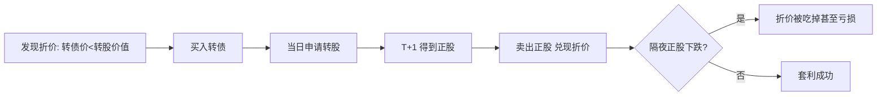

# QMT量化实战：可转债折溢价套利策略

> [!note] 本篇定位
> 讲清两类可转债套利——**折价套利**（买债转股卖股）和**双低轮动**（统计套利）的原理，以及在 QMT/miniQMT 实盘落地时的工程细节与陷阱。重点：折价套利看着"无风险"，实则受 T+1、停牌、规模等约束，真正能稳定做的是带风控的双低轮动。

## 一、两类套利对比

| 类型 | 操作 | 风险等级 | 难点 |
|---|---|---|---|
| 折价套利 | 转债价 < 转股价值 → 买转债 → 转股 → 次日卖正股 | 看似低，实则有隔夜风险 | T+1、停牌、折价稍纵即逝 |
| 双低轮动 | 买"低价+低溢价"转债，博估值修复 | 统计套利（系统性风险） | 选债与轮动纪律 |

## 二、折价套利的数学

$$
\text{转股价值}=\frac{100}{\text{转股价}}\times\text{正股价},\qquad
\text{折价率}=\frac{\text{转股价值}-\text{转债价格}}{\text{转债价格}}
$$

当折价率 > 0（转债比转股后价值便宜）时，理论上：买入转债 → 当日转股 → 得到正股 → **次日**卖出正股，赚折价。



> [!warning] 折价套利没有想象中"无风险"
> 转股得到的正股 **T+1 才能卖**，隔夜正股若下跌，可能吃掉甚至超过折价收益。此外：折价转债往往规模小、流动性差、可能临近停牌或强赎。**这是带方向风险的套利，不是无风险套利。**

## 三、双低轮动（更现实的选择）

$$
\text{溢价率}=\frac{\text{转债价}-\text{转股价值}}{\text{转股价值}},\quad
\text{双低值}=\text{转债价}+\text{溢价率}(\%)\times100
$$

选债逻辑：
1. 取双低值最小的前 N 只；
2. 过滤剩余规模过小（流动性）、价格过高（强赎风险）、低评级（信用）；
3. 等权持有，定期轮动（见 [[双低轮动策略]]）。

## 四、QMT 实盘工程要点

| 环节 | 注意事项 |
|---|---|
| 数据 | 转股价等历史数据标准行情 API 常不直接提供，需 F10/财务数据包 |
| 转股动作 | 回测引擎通常**不支持模拟 T+1 转股**，需自行处理 |
| 下单 | 转债 T+0、正股 T+1，套利两腿规则不同 |
| 撮合/滑点 | 小规模转债盘口薄，市价单冲击大，优先限价 |
| 风控 | 单券上限、停牌/强赎前剔除、隔夜敞口控制 |

```python
# 双低轮动选债（QMT 思路伪代码）
def select_double_low(df, n=20):
    df["转股价值"] = 100 / df["转股价"] * df["正股价"]
    df["溢价率"] = (df["现价"] / df["转股价值"] - 1) * 100
    df["双低值"] = df["现价"] + df["溢价率"]
    pool = df[(df["余额"] >= 2) & (df["现价"] <= 130) & (~df["已强赎"])]
    return pool.nsmallest(n, "双低值")
```

## 常见误区

| 误区 | 更好的理解 |
|---|---|
| 折价套利无风险 | T+1 隔夜+流动性+停牌风险，是方向性套利 |
| 折价越大越好 | 大折价往往伴随停牌/退市/流动性风险 |
| 回测能模拟转股 | 多数引擎不支持，需自行建模 |
| 小规模债容量无限 | 盘口薄，资金稍大就打满冲击成本 |
| 双低轮动=套利无风险 | 它是统计套利，系统性下跌仍亏 |

## 相关链接
- [[量化选债系统]]
- [[量化择时与轮动策略]]
- [[双低策略详解]]
- [[双低轮动策略]]
- [[市场微观结构与交易执行]]

## 实战掌握清单

> [!tip] 交易者视角
> QMT量化实战：可转债折溢价套利策略 的学习重点不是记住术语，而是把它放进研究、组合、执行和复盘的闭环。可转债同时含债性、股性、期权性和条款博弈，必须把价格、溢价率、评级、正股和流动性一起看。

### 关键判断

- 先拆分债底、转股价值、转股溢价率和到期收益率。
- 检查强赎、回售、下修、赎回价格和剩余期限。
- 用正股基本面和信用风险解释转债波动。

### 落地动作

1. 双低策略要同时看价格、溢价率、规模和成交。
2. 量化选债要记录停牌、强赎公告和流动性过滤。
3. 组合中限制低评级、临近强赎和小规模券暴露。

### 失效边界

- 只看低价忽略信用风险。
- 只看低溢价忽略正股下跌。
- 强赎风险未及时处理。

### 复盘问题

- 这项知识改变了哪一个具体决策：标的、方向、仓位、退出、对冲还是不交易？
- 如果判断相反，最大亏损、最长恢复期和退出触发条件是什么？
- 有没有一个更简单的基准方法可以取得相近结果？
