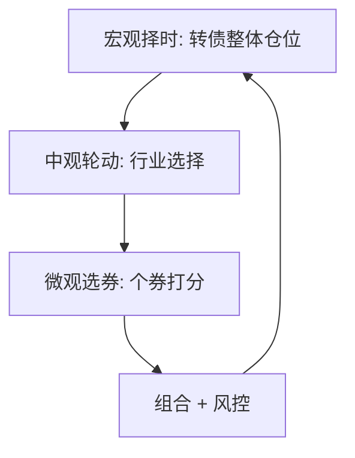

# 可转债量化择时、轮动、选券策略

> [!note] 三层框架
> 转债量化可以分三个层次：**宏观择时**（整体转债该多配还是少配）、**中观轮动**（在哪些行业的转债上）、**微观选券**（具体买哪几只）。三层各司其职，叠加才完整。下文所有收益/回撤数字均为**示意**，用于说明思路差异，不代表可复制的业绩。

## 一、宏观择时：转债整体估值

判断转债**整体**便宜还是贵，决定总仓位：

| 信号 | 含义 | 倾向 |
|---|---|---|
| 全市场转股溢价率中位数 | 估值高低 | 偏高→减仓 |
| 破面（<100元）转债占比 | 债性保护充裕度 | 占比高→机会多 |
| 转债隐含波动率 vs 正股已实现波动率 | 期权贵不贵 | 隐含过高→谨慎 |
| 纯债 YTM 中枢 | 债底吸引力 | YTM 高→防守价值高 |

> [!tip] 择时不是预测点位
> 择时这里指的是"在整体贵的时候少配、便宜的时候多配"，是估值驱动的仓位管理，不是预测涨跌。

## 二、低价策略的改进

传统"只买最低价"策略的两个问题：**信用风险**（低价里混着信用陷阱）和**容量小**（极低价标的少）。改进方向：

| 改进 | 思路 |
|---|---|
| 次低价"缝补" | 不取最极端低价，取次低价区间，规避信用雷、扩大容量 |
| 期权式"平替" | 用低溢价、债底扎实的标的替代纯低价，提升弹性 |
| 信用过滤 | 限定评级，剔除弱资质（见 [[转债信用风险可控]]） |

## 三、双低多因子增强

在"价格 + 溢价率"双低基础上，叠加更多因子提升稳健性：

| 增强因子 | 作用 |
|---|---|
| 双低值历史分位数 | 判断当前是否处于相对便宜区间 |
| 隐含波动率 | 期权价值视角，低估的"便宜期权" |
| 转债价格动量 | 捕捉趋势/规避持续走弱 |
| 正股质量/动量 | 股性来源的基本面与趋势 |
| 余额/流动性 | 控制冲击成本 |

合成与检验方法见 [[多因子策略实战]]、[[因子检验与评价]]。

## 四、中观行业轮动

在行业层面分配转债权重，思路同股票行业轮动：

- 用**行业转债动量**（前期超跌后的均值回归空间）或正股景气度选行业；
- 控制单一行业权重上限，分散风险；
- 轮动周期不宜过快（成本）。

## 五、组合与风控

## 常见误区

| 误区 | 更好的理解 |
|---|---|
| 多因子=年化越高越好 | 因子越多越易过拟合，要样本外验证 |
| 择时=预测涨跌 | 这里是估值驱动的仓位管理 |
| 行业轮动越勤越好 | 成本会侵蚀收益 |
| 低价就是便宜 | 低价可能是信用风险定价 |
| 忽略容量 | 极端低价策略容量小，资金一大就失效 |

## 相关链接
- [[双低策略详解]]
- [[量化选债系统]]
- [[QMT折溢价套利]]
- [[多因子策略实战]]
- [[因子检验与评价]]
- [[转债信用风险可控]]
