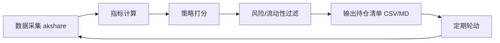

# 可转债量化选债系统

> [!note] 本篇定位
> 把可转债投资**系统化**：自动拉全市场数据 → 算关键指标 → 按策略打分筛选 → 风险过滤 → 输出持仓清单。本篇给出这套系统的结构、关键指标公式、多策略设计和 Python 思路骨架。数字均为示例。

## 一、系统架构



| 模块 | 职责 |
|---|---|
| 数据采集 | 用 akshare 等免费源拉全市场转债行情与正股数据 |
| 指标计算 | 转股价值、溢价率、YTM、纯债价值、双低值 |
| 策略打分 | 按选定策略对转债打分排序 |
| 风险过滤 | 剔除强赎/临期/低评级/低流动性 |
| 输出 | 生成持仓清单与报告 |

**环境**：Python 3.8+，依赖 `pandas / numpy / akshare / scipy`。

## 二、关键指标

$$
\text{转股价值}=\frac{100}{\text{转股价}}\times\text{正股价},\quad
\text{溢价率}=\frac{\text{转债价}-\text{转股价值}}{\text{转股价值}}
$$
$$
\text{双低值}=\text{转债价}+\text{溢价率}(\%)\times100
$$

纯债价值（债底）= 把票息与本金按合适的信用折现率贴现；YTM = 使现金流现值等于现价的内部收益率（见 [[固定收益与利率]]）。

## 三、内置多策略

| 策略 | 思路 | 适用 |
|---|---|---|
| 双低 | 双低值最小 | 震荡市、攻守兼备 |
| 高 YTM | 纯债收益率高 | 熊市防守、收息 |
| 下修博弈 | 低价+下修动机 | 博弈下修 |
| 低溢价 | 溢价率最低 | 牛市/看好正股进攻 |
| 综合评分 | 多因子加权 | 默认通用 |
| 估值模型 | 拆解期权价值选低估 | 寻找定价偏差 |

### 期权式估值思路（示意）

$$
\text{转债理论值} \approx \max(\text{债底},\ \text{回售价值}) + \text{转股期权价值} + \text{下修期权价值} - \text{强赎损失}$$

把转债拆成"债 + 多个期权"来估值，再选市价低于理论值的（呼应 [[衍生品与期权进阶]] 的期权思想）。

## 四、Python 思路骨架

```python
import akshare as ak
import pandas as pd

# 1) 取全市场转债数据（字段名以实际接口为准）
df = ak.bond_cb_jsl()          # 示例：集思录式数据
# 2) 指标
df["转股价值"] = 100 / df["转股价"] * df["正股价"]
df["溢价率"] = (df["现价"] / df["转股价值"] - 1) * 100
df["双低值"] = df["现价"] + df["溢价率"]
# 3) 风险过滤
mask = (~df["已强赎"]) & (df["剩余年限"] >= 1) & (df["评级"] >= "AA-") & (df["余额"] >= 2)
pool = df[mask]
# 4) 策略打分（以双低为例）
result = pool.nsmallest(20, "双低值")`"代码", "名称", "现价", "溢价率", "双低值"`
result.to_csv("持仓清单.csv", index=False)
```

## 五、按市场环境切换策略

| 市场环境 | 推荐策略 |
|---|---|
| 牛市/看好正股 | 低溢价（进攻） |
| 震荡市 | 双低、综合评分 |
| 熊市/防守 | 高 YTM、估值模型 |
| 博弈下修 | 下修博弈 |

## 常见误区

| 误区 | 更好的理解 |
|---|---|
| 系统选出来就能闭眼买 | 仍需风险过滤与人工复核 |
| 不验证数据质量 | 转股价、余额等字段易错，需校验 |
| 回测年化照搬实盘 | 容量、成本、滑点会显著拉低 |
| 不更新评级/强赎状态 | 状态变化未剔除会踩雷 |

## 相关链接
- [[量化择时与轮动策略]]
- [[QMT折溢价套利]]
- [[双低策略详解]]
- [[可转债核心概念]]
- [[多因子策略实战]]

## 实战掌握清单

> [!tip] 交易者视角
> 可转债量化选债系统 的学习重点不是记住术语，而是把它放进研究、组合、执行和复盘的闭环。可转债同时含债性、股性、期权性和条款博弈，必须把价格、溢价率、评级、正股和流动性一起看。

### 关键判断

- 先拆分债底、转股价值、转股溢价率和到期收益率。
- 检查强赎、回售、下修、赎回价格和剩余期限。
- 用正股基本面和信用风险解释转债波动。

### 落地动作

1. 双低策略要同时看价格、溢价率、规模和成交。
2. 量化选债要记录停牌、强赎公告和流动性过滤。
3. 组合中限制低评级、临近强赎和小规模券暴露。

### 失效边界

- 只看低价忽略信用风险。
- 只看低溢价忽略正股下跌。
- 强赎风险未及时处理。

### 复盘问题

- 这项知识改变了哪一个具体决策：标的、方向、仓位、退出、对冲还是不交易？
- 如果判断相反，最大亏损、最长恢复期和退出触发条件是什么？
- 有没有一个更简单的基准方法可以取得相近结果？
