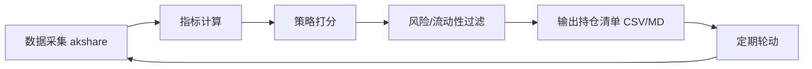

# 可转债量化选债系统

> [!note] 本篇定位
> 把可转债投资**系统化**：自动拉全市场数据 → 算关键指标 → 按策略打分筛选 → 风险过滤 → 输出持仓清单。本篇给出这套系统的结构、关键指标公式、多策略设计和 Python 思路骨架。数字均为示例。

## 一、系统架构



| 模块 | 职责 |
|---|---|
| 数据采集 | 用 akshare 等免费源拉全市场转债行情与正股数据 |
| 指标计算 | 转股价值、溢价率、YTM、纯债价值、双低值 |
| 策略打分 | 按选定策略对转债打分排序 |
| 风险过滤 | 剔除强赎/临期/低评级/低流动性 |
| 输出 | 生成持仓清单与报告 |

**环境**：Python 3.8+，依赖 `pandas / numpy / akshare / scipy`。

## 二、关键指标

$$
\text{转股价值}=\frac{100}{\text{转股价}}\times\text{正股价},\quad
\text{溢价率}=\frac{\text{转债价}-\text{转股价值}}{\text{转股价值}}
$$
$$
\text{双低值}=\text{转债价}+\text{溢价率}(\%)\times100
$$

纯债价值（债底）= 把票息与本金按合适的信用折现率贴现；YTM = 使现金流现值等于现价的内部收益率（见 [[固定收益与利率]]）。

## 三、内置多策略

| 策略 | 思路 | 适用 |
|---|---|---|
| 双低 | 双低值最小 | 震荡市、攻守兼备 |
| 高 YTM | 纯债收益率高 | 熊市防守、收息 |
| 下修博弈 | 低价+下修动机 | 博弈下修 |
| 低溢价 | 溢价率最低 | 牛市/看好正股进攻 |
| 综合评分 | 多因子加权 | 默认通用 |
| 估值模型 | 拆解期权价值选低估 | 寻找定价偏差 |

### 期权式估值思路（示意）

$$
\text{转债理论值} \approx \max(\text{债底},\ \text{回售价值}) + \text{转股期权价值} + \text{下修期权价值} - \text{强赎损失}$$

把转债拆成"债 + 多个期权"来估值，再选市价低于理论值的（呼应 [[衍生品与期权进阶]] 的期权思想）。

## 四、Python 思路骨架

```python
import akshare as ak
import pandas as pd

# 1) 取全市场转债数据（字段名以实际接口为准）
df = ak.bond_cb_jsl()          # 示例：集思录式数据
# 2) 指标
df["转股价值"] = 100 / df["转股价"] * df["正股价"]
df["溢价率"] = (df["现价"] / df["转股价值"] - 1) * 100
df["双低值"] = df["现价"] + df["溢价率"]
# 3) 风险过滤
mask = (~df["已强赎"]) & (df["剩余年限"] >= 1) & (df["评级"] >= "AA-") & (df["余额"] >= 2)
pool = df[mask]
# 4) 策略打分（以双低为例）
result = pool.nsmallest(20, "双低值")`"代码", "名称", "现价", "溢价率", "双低值"`
result.to_csv("持仓清单.csv", index=False)
```

## 五、按市场环境切换策略

| 市场环境 | 推荐策略 |
|---|---|
| 牛市/看好正股 | 低溢价（进攻） |
| 震荡市 | 双低、综合评分 |
| 熊市/防守 | 高 YTM、估值模型 |
| 博弈下修 | 下修博弈 |

## 常见误区

| 误区 | 更好的理解 |
|---|---|
| 系统选出来就能闭眼买 | 仍需风险过滤与人工复核 |
| 不验证数据质量 | 转股价、余额等字段易错，需校验 |
| 回测年化照搬实盘 | 容量、成本、滑点会显著拉低 |
| 不更新评级/强赎状态 | 状态变化未剔除会踩雷 |

## 相关链接
- [[量化择时与轮动策略]]
- [[QMT折溢价套利]]
- [[双低策略详解]]
- [[可转债核心概念]]
- [[多因子策略实战]]

## 课程化学习补充

> [!important] 学习定位
> 可转债同时有债性、股性和条款博弈，分析必须把债底、转股价值、溢价率、信用风险和强赎风险放在一起。本文仅用于学习、研究与复盘，不构成任何投资建议。

### 必须掌握的问题

- 债底和 YTM 是否合理
- 转股溢价率是否过高
- 正股弹性和信用质量如何
- 强赎/回售/下修条款是否触发临界

### 实战应用流程

1. 先写清楚你的投资假设：为什么这个信号、资产或方法应该产生收益。
2. 明确数据口径：样本范围、更新时间、复权/分红/停牌处理和交易日历。
3. 做最小可行验证：先用简单规则验证方向，再逐步加入复杂模型。
4. 把成本和约束前置：手续费、滑点、冲击成本、保证金、流动性和容量都要进入测算。
5. 上线后持续复盘：记录信号、下单、成交、持仓、回撤和失效原因。

### 风险与失效条件

- 信用下沉
- 高价高溢价双杀
- 流动性薄导致滑点
- 强赎前追高

### 复盘问题

- 这笔交易或这套模型赚的是什么钱：风险补偿、行为偏差、流动性溢价，还是偶然噪音？
- 如果市场环境反过来，最大亏损和最长恢复期会是多少？
- 当前结论是否依赖某个不可持续假设，例如低利率、低波动、充裕流动性或监管套利？
- 有没有一个更简单的基准策略能取得接近效果？

### 延伸学习

- [[可转债核心概念]]
- [[固定收益与利率]]
- [[市场微观结构与交易执行]]
- [[风险度量指标]]

## 跨领域进阶扩展

> [!tip] 交易者视角
> 学到 `可转债量化选债系统` 时，不要只把它当成孤立知识点。把可转债拆成债底、股性、条款和流动性四个维度。优秀投资交易者会把它放入“宏观背景 - 资产选择 - 估值/信号 - 组合风险 - 交易执行 - 复盘反馈”的闭环。

### 与其他知识的连接

- 正股基本面和波动率
- 转股溢价率、YTM 和债底
- 强赎、回售、下修和信用风险
- 盘口流动性和交易制度

### 进阶训练

1. 给一只转债画出债底-转股价值-溢价率图
2. 列出条款触发条件
3. 测算强赎风险和流动性退出成本

### 能力验收

- 能否说清楚这个主题影响的是收益来源、风险来源、交易成本、流动性还是心理纪律？
- 能否指出它在什么市场环境、资产类别或交易周期中更有效？
- 能否把它写成一条可复盘的研究或交易规则？
- 能否说明如果判断错误，组合最大损失和退出机制是什么？

### 全局关联

- [[综合金融知识体系/金融投资全知识地图|金融投资全知识地图]]
- [[综合金融知识体系/优秀投资交易者能力地图|优秀投资交易者能力地图]]
- [[综合金融知识体系/一次性学习路线与复盘模板|一次性学习路线与复盘模板]]
