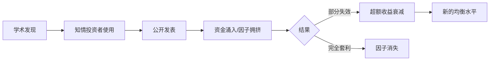

# 🔑 什么是因子？

> [!note] 核心定义
> 在量化金融中，**因子** 是指一组能够系统性解释资产横截面收益差异的**可度量特征**。形象地说，因子是给股票打分的评分标准——得分高的股票期望收益更高。

## 一、因子的直观理解

想象你面前有 5000 只股票，用**一个维度**给它们排序：

- **市盈率低** 的排前面 → 这是一个**价值因子**
- **过去6个月涨幅高** 的排前面 → 这是一个**动量因子**
- **波动率低** 的排前面 → 这是一个**低波动因子**

每个因子将股票分成"高分"组和"低分组"，投资者买入高分、卖空低分，获取因子溢价。

## 二、因子的经济学解释

因子为什么能产生超额收益？学术界有两大解释流派：

### 2.1 风险补偿说（理性框架）

| 因子 | 承担的风险 |
|-----|-----------|
| 价值因子 | 财务困境风险（价值股通常基本面不佳） |
| 规模因子 | 流动性风险（小盘股交易困难） |
| 动量因子 | 崩盘风险（动量策略在熊市反转时巨亏） |

> 投资者买入低估值的价值股，其实是在承担这些公司的**财务困境风险**，所以理应获得风险补偿。这符合**有效市场假说**。

### 2.2 行为金融说（非理性框架）

| 因子 | 行为偏差 |
|-----|---------|
| 价值因子 | 过度外推（过度悲观） |
| 动量因子 | 反应不足 / 证实偏差 |
| 低波动异象 | 彩票偏好（投资者追逐高波动博大涨） |

> 投资者由于认知偏差导致错误定价，因子正是利用这些定价错误来获利。但套利限制使得定价错误无法被快速消除。

## 三、因子 vs Alpha

| 概念 | 含义 | 获取方式 |
|-----|------|---------|
| **因子收益（Risk Premium）** | 承担已知系统性风险获得的补偿 | 被动暴露（Smart Beta） |
| **Alpha** | 超越因子模型解释的超额收益 | 主动选股能力 |

在 Fama-French 框架下，投资组合收益可以分解为：

$$R_i = α_i + β_{MKT}·MKT + β_{SMB}·SMB + β_{HML}·HML + ε_i$$

- 如果 $α_i > 0$ 且显著，说明存在**选股能力**
- 如果 $α_i ≈ 0$，说明收益完全由**因子暴露**解释

> [!tip] 关键洞察
> 大部分"明星基金经理"的超额收益，其实都来自对已知因子的**系统性暴露**，而非真正的选股能力。这就是为什么因子投资能"民主化"主动管理——通过ETF/指数基金就能获取因子溢价。

## 四、好因子的标准

| 标准 | 说明 |
|-----|------|
| **经济学逻辑** | 有合理的风险或行为解释 |
| **统计显著性** | 回测中 t-statistic > 2.0 |
| **稳健性** | 不同市场、不同时段均有效 |
| **可投资性** | 容量足够，交易成本可控 |
| **增量信息** | 与已知因子相关性低 |

## 五、因子的生命周期



> [!warning] 关键警示
> 因子发现并公开发表后，其超额收益通常会**衰减**。这是因子投资的核心悖论：公开研究本身会破坏因子的盈利能力。

## 六、因子不是“神奇信号”

很多人学习因子时会犯一个错误：看到某个指标历史收益高，就把它当作万能选股公式。真正的因子研究要先回答三个问题：

1. **为什么它应该赚钱**：来自风险补偿、行为偏差、制度约束、流动性补偿，还是数据挖掘？
2. **它在什么环境下赚钱**：牛市、熊市、震荡市、高利率、低利率、宽信用、紧信用是否不同？
3. **它如何进入组合**：单因子排序只是研究起点，真实收益还取决于行业暴露、市值暴露、换手、交易成本、容量和风控。

因此，因子更像一条“可检验的投资假设”，而不是一个直接买卖按钮。一个优秀交易者会把因子拆成：

- **定义**：指标如何计算，是否可在交易时点真实获得。
- **解释**：为什么市场会长期补偿这个特征。
- **验证**：IC、Rank IC、分层收益、换手和样本外是否稳定。
- **组合**：如何中性化、加权、控制相关性和风险贡献。
- **监控**：上线后是否衰减、拥挤、失效或成本上升。

## 七、因子研究完整流程

| 阶段 | 要做什么 | 常见错误 |
|---|---|---|
| 提出假设 | 写清因子定义、收益来源和失效场景 | 只因为回测收益好就相信因子 |
| 数据准备 | 处理公告日、复权、停牌、缺失值、极端值 | 用未来数据、忽略财报披露时点 |
| 因子清洗 | 去极值、标准化、行业/市值中性化 | 把行业或市值暴露误认成 alpha |
| 有效性检验 | 计算 IC、Rank IC、分层收益、多空组合 | 只看累计收益，不看稳定性 |
| 成本检验 | 计算换手、滑点、冲击成本和容量 | 回测不扣成本，实盘收益消失 |
| 组合构建 | 多因子合成、风险约束、权重分配 | 高相关因子重复下注 |
| 样本外验证 | 滚动窗口、不同市场、不同时间段检验 | 参数只适合某段历史 |
| 实盘监控 | 跟踪因子收益、拥挤度、成交质量 | 上线后不复盘，失效仍继续执行 |

一个最小可行因子研究不需要一开始很复杂，但必须能被复现。至少要记录：

```text
因子名称：
计算公式：
数据来源：
可交易时点：
经济解释：
预期方向：
中性化处理：
检验区间：
IC / Rank IC：
分层收益：
换手率：
交易成本：
失效条件：
```

## 八、核心检验指标怎么读

| 指标 | 含义 | 重点看什么 |
|---|---|---|
| IC | 因子值与未来收益的相关性 | 均值、稳定性、正负方向是否一致 |
| Rank IC | 因子排序与未来收益排序的相关性 | 更适合非线性、非正态的因子排序 |
| ICIR | IC 均值 / IC 波动 | 衡量因子预测能力是否稳定 |
| 分层收益 | 按因子值分组后的收益差异 | 高分组是否持续优于低分组 |
| 多空收益 | 买高分组、卖低分组的收益 | 是否能扣除成本后仍有效 |
| 换手率 | 组合成分变化速度 | 决定成本、容量和实盘可行性 |
| 最大回撤 | 因子策略最差阶段的亏损 | 判断是否能长期执行 |

阅读这些指标时要注意：IC 不高并不一定没用，长期稳定的小 IC 可以通过分散和组合构建变成可用收益；但如果因子方向频繁反转、分层收益混乱、换手极高或样本外失效，就不能因为某段回测曲线漂亮而上线。

## 九、中性化、正交化与因子组合

因子研究最容易出现“伪 alpha”。例如某个因子看起来有效，实际只是偏向小市值；某个质量因子看起来有效，实际只是偏向某些行业。为了避免误判，常见处理包括：

- **行业中性化**：让每个行业内比较因子，避免行业暴露主导结果。
- **市值中性化**：剥离大盘/小盘偏好，确认因子本身是否有效。
- **风格中性化**：控制价值、成长、动量、波动率等已知风格暴露。
- **正交化**：当两个因子高度相关时，保留增量信息，减少重复下注。

多因子组合不是把所有指标加起来。更稳健的流程是：

1. 先保留有经济解释、样本外稳定、成本可控的因子。
2. 再检查因子之间的相关性，去掉高度重复的指标。
3. 对不同类型因子设置权重上限，避免某一类信号主导组合。
4. 用组合风险指标检查行业、市值、流动性和个股集中度。
5. 上线后监控每个因子的边际贡献，而不是只看总收益。

## 十、因子失效与拥挤

因子失效通常不是突然发生，而是慢慢出现迹象：

- IC 均值下降，方向开始不稳定。
- 分层收益不再单调，高分组不再明显优于低分组。
- 换手升高但收益不升，交易成本吞噬 alpha。
- 因子持仓和市场热门交易高度重合，拥挤度上升。
- 压力期出现集中踩踏，流动性明显恶化。

处理因子失效时，不要立刻“调参数救曲线”。先判断它属于三类问题中的哪一种：

| 类型 | 说明 | 应对 |
|---|---|---|
| 暂时回撤 | 因子长期有效，但当前环境不利 | 降低预期，检查风险预算 |
| 结构衰减 | 因子公开、资金拥挤或市场制度变化 | 降低权重，寻找增量解释 |
| 研究错误 | 数据泄漏、过拟合、成本低估 | 停止使用，重做研究流程 |

## 十一、从因子到真实交易

因子研究只有进入组合和交易系统，才真正影响收益曲线。落地时要回答：

- 买入多少只股票，单票权重上限是多少？
- 调仓频率是日、周、月还是季度？
- 交易成本、冲击成本和最小成交量门槛如何设置？
- 因子组合是否与已有持仓高度相关？
- 如果连续三个月跑输基准，是继续执行、降权，还是暂停？

因子投资的核心不是“找到一个永远有效的指标”，而是建立一套可持续更新的研究系统：不断提出假设、严格验证、控制成本、监控衰减，并把每次失败写回流程。

---

📑 **返回**：[[因子基础总览]] | [[因子投资总览]]

## 实战掌握清单

> [!tip] 交易者视角
> 🔑 什么是因子？ 的学习重点不是记住术语，而是把它放进研究、组合、执行和复盘的闭环。因子研究要证明信号背后的经济逻辑、统计稳定性和可交易性，而不是堆砌指标。

### 关键判断

- 明确因子定义、方向、覆盖范围和缺失值处理。
- 检验IC、Rank IC、分层收益、换手和行业市值暴露。
- 判断收益来自风险补偿、行为偏差、制度结构还是数据噪音。

### 落地动作

1. 做去极值、标准化、中性化和样本外检验。
2. 用组合层面的归因确认因子是否真的贡献alpha。
3. 持续监控拥挤、衰减、容量和相关性变化。

### 失效边界

- 因子动物园。
- 把行业或市值暴露误认为alpha。
- 忽略交易成本导致纸面有效、实盘无效。

### 复盘问题

- 这项知识改变了哪一个具体决策：标的、方向、仓位、退出、对冲还是不交易？
- 如果判断相反，最大亏损、最长恢复期和退出触发条件是什么？
- 有没有一个更简单的基准方法可以取得相近结果？
