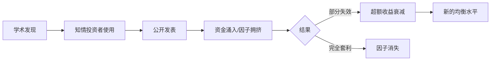

# 🔑 什么是因子？

> [!note] 核心定义
> 在量化金融中，**因子** 是指一组能够系统性解释资产横截面收益差异的**可度量特征**。形象地说，因子是给股票打分的评分标准——得分高的股票期望收益更高。

## 一、因子的直观理解

想象你面前有 5000 只股票，用**一个维度**给它们排序：

- **市盈率低** 的排前面 → 这是一个**价值因子**
- **过去6个月涨幅高** 的排前面 → 这是一个**动量因子**
- **波动率低** 的排前面 → 这是一个**低波动因子**

每个因子将股票分成"高分"组和"低分组"，投资者买入高分、卖空低分，获取因子溢价。

## 二、因子的经济学解释

因子为什么能产生超额收益？学术界有两大解释流派：

### 2.1 风险补偿说（理性框架）

| 因子 | 承担的风险 |
|-----|-----------|
| 价值因子 | 财务困境风险（价值股通常基本面不佳） |
| 规模因子 | 流动性风险（小盘股交易困难） |
| 动量因子 | 崩盘风险（动量策略在熊市反转时巨亏） |

> 投资者买入低估值的价值股，其实是在承担这些公司的**财务困境风险**，所以理应获得风险补偿。这符合**有效市场假说**。

### 2.2 行为金融说（非理性框架）

| 因子 | 行为偏差 |
|-----|---------|
| 价值因子 | 过度外推（过度悲观） |
| 动量因子 | 反应不足 / 证实偏差 |
| 低波动异象 | 彩票偏好（投资者追逐高波动博大涨） |

> 投资者由于认知偏差导致错误定价，因子正是利用这些定价错误来获利。但套利限制使得定价错误无法被快速消除。

## 三、因子 vs Alpha

| 概念 | 含义 | 获取方式 |
|-----|------|---------|
| **因子收益（Risk Premium）** | 承担已知系统性风险获得的补偿 | 被动暴露（Smart Beta） |
| **Alpha** | 超越因子模型解释的超额收益 | 主动选股能力 |

在 Fama-French 框架下，投资组合收益可以分解为：

$$R_i = α_i + β_{MKT}·MKT + β_{SMB}·SMB + β_{HML}·HML + ε_i$$

- 如果 $α_i > 0$ 且显著，说明存在**选股能力**
- 如果 $α_i ≈ 0$，说明收益完全由**因子暴露**解释

> [!tip] 关键洞察
> 大部分"明星基金经理"的超额收益，其实都来自对已知因子的**系统性暴露**，而非真正的选股能力。这就是为什么因子投资能"民主化"主动管理——通过ETF/指数基金就能获取因子溢价。

## 四、好因子的标准

| 标准 | 说明 |
|-----|------|
| **经济学逻辑** | 有合理的风险或行为解释 |
| **统计显著性** | 回测中 t-statistic > 2.0 |
| **稳健性** | 不同市场、不同时段均有效 |
| **可投资性** | 容量足够，交易成本可控 |
| **增量信息** | 与已知因子相关性低 |

## 五、因子的生命周期

> [!warning] 关键警示
> 因子发现并公开发表后，其超额收益通常会**衰减**。这是因子投资的核心悖论：公开研究本身会破坏因子的盈利能力。

---

📑 **返回**：[[因子基础总览]] | [[因子投资总览]]

## 课程化学习补充

> [!important] 学习定位
> 因子投资把可解释的收益来源系统化，关键是因子定义、数据口径、检验方法、组合构建和衰减监控。本文仅用于学习、研究与复盘，不构成任何投资建议。

### 必须掌握的问题

- 因子方向是否有经济解释
- 是否做去极值/中性化/标准化
- IC 和分层收益是否稳定
- 换手和容量是否可交易

### 实战应用流程

1. 先写清楚你的投资假设：为什么这个信号、资产或方法应该产生收益。
2. 明确数据口径：样本范围、更新时间、复权/分红/停牌处理和交易日历。
3. 做最小可行验证：先用简单规则验证方向，再逐步加入复杂模型。
4. 把成本和约束前置：手续费、滑点、冲击成本、保证金、流动性和容量都要进入测算。
5. 上线后持续复盘：记录信号、下单、成交、持仓、回撤和失效原因。

### 风险与失效条件

- 因子动物园
- 样本内挖掘
- 拥挤交易
- 行业和市值暴露伪装成 alpha

### 复盘问题

- 这笔交易或这套模型赚的是什么钱：风险补偿、行为偏差、流动性溢价，还是偶然噪音？
- 如果市场环境反过来，最大亏损和最长恢复期会是多少？
- 当前结论是否依赖某个不可持续假设，例如低利率、低波动、充裕流动性或监管套利？
- 有没有一个更简单的基准策略能取得接近效果？

### 延伸学习

- [[因子投资总览]]
- [[因子检验与评价]]
- [[因子构建方法]]
- [[回测质量门清单]]

## 跨领域进阶扩展

> [!tip] 交易者视角
> 学到 `🔑 什么是因子？` 时，不要只把它当成孤立知识点。把因子当成可解释、可检验、可组合的收益来源。优秀投资交易者会把它放入“宏观背景 - 资产选择 - 估值/信号 - 组合风险 - 交易执行 - 复盘反馈”的闭环。

### 与其他知识的连接

- 因子定义、IC 和分层收益
- 行业/市值中性化和风险暴露
- 换手、容量和拥挤
- 组合构建和衰减监控

### 进阶训练

1. 做单因子分层回测
2. 检查因子与行业市值暴露的关系
3. 建立因子失效和拥挤监控

### 能力验收

- 能否说清楚这个主题影响的是收益来源、风险来源、交易成本、流动性还是心理纪律？
- 能否指出它在什么市场环境、资产类别或交易周期中更有效？
- 能否把它写成一条可复盘的研究或交易规则？
- 能否说明如果判断错误，组合最大损失和退出机制是什么？

### 全局关联

- [[综合金融知识体系/金融投资全知识地图|金融投资全知识地图]]
- [[综合金融知识体系/优秀投资交易者能力地图|优秀投资交易者能力地图]]
- [[综合金融知识体系/一次性学习路线与复盘模板|一次性学习路线与复盘模板]]
