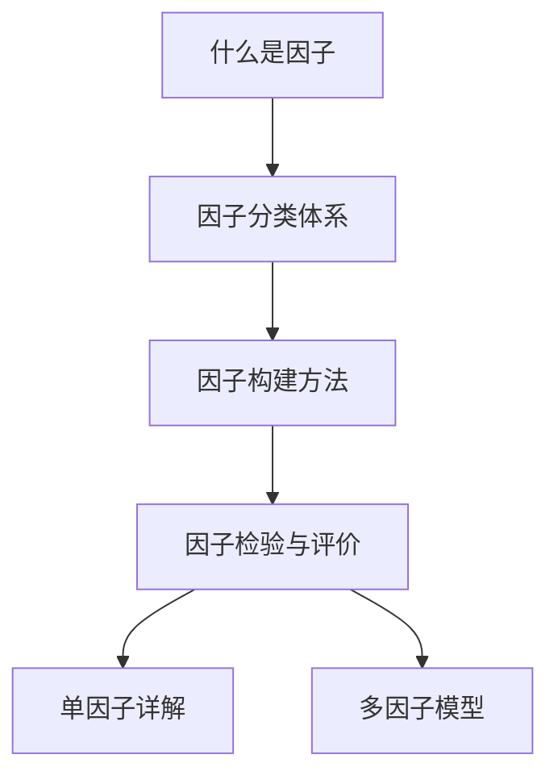

# 📚 因子基础总览

> [!note] 模块简介
> 本模块是因子投资的入门基石，涵盖因子的定义、分类、构建方法论和检验体系。建议按顺序阅读，建立完整的因子认知框架。

## 本模块内容

| 序号 | 笔记 | 核心内容 |
|-----|------|---------|
| 1 | [[什么是因子]] | 因子的经济学定义、风险vs行为解释、因子与alpha的区别 |
| 2 | [[因子分类体系]] | 十大因子类别的分类逻辑与代表因子 |
| 3 | [[因子构建方法]] | 因子值计算、标准化、中性化处理 |
| 4 | [[因子检验与评价]] | IC分析、分层回测、Fama-MacBeth回归、绩效归因 |

## 前置知识

建议先阅读：
- 量化投资基础概念
- 金融计量经济学基础
- 投资组合管理理论

## 推荐阅读顺序

---

📑 **返回**：[[因子投资总览]] | [[目录]]

## 实战掌握清单

> [!tip] 交易者视角
> 因子基础总览 的学习重点不是记住术语，而是把它放进研究、组合、执行和复盘的闭环。因子研究要证明信号背后的经济逻辑、统计稳定性和可交易性，而不是堆砌指标。

### 关键判断

- 明确因子定义、方向、覆盖范围和缺失值处理。
- 检验IC、Rank IC、分层收益、换手和行业市值暴露。
- 判断收益来自风险补偿、行为偏差、制度结构还是数据噪音。

### 落地动作

1. 做去极值、标准化、中性化和样本外检验。
2. 用组合层面的归因确认因子是否真的贡献alpha。
3. 持续监控拥挤、衰减、容量和相关性变化。

### 失效边界

- 因子动物园。
- 把行业或市值暴露误认为alpha。
- 忽略交易成本导致纸面有效、实盘无效。

### 复盘问题

- 这项知识改变了哪一个具体决策：标的、方向、仓位、退出、对冲还是不交易？
- 如果判断相反，最大亏损、最长恢复期和退出触发条件是什么？
- 有没有一个更简单的基准方法可以取得相近结果？

## 深度案例与训练

### 因子实验

围绕 因子基础总览 做一次完整实验：定义信号、确定股票池、处理极值、做标准化和中性化，再输出 IC、Rank IC、分层收益、换手率、最大回撤和行业暴露。

### 组合验证

- 检查因子是否只在某个行业、市值段或市场阶段有效。
- 用样本外和滚动窗口观察稳定性。
- 将因子放入多因子组合，看新增收益是否被相关性抵消。

### 复盘标准

因子有效不等于可交易。必须确认容量、成本、拥挤、衰减和实盘成交质量。

## 最小可执行项目

### 因子研究报告

围绕 因子基础总览 写一份迷你研究报告：研究假设、因子公式、数据口径、中性化方法、IC、分层收益、组合构建、成本、容量和失效监控。

| 指标 | 用途 |
|---|---|
| IC | 衡量预测方向 |
| 分层收益 | 检查单调性 |
| 换手率 | 估计交易成本 |
| 暴露归因 | 排除伪 alpha |
| 拥挤度 | 监控衰减风险 |

### 验收标准

报告必须说明因子为何有效、何时失效，以及扣费后是否可交易。

## 七、因子学习路线细化

学习因子投资时，最容易犯的错误是直接跳到“哪个因子收益最高”。更稳的路线是先理解因子为什么可能赚钱，再学习如何定义、清洗、检验和组合。

1. 从[[什么是因子]]开始，区分风险补偿、行为偏差和数据噪音。
2. 用[[因子分类体系]]建立收益来源地图，避免把所有指标都叫 alpha。
3. 用[[因子构建方法]]掌握去极值、标准化、中性化和缺失值处理。
4. 用[[因子检验与评价]]验证 IC、分层收益、换手、成本和稳定性。
5. 进入单因子详解后，每学一个因子都写出经济解释、适用市场和失效场景。

最终目标不是拥有很多因子，而是拥有少数能解释、能交易、能监控、能在失效时及时退出的收益来源。

## 进一步实战化

### 因子研究验收

围绕 `因子基础总览` 做一张因子研究验收表：公式、方向、股票池、数据时点、中性化变量、IC、分层收益、换手、成本、容量和衰减监控。

| 环节 | 最低标准 |
|---|---|
| 经济解释 | 知道为什么可能有效 |
| 统计检验 | 样本外仍有稳定性 |
| 组合归因 | 排除行业和市值伪 alpha |
| 实盘约束 | 扣费后仍可交易 |

验收标准：能说清这个因子赚的是风险补偿、行为偏差、制度结构还是数据噪音。

## 八、最终提醒

因子投资的核心不是找到很多看起来有效的指标，而是建立一套从经济解释、数据处理、统计检验到组合执行的闭环。没有解释的因子容易过拟合，没有成本约束的因子难以实盘，没有失效监控的因子会在衰减后继续消耗资金。

学习每一个因子时，都要同时问四件事：它为什么可能赚钱，它在什么市场状态下更有效，它和已有因子是否高度重叠，它失效时会出现什么可观察信号。能回答这些问题，因子才从“变量”变成“收益来源”。
