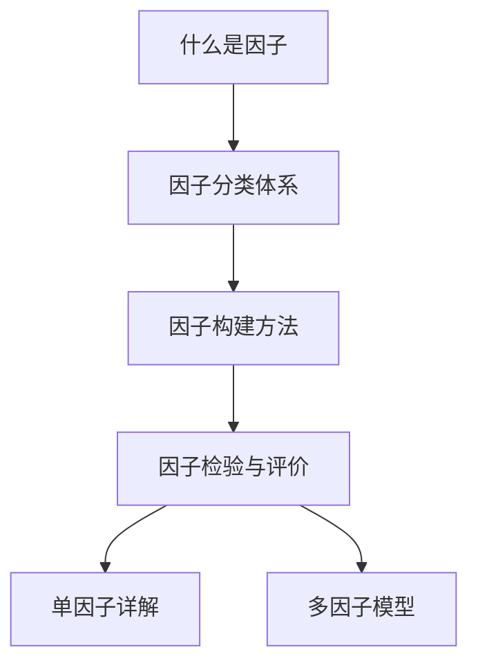

# 📚 因子基础总览

> [!note] 模块简介
> 本模块是因子投资的入门基石，涵盖因子的定义、分类、构建方法论和检验体系。建议按顺序阅读，建立完整的因子认知框架。

## 本模块内容

| 序号 | 笔记 | 核心内容 |
|-----|------|---------|
| 1 | [[什么是因子]] | 因子的经济学定义、风险vs行为解释、因子与alpha的区别 |
| 2 | [[因子分类体系]] | 十大因子类别的分类逻辑与代表因子 |
| 3 | [[因子构建方法]] | 因子值计算、标准化、中性化处理 |
| 4 | [[因子检验与评价]] | IC分析、分层回测、Fama-MacBeth回归、绩效归因 |

## 前置知识

建议先阅读：
- 量化投资基础概念
- 金融计量经济学基础
- 投资组合管理理论

## 推荐阅读顺序

---

📑 **返回**：[[因子投资总览]] | [[目录]]
