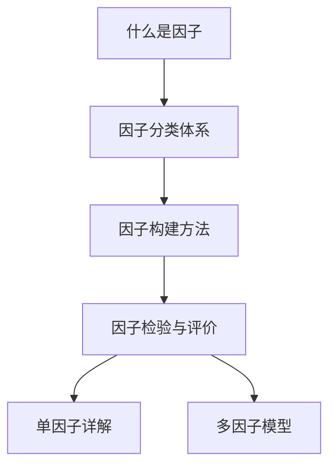

# 📚 因子基础总览

> [!note] 模块简介
> 本模块是因子投资的入门基石，涵盖因子的定义、分类、构建方法论和检验体系。建议按顺序阅读，建立完整的因子认知框架。

## 本模块内容

| 序号 | 笔记 | 核心内容 |
|-----|------|---------|
| 1 | [[什么是因子]] | 因子的经济学定义、风险vs行为解释、因子与alpha的区别 |
| 2 | [[因子分类体系]] | 十大因子类别的分类逻辑与代表因子 |
| 3 | [[因子构建方法]] | 因子值计算、标准化、中性化处理 |
| 4 | [[因子检验与评价]] | IC分析、分层回测、Fama-MacBeth回归、绩效归因 |

## 前置知识

建议先阅读：
- 量化投资基础概念
- 金融计量经济学基础
- 投资组合管理理论

## 推荐阅读顺序

---

📑 **返回**：[[因子投资总览]] | [[目录]]

## 课程化学习补充

> [!important] 学习定位
> 因子投资把可解释的收益来源系统化，关键是因子定义、数据口径、检验方法、组合构建和衰减监控。本文仅用于学习、研究与复盘，不构成任何投资建议。

### 必须掌握的问题

- 因子方向是否有经济解释
- 是否做去极值/中性化/标准化
- IC 和分层收益是否稳定
- 换手和容量是否可交易

### 实战应用流程

1. 先写清楚你的投资假设：为什么这个信号、资产或方法应该产生收益。
2. 明确数据口径：样本范围、更新时间、复权/分红/停牌处理和交易日历。
3. 做最小可行验证：先用简单规则验证方向，再逐步加入复杂模型。
4. 把成本和约束前置：手续费、滑点、冲击成本、保证金、流动性和容量都要进入测算。
5. 上线后持续复盘：记录信号、下单、成交、持仓、回撤和失效原因。

### 风险与失效条件

- 因子动物园
- 样本内挖掘
- 拥挤交易
- 行业和市值暴露伪装成 alpha

### 复盘问题

- 这笔交易或这套模型赚的是什么钱：风险补偿、行为偏差、流动性溢价，还是偶然噪音？
- 如果市场环境反过来，最大亏损和最长恢复期会是多少？
- 当前结论是否依赖某个不可持续假设，例如低利率、低波动、充裕流动性或监管套利？
- 有没有一个更简单的基准策略能取得接近效果？

### 延伸学习

- [[因子投资总览]]
- [[因子检验与评价]]
- [[因子构建方法]]
- [[回测质量门清单]]

## 跨领域进阶扩展

> [!tip] 交易者视角
> 学到 `📚 因子基础总览` 时，不要只把它当成孤立知识点。把因子当成可解释、可检验、可组合的收益来源。优秀投资交易者会把它放入“宏观背景 - 资产选择 - 估值/信号 - 组合风险 - 交易执行 - 复盘反馈”的闭环。

### 与其他知识的连接

- 因子定义、IC 和分层收益
- 行业/市值中性化和风险暴露
- 换手、容量和拥挤
- 组合构建和衰减监控

### 进阶训练

1. 做单因子分层回测
2. 检查因子与行业市值暴露的关系
3. 建立因子失效和拥挤监控

### 能力验收

- 能否说清楚这个主题影响的是收益来源、风险来源、交易成本、流动性还是心理纪律？
- 能否指出它在什么市场环境、资产类别或交易周期中更有效？
- 能否把它写成一条可复盘的研究或交易规则？
- 能否说明如果判断错误，组合最大损失和退出机制是什么？

### 全局关联

- [[综合金融知识体系/金融投资全知识地图|金融投资全知识地图]]
- [[综合金融知识体系/优秀投资交易者能力地图|优秀投资交易者能力地图]]
- [[综合金融知识体系/一次性学习路线与复盘模板|一次性学习路线与复盘模板]]
