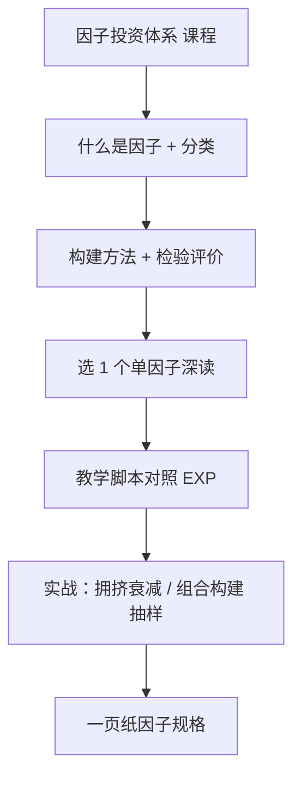

# 因子投资实操导航

> [!note] 核心问题
> 进阶「因子投资」体量很大（总览 + 单因子 + 汇总 + 实战），阶段零只有**价量双因子教学脚本**。本篇分清 **教学因子 / 研究因子 / 可交易因子** 三层，给出 2 周路径、PIT 红线，以及和 quant-lab、课程的接线，避免「收藏 500 个因子名」式假进度。

## 学习目标

1. 用一张表区分教学、研究、可交易三层要求。  
2. 按推荐顺序读因子基础 4 篇 + 1 个单因子深读。  
3. 跑通或复核 `run_factor_score.py`，并写清其边界。  
4. 列出财务因子上线前的 PIT/公告日检查项。  
5. 完成「因子研究一页纸」作业，而不是堆指标列表。  

## 三层能力（先站队）

| 层 | 你在做什么 | 数据 | 典型工具 | 本库入口 |
|---|---|---|---|---|
| **教学** | 学会打分→排序→持仓→成本 | 价量为主 | quant-lab | [[因子打分实操]] |
| **研究** | 检验因子是否稳健、可解释 | 需 PIT/质量 | 平台/Qlib/自建 | 本专题基础+检验篇 |
| **可交易** | 容量、拥挤、衰减、执行 | 许可+运维 | 部署+风控 | [[因子拥挤与衰减]] · 部署专题 |

> [!warning]
> 教学层夏普好看 **≠** 可交易。财务因子在缺公告日对齐时，默认视为**不可交卷为研究结论**。

## 与阶段零脚本对照

| 项目 | `run_factor_score.py`（教学） | 研究级因子 |
|---|---|---|
| 因子 | 动量 + 低波（价量） | 价值/质量/成长等 + 清洗 |
| 池 | 小 watchlist | 可投资宇宙 + 退市 |
| 滞后 | 权重 `shift(1)` | 信号日与可交易日严格定义 |
| 财务 | **不做** | 必须 PIT |
| 目的 | 流程肌肉记忆 | 可发表/可产品的证据 |

命令复习：

```powershell
cd ...\quant-lab
python scripts/pull_watchlist.py
python scripts/run_factor_score.py --top-k 2 --mom-lookback 20 --vol-lookback 20
```

详见 [[因子打分实操]]。

## 推荐 2 周路径



| 天 | 读什么 | 产出 |
|---:|---|---|
| 1–2 | [[因子投资体系]]（入门）+ [[什么是因子]] + [[因子分类体系]] | 用自己的话定义因子 |
| 3–4 | [[因子构建方法]] + [[因子检验与评价]] | 写出检验指标清单 |
| 5 | 单因子一篇：建议 [[动量因子]] 或 [[价值因子]] | 经济学逻辑 5 行 |
| 6 | 汇总可选：[[动量因子汇总]] / [[价值因子汇总]] | 只记 3 个代表指标 |
| 7–8 | 跑/复核 quant-lab 因子打分 + [[回测与quant-lab对照清单]] | EXP |
| 9 | [[因子拥挤与衰减]] 或 [[A股因子特征]] | 失效条件 3 条 |
| 10 | 写「因子研究一页纸」（见下） | 交卷 |

不必按 500+ 文件名通读；需要时再查汇总表。

## PIT 与前视红线（财务/分析师类）

| 检查 | 合格标准 |
|---|---|
| 信息可知时刻 | 用**公告日/落库日**，不是报告期截止日 |
| 点-in-time 财务 | 当时可得的最新报表，非事后重述全集 |
| 股票池 | 当时可交易集合，含退市处理意识 |
| 行业/市值中性 | 若声称「纯因子」，需说明是否中性化 |
| 成本与换手 | 调仓频率与费用进入回测 |
| 多重试错 | 试了很多因子后要校正「显著」幻觉 |

教学价量因子仍要防：复权错误、停牌成交、当根 bar 买卖。见 [[回测方法论]]、[[复权与公司行动实操]]。

## 因子研究一页纸（作业模板）

| 字段 | 填写 |
|---|---|
| 因子名称 |  |
| 层（教学/研究/可交易） |  |
| 定义（公式级） |  |
| 经济学/行为逻辑 |  |
| 数据字段与来源 |  |
| 更新频率 |  |
| 股票池 |  |
| 方向（多高/多低） |  |
| 中性化 | 无/市值/行业 |
| 组合规则 | top_k / 加权 |
| 成本假设 |  |
| 主区间结果 |  |
| 样本外/分段 |  |
| 失效与拥挤信号 |  |
| 明确不做的声称 |  |

## 专题内读物地图

| 区块 | 入口 | 何时读 |
|---|---|---|
| 总览 | [[因子投资总览]] | 要全景分类时 |
| 基础 | [[因子基础总览]] | 路径第 1 周 |
| 单因子 | [[单因子详解总览]] | 选 1–2 个深读 |
| 多因子模型 | 目录第三节 | 有 CAPM/FF 基础后 |
| 实战 | [[因子投资实战总览]] 等 | 一页纸之后 |
| 类别汇总 | 价值/动量/…汇总 | 检索代表因子 |
| 工具 | [[因子投资工具]] · [[Qlib上手实操]] | 扩研究平台时 |

完整树：[[因子投资/目录]]。

## 与其它专题

| 专题 | 关系 |
|---|---|
| [[组合层实操]] | 有了分数后如何加权/再平衡 |
| [[阶段四风控卡实操]] | 因子策略的回撤与资金上限 |
| [[进阶工具部署与回测实操导航]] | 数据与回测质量 |
| [[机器学习与AI在量化中的应用]] | ML 特征 ≠ 自动 alpha |

## 常见误区

| 误区 | 更好的理解 |
|---|---|
| 因子越多越好 | 噪声、共线性、过拟合 |
| 论文因子直接 A 股可交易 | 需要本地化与成本 |
| z-score 很高级 | 只是无量纲化 |
| 教学脚本夏普可写进简历当业绩 | 写「流程与边界」更诚实 |
| 先挖 100 个因子再学检验 | 先学会证伪一个 |

## 练习（本波验收）

- [ ] 三层表能口述  
- [ ] 基础 4 篇 + 1 单因子已读  
- [ ] quant-lab 因子结果或明确复述边界  
- [ ] 一页纸填完  
- [ ] 失效条件 ≥3  

## 相关概念

[[因子投资/目录]] [[因子投资体系]] [[因子打分实操]] [[因子检验与评价]] [[回测与quant-lab对照清单]] [[全库百科化路线图]]
