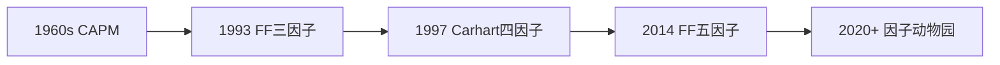

# 🌐 因子投资总览 (Factor Investing Overview)

> [!note] 什么是因子投资？
> 因子投资（Factor Investing）是一种系统性投资方法，通过识别能够解释资产横截面收益差异的共同特征（即"因子"），来构建投资组合并获取风险溢价。因子投资源于 **资产定价理论**，由 Fama-French 三因子模型开创，如今已发展成为一个庞大的研究体系。

## 一、因子的本质

在量化金融中，**因子（Factor）** 可以理解为一组具有相似特征的资产，这些特征能够系统性解释其收益差异。因子的经济学逻辑通常源于**风险溢价** 或**行为偏差**：

- **风险补偿说**：承担特定系统性风险获得补偿（如价值因子 = 财务困境风险溢价）
- **行为金融说**：市场参与者行为偏差导致错误定价（如动量因子 = 反应不足）

## 二、因子分类框架

因子投资按**数据来源** 和**构建方法** 可大致分为以下类别：

### 2.1 基本面因子

基于公司**财务报表数据** 构建，反映企业经营质量与财务状况：

| 子类别 | 代表因子 | 逻辑 |
|-------|---------|------|
| 价值因子 (Value) | 账面市值比 (B/P)、盈利收益率 (E/P) | 低估值的股票长期跑赢 |
| 质量因子 (Quality) | ROIC、应计比率、债务权益比 | 高盈利、低杠杆公司更优 |
| 成长因子 (Growth) | 营收增长、利润增长、PEG | 高增长公司享有溢价 |
| 规模因子 (Size) | 总市值、自由流通市值 | 小市值公司超额收益 |

### 2.2 市场数据因子

基于**价格、成交量** 等市场交易数据构建：

| 子类别 | 代表因子 | 逻辑 |
|-------|---------|------|
| 动量因子 (Momentum) | K月累计收益、加速度动量 | 趋势延续性 |
| 波动率因子 (Volatility) | 特质波动率、Beta、VaR | 低波动率异象 |
| 流动性因子 (Liquidity) | Amihud非流动性、换手率 | 流动性溢价 |
| 技术因子 (Technical) | RSI、MACD、量价背离 | 技术信号有效性 |

### 2.3 另类数据因子

基于**非传统数据** 构建的新型因子：

| 子类别 | 代表因子 | 数据源 |
|-------|---------|-------|
| 情绪因子 (Emotion) | 分析师覆盖、新闻情绪、资金流向 | 舆情、研报、交易行为 |
| 基本面因子 (Basic-Surface) | 180+ 个财务报表衍生指标 | 详细财务数据 |

## 三、因子研究的学术脉络

| 年份 | 模型/论文 | 核心贡献 | 因子 |
|-----|---------|---------|------|
| 1964 | Sharpe/Lintner CAPM | 单因子基础 | 市场因子 |
| 1993 | Fama-French 三因子 | 开创因子投资 | 市场 + 规模 + 价值 |
| 1997 | Carhart 四因子 | 纳入动量 | + 动量因子 |
| 2014 | Fama-French 五因子 | 扩展框架 | + 盈利 + 投资 |
| 2016 | AQR 因子动物园 | 系统性综述 | 500+ 因子 |

## 四、因子投资的核心议题

### 4.1 因子构建
- 如何定义和测量一个因子？
- 因子组合加权方案（等权/市值加权/波动率加权）
- 行业中性 vs 市场中性

### 4.2 因子检验
- 信息系数（IC, Rank IC）
- 因子收益（Fama-MacBeth回归）
- 分层回测与绩效归因

### 4.3 因子组合
- 多因子合成方法（等权/IC加权/最大化IR）
- 因子暴露管理
- 因子择时（Factor Timing）

### 4.4 因子投资挑战
- 因子拥挤（Factor Crowding）
- 因子衰减（Factor Decay）
- 幸存者偏差与数据挖掘
- 交易成本侵蚀

## 五、A股因子特征速览

中国市场与发达市场因子表现存在显著差异：

| 特点 | 说明 |
|-----|------|
| 小市值效应 | A股小盘效应显著强于美股 |
| 价值因子动摇 | 近年A股价值因子表现弱于美股 |
| 动量因子弱 | A股短期反转更强，中期动量较弱 |
| 流动性溢价 | 非流动资产溢价显著 |
| 政策因子 | 独特的政策驱动因素 |

## 六、深入学习路径

1. **入门**：[[一、因子基础/什么是因子|什么是因子]] → [[一、因子基础/因子分类体系|因子分类体系]]
2. **分类学习**：挑选感兴趣的因子类别（如 [[二、单因子详解/价值因子|价值因子]]），阅读详细解析
3. **建模**：学习 [[三、多因子模型/Fama-French三因子模型|Fama-French三因子模型]] 构建
4. **实战**：参考 [[四、因子投资实战/因子投资组合构建|因子投资组合构建]] 搭建策略

> [!warning] 风险提示
> 因子投资的**历史表现不保证未来收益**。所有因子均存在周期性失效的可能，需结合市场环境、因子拥挤度、交易成本等因素综合评估。本专题内容仅供教育和研究使用，不构成投资建议。

---

📑 **返回**：[[目录]]
