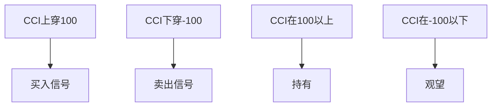

# CCI指标详解

> [!note] 💡 概念解析
> CCI（Commodity Channel Index，商品通道指数）是由唐纳德·兰伯特开发的动量指标，用于衡量价格偏离统计平均值的程度，是无界线指标，可以识别超买超卖和趋势变化。

## 一、CCI的计算公式

$$\text{CCI} = \frac{\text{TP} - \text{MA}(\text{TP})}{0.015 \times \text{MD}}$$

其中：
- $\text{TP} = \frac{\text{最高价} + \text{最低价} + \text{收盘价}}{3}$（典型价格）
- $\text{MA}(\text{TP})$：TP的N日移动平均
- $\text{MD}$：TP的N日平均绝对偏差
- $0.015$：常数系数

## 二、CCI的应用法则

### 2.1 超买超卖

| CCI数值 | 市场状态 | 操作建议 |
|--------|---------|---------|
| > 100 | 超买 | 卖出 |
| 50-100 | 正常偏强 | 持有 |
| -50-50 | 正常 | 观望 |
| -100--50 | 正常偏弱 | 关注 |
| < -100 | 超卖 | 买入 |

### 2.2 趋势判断

> [!tip] CCI趋势判断
> - **CCI > 100**：强势上涨趋势
> - **CCI < -100**：强势下跌趋势
> - **CCI在-100到100之间**：震荡整理

### 2.3 背离信号

- **顶背离**：价格创新高，CCI未创新高 → 上涨动能减弱
- **底背离**：价格创新低，CCI未创新低 → 下跌动能减弱

## 三、CCI的实战应用

### 3.1 趋势跟踪策略

### 3.2 震荡交易策略

| 信号 | 条件 | 操作 |
|------|------|------|
| 超卖买入 | CCI < -100后上穿-100 | 买入 |
| 超买卖出 | CCI > 100后下穿100 | 卖出 |
| 背离 | 价格与CCI方向相反 | 关注反转 |

### 3.3 多时间框架分析

> [!example] 多时间框架CCI策略
> 1. 在**周线**CCI判断大趋势
> 2. 在**日线**CCI寻找入场时机
> 3. 在**小时**CCI精确入场

## 四、CCI与其他指标的配合

| 配合指标 | 作用 |
|---------|------|
| MA | 确认趋势方向 |
| RSI | 双重确认超买超卖 |
| BOLL | 确认波动性 |
| 成交量 | 确认突破有效性 |

## 五、CCI的注意事项

> [!warning] 使用注意
> 1. CCI是**无界线指标**，可能超出常规范围
> 2. 在**趋势市**中，CCI可能长期处于超买或超卖区
> 3. 在**震荡市**中，CCI信号更可靠
> 4. 需要**结合其他指标**确认信号

## 📚 相关概念

[[震荡类指标（KDJ、RSI、CCI）]] [[趋势类指标（MA、EMA、MACD）]] [[趋势强度指标（DMI、布林带）]] [[五大核心技术指标指南]] [[指标组合使用方法论]]

## 课程化学习补充

> [!important] 学习定位
> 技术指标是价格与成交量的压缩表达，适合做信号过滤、风险控制和交易纪律，不适合孤立预测未来。本文仅用于学习、研究与复盘，不构成任何投资建议。

### 必须掌握的问题

- 指标参数是否符合交易周期
- 信号是否经过样本外验证
- 是否与趋势/量能/波动率共振
- 是否明确无效条件

### 实战应用流程

1. 先写清楚你的投资假设：为什么这个信号、资产或方法应该产生收益。
2. 明确数据口径：样本范围、更新时间、复权/分红/停牌处理和交易日历。
3. 做最小可行验证：先用简单规则验证方向，再逐步加入复杂模型。
4. 把成本和约束前置：手续费、滑点、冲击成本、保证金、流动性和容量都要进入测算。
5. 上线后持续复盘：记录信号、下单、成交、持仓、回撤和失效原因。

### 风险与失效条件

- 指标共线导致虚假确认
- 震荡市和趋势市参数错配
- 过度优化
- 忽略滑点和交易成本

### 复盘问题

- 这笔交易或这套模型赚的是什么钱：风险补偿、行为偏差、流动性溢价，还是偶然噪音？
- 如果市场环境反过来，最大亏损和最长恢复期会是多少？
- 当前结论是否依赖某个不可持续假设，例如低利率、低波动、充裕流动性或监管套利？
- 有没有一个更简单的基准策略能取得接近效果？

### 延伸学习

- [[技术分析完整指南]]
- [[量价关系与成交量指标]]
- [[假形态识别与应对]]
- [[风险度量指标]]
