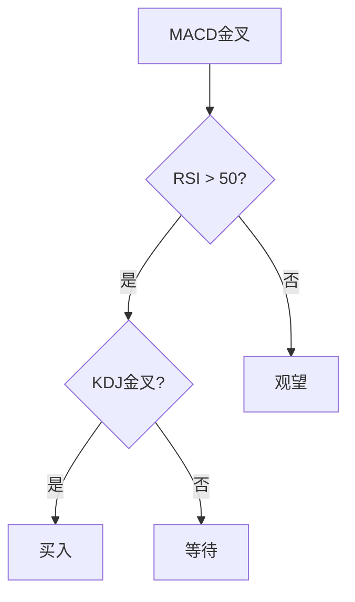

# MACD-KDJ-RSI牛市指南

> [!note] 💡 概念解析
> MACD、KDJ、RSI是牛市中最常用的三大指标组合，MACD判断趋势，KDJ把握短期节奏，RSI识别超买超卖，三者配合可以有效捕捉牛市行情。

## 一、牛市中的指标特征

### 1.1 MACD特征

| 特征 | 说明 |
|------|------|
| DIF > DEA | 多头排列 |
| MACD柱为正 | 上涨动能充足 |
| 金叉后持续向上 | 趋势延续 |
| 零轴上方运行 | 强势市场 |

### 1.2 KDJ特征

| 特征 | 说明 |
|------|------|
| K > D | 多头排列 |
| J值 > 100 | 强势超买 |
| 金叉频繁 | 短期机会多 |
| 高位钝化 | 强势延续 |

### 1.3 RSI特征

| 特征 | 说明 |
|------|------|
| RSI > 50 | 多头市场 |
| RSI > 70 | 超买但可能延续 |
| RSI持续高位 | 强势特征 |
| 背离信号 | 趋势减弱预警 |

## 二、牛市中的指标组合策略

### 2.1 趋势确认策略

> [!tip] MACD + RSI确认
> 1. MACD金叉 → 趋势转多
> 2. RSI > 50 → 多头市场确认
> 3. 两者同时满足 → 买入信号

### 2.2 短期节奏策略

> [!tip] KDJ + RSI配合
> 1. KDJ金叉 → 短期买入信号
> 2. RSI < 70 → 非超买区域
> 3. 两者同时满足 → 短期买入

### 2.3 综合策略

## 三、牛市中的注意事项

### 3.1 超买钝化

> [!warning] 牛市中的超买
> 在牛市中，RSI和KDJ可能长期处于超买区域（钝化），这是强势特征，**不是卖出信号**。只有出现背离信号时才需要警惕。

### 3.2 趋势延续

> [!important] 牛市操作原则
> 1. **不要轻易做空**：牛市中做空容易亏损
> 2. **回调买入**：利用KDJ和RSI的短期回调信号买入
> 3. **持股为主**：MACD多头排列时持股不动
> 4. **关注背离**：出现顶背离时减仓

## 四、牛市中的风险控制

| 风险 | 控制方法 |
|------|---------|
| 超买风险 | 设置止盈点 |
| 趋势反转 | 关注MACD死叉 |
| 短期回调 | 利用KDJ超卖买入 |
| 政策风险 | 关注基本面变化 |

## 五、牛市中的指标参数调整

> [!tip] 参数优化
> 1. **MACD**：可使用(12, 26, 9)默认参数
> 2. **KDJ**：可使用(9, 3, 3)默认参数
> 3. **RSI**：可使用14日参数
> 4. 在牛市中，指标参数**不需要特别调整**

## 📚 相关概念

[[趋势类指标（MA、EMA、MACD）]] [[震荡类指标（KDJ、RSI、CCI）]] [[五大核心技术指标指南]] [[多因子趋势跟踪策略]] [[指标组合使用方法论]]

## 实战掌握清单

> [!tip] 交易者视角
> MACD-KDJ-RSI牛市指南 的学习重点不是记住术语，而是把它放进研究、组合、执行和复盘的闭环。技术指标是价格、成交量和波动率的二次加工，核心价值在于把主观观察变成稳定规则。

### 关键判断

- 先确认指标属于趋势、震荡、量能、波动率还是资金流。
- 判断当前市场是否适合该指标：趋势指标怕横盘，震荡指标怕单边。
- 把参数选择、信号延迟和交易频率写清楚。

### 落地动作

1. 用样本外数据检验信号，而不是只看历史图形好不好看。
2. 同时记录胜率、盈亏比、换手、滑点和回撤。
3. 把指标作为过滤器、触发器或退出规则，避免多个同源指标重复投票。

### 失效边界

- 参数过拟合。
- 忽略手续费和滑点。
- 在市场结构变化后继续迷信旧阈值。

### 复盘问题

- 这项知识改变了哪一个具体决策：标的、方向、仓位、退出、对冲还是不交易？
- 如果判断相反，最大亏损、最长恢复期和退出触发条件是什么？
- 有没有一个更简单的基准方法可以取得相近结果？

## 深度案例与训练

### 指标实验

围绕 MACD-KDJ-RSI牛市指南 设计三组实验：趋势行情、震荡行情和急跌反弹。分别测试参数、信号延迟、胜率、盈亏比、换手率和最大回撤。

### 组合使用

- 不要堆叠多个同源指标，例如多个均线指标重复投票。
- 指标最好分工：趋势判断、入场触发、风险退出、仓位过滤。
- 对指标做样本外验证，避免只适合历史图形。

### 实盘要求

指标信号必须配合交易成本、流动性和止损纪律。
