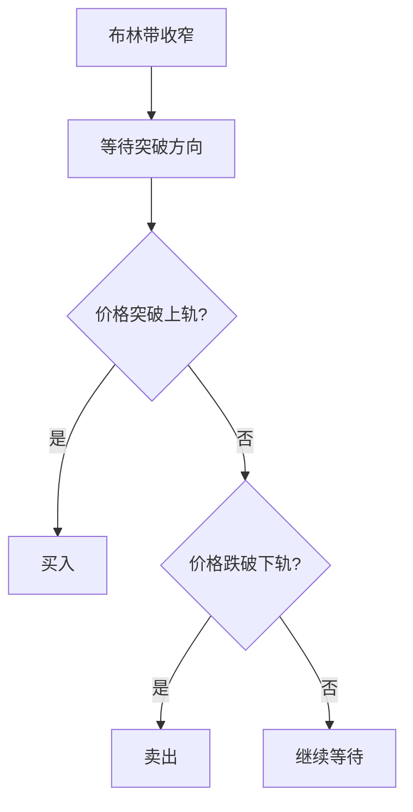

# 布林带详解

> [!note] 💡 概念解析
> 布林带（Bollinger Bands）是由约翰·布林格开发的波动性指标，由中轨（移动平均线）和上下轨（标准差通道）构成，用于衡量价格波动范围和识别超买超卖状态。

## 一、布林带的计算公式

### 1.1 三条线的计算

$$\text{中轨} = \text{MA}(N)$$
$$\text{上轨} = \text{中轨} + k \times \sigma$$
$$\text{下轨} = \text{中轨} - k \times \sigma$$

其中：
- $N$：计算周期，通常取20
- $k$：标准差倍数，通常取2
- $\sigma$：N日收盘价的标准差

### 1.2 布林带的构成

| 组成部分 | 计算方法 | 作用 |
|---------|---------|------|
| 中轨 | 20日移动平均线 | 趋势方向 |
| 上轨 | 中轨 + 2倍标准差 | 阻力位 |
| 下轨 | 中轨 - 2倍标准差 | 支撑位 |
| 带宽 | (上轨 - 下轨) / 中轨 | 波动性 |

## 二、布林带的应用法则

### 2.1 超买超卖

| 信号 | 条件 | 操作 |
|------|------|------|
| 超买 | 价格触及上轨 | 卖出 |
| 超卖 | 价格触及下轨 | 买入 |
| 中性 | 价格在中轨附近 | 观望 |

### 2.2 趋势判断

> [!tip] 趋势判断方法
> - 价格在**中轨上方**运行 → 上升趋势
> - 价格在**中轨下方**运行 → 下跌趋势
> - 价格**围绕中轨**震荡 → 盘整趋势

### 2.3 波动性分析

| 布林带状态 | 含义 | 操作建议 |
|-----------|------|---------|
| 带宽收窄 | 波动性减小 | 变盘在即 |
| 带宽扩张 | 波动性增大 | 趋势延续 |
| 带宽稳定 | 波动性正常 | 正常交易 |

## 三、布林带的实战策略

### 3.1 布林带收窄突破策略

### 3.2 布林带通道交易策略

> [!example] 通道交易
> 1. 价格触及**下轨** → 买入
> 2. 价格触及**上轨** → 卖出
> 3. 价格在**中轨**附近 → 观望

### 3.3 布林带与其他指标配合

| 配合指标 | 作用 |
|---------|------|
| RSI | 确认超买超卖 |
| MACD | 确认趋势方向 |
| KDJ | 确认短期买卖点 |
| 成交量 | 确认突破有效性 |

## 四、布林带的参数设置

### 4.1 默认参数

- **周期**：20日
- **标准差倍数**：2
- **适用**：大多数股票和市场

### 4.2 参数调整

> [!tip] 参数优化
> 1. **短线交易**：周期可缩短至10-15日
> 2. **长线投资**：周期可延长至30-50日
> 3. **波动大的市场**：标准差倍数可增加至2.5-3
> 4. **波动小的市场**：标准差倍数可减少至1.5

## 五、布林带的注意事项

> [!warning] 使用注意
> 1. 布林带是**滞后指标**，不能预测未来
> 2. 在**趋势市**中，价格可能长期触及上轨或下轨
> 3. 布林带收窄后**不一定**突破，可能继续盘整
> 4. 需要**结合其他指标**确认信号

## 📚 相关概念

[[趋势强度指标（DMI、布林带）]] [[震荡类指标（KDJ、RSI、CCI）]] [[趋势类指标（MA、EMA、MACD）]] [[五大核心技术指标指南]] [[指标组合使用方法论]]

## 实战掌握清单

> [!tip] 交易者视角
> 布林带详解 的学习重点不是记住术语，而是把它放进研究、组合、执行和复盘的闭环。技术指标是价格、成交量和波动率的二次加工，核心价值在于把主观观察变成稳定规则。

### 关键判断

- 先确认指标属于趋势、震荡、量能、波动率还是资金流。
- 判断当前市场是否适合该指标：趋势指标怕横盘，震荡指标怕单边。
- 把参数选择、信号延迟和交易频率写清楚。

### 落地动作

1. 用样本外数据检验信号，而不是只看历史图形好不好看。
2. 同时记录胜率、盈亏比、换手、滑点和回撤。
3. 把指标作为过滤器、触发器或退出规则，避免多个同源指标重复投票。

### 失效边界

- 参数过拟合。
- 忽略手续费和滑点。
- 在市场结构变化后继续迷信旧阈值。

### 复盘问题

- 这项知识改变了哪一个具体决策：标的、方向、仓位、退出、对冲还是不交易？
- 如果判断相反，最大亏损、最长恢复期和退出触发条件是什么？
- 有没有一个更简单的基准方法可以取得相近结果？
