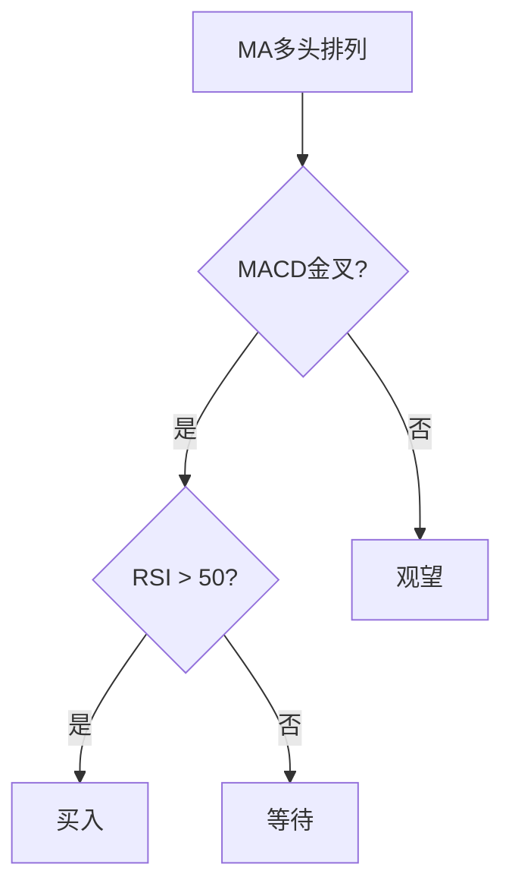

# 技术指标2025指南

> [!note] 💡 概念解析
> 技术指标2025指南是对当前主流技术指标的最新总结，结合现代市场特点，提供了更系统、更实用的技术分析框架。

## 一、2025年技术分析的新特点

### 1.1 市场环境变化

| 变化 | 影响 |
|------|------|
| 量化交易普及 | 指标信号可能被程序化交易放大 |
| 信息传播加速 | 价格反应更快 |
| 市场联动增强 | 跨市场分析更重要 |
| 政策影响加大 | 基本面与技术面结合 |

### 1.2 指标应用的新趋势

> [!tip] 2025年趋势
> 1. **多指标组合**：单一指标可靠性下降
> 2. **跨市场分析**：不同市场相互影响
> 3. **机器学习**：AI辅助指标分析
> 4. **实时数据**：高频数据应用

## 二、2025年主流技术指标

### 2.1 趋势类指标

| 指标 | 应用 | 2025年改进 |
|------|------|-----------|
| MA | 趋势判断 | 自适应参数 |
| MACD | 趋势确认 | 多时间框架 |
| EMA | 趋势跟踪 | 权重优化 |

### 2.2 动量类指标

| 指标 | 应用 | 2025年改进 |
|------|------|-----------|
| RSI | 超买超卖 | 动态阈值 |
| KDJ | 短期买卖 | 参数优化 |
| CCI | 偏离程度 | 多周期分析 |

### 2.3 波动性指标

| 指标 | 应用 | 2025年改进 |
|------|------|-----------|
| BOLL | 波动范围 | 自适应宽度 |
| ATR | 止损设置 | 动态止损 |

### 2.4 成交量指标

| 指标 | 应用 | 2025年改进 |
|------|------|-----------|
| OBV | 量价关系 | 多因子增强 |
| VR | 买卖气势 | 跨市场分析 |

## 三、2025年指标组合策略

### 3.1 趋势跟踪策略

### 3.2 震荡交易策略

| 信号 | 条件 | 操作 |
|------|------|------|
| 超卖买入 | RSI < 30 + KDJ金叉 | 买入 |
| 超买卖出 | RSI > 70 + KDJ死叉 | 卖出 |
| 通道交易 | 价格触及BOLL下轨 | 买入 |

### 3.3 多因子选股策略

> [!example] 多因子选股
> 1. **趋势因子**：MA多头排列
> 2. **动量因子**：RSI > 50
> 3. **波动因子**：BOLL中轨以上
> 4. **成交量因子**：OBV上升

## 四、2025年指标应用的注意事项

> [!warning] 避免误区
> 1. 不要过度依赖**单一指标**
> 2. 不要忽视**市场环境**变化
> 3. 不要把**历史数据**直接应用于未来
> 4. 不要忽略**基本面**分析

## 📚 相关概念

[[五大核心技术指标指南]] [[十大技术指标详解]] [[六大技术指标指南]] [[多因子趋势跟踪策略]] [[指标组合使用方法论]]

## 课程化学习补充

> [!important] 学习定位
> 技术指标是价格与成交量的压缩表达，适合做信号过滤、风险控制和交易纪律，不适合孤立预测未来。本文仅用于学习、研究与复盘，不构成任何投资建议。

### 必须掌握的问题

- 指标参数是否符合交易周期
- 信号是否经过样本外验证
- 是否与趋势/量能/波动率共振
- 是否明确无效条件

### 实战应用流程

1. 先写清楚你的投资假设：为什么这个信号、资产或方法应该产生收益。
2. 明确数据口径：样本范围、更新时间、复权/分红/停牌处理和交易日历。
3. 做最小可行验证：先用简单规则验证方向，再逐步加入复杂模型。
4. 把成本和约束前置：手续费、滑点、冲击成本、保证金、流动性和容量都要进入测算。
5. 上线后持续复盘：记录信号、下单、成交、持仓、回撤和失效原因。

### 风险与失效条件

- 指标共线导致虚假确认
- 震荡市和趋势市参数错配
- 过度优化
- 忽略滑点和交易成本

### 复盘问题

- 这笔交易或这套模型赚的是什么钱：风险补偿、行为偏差、流动性溢价，还是偶然噪音？
- 如果市场环境反过来，最大亏损和最长恢复期会是多少？
- 当前结论是否依赖某个不可持续假设，例如低利率、低波动、充裕流动性或监管套利？
- 有没有一个更简单的基准策略能取得接近效果？

### 延伸学习

- [[技术分析完整指南]]
- [[量价关系与成交量指标]]
- [[假形态识别与应对]]
- [[风险度量指标]]

## 跨领域进阶扩展

> [!tip] 交易者视角
> 学到 `技术指标2025指南` 时，不要只把它当成孤立知识点。把指标当成信号过滤器和纪律工具，不能替代交易系统。优秀投资交易者会把它放入“宏观背景 - 资产选择 - 估值/信号 - 组合风险 - 交易执行 - 复盘反馈”的闭环。

### 与其他知识的连接

- 趋势、动量、均值回归和波动率
- 成交量和资金流验证
- 多周期共振与冲突
- 成本、滑点和过度交易

### 进阶训练

1. 比较指标在趋势市和震荡市的表现
2. 给每个信号定义入场、退出、止损和暂停条件
3. 用样本外数据检查参数稳定性

### 能力验收

- 能否说清楚这个主题影响的是收益来源、风险来源、交易成本、流动性还是心理纪律？
- 能否指出它在什么市场环境、资产类别或交易周期中更有效？
- 能否把它写成一条可复盘的研究或交易规则？
- 能否说明如果判断错误，组合最大损失和退出机制是什么？

### 全局关联

- [[综合金融知识体系/金融投资全知识地图|金融投资全知识地图]]
- [[综合金融知识体系/优秀投资交易者能力地图|优秀投资交易者能力地图]]
- [[综合金融知识体系/一次性学习路线与复盘模板|一次性学习路线与复盘模板]]
