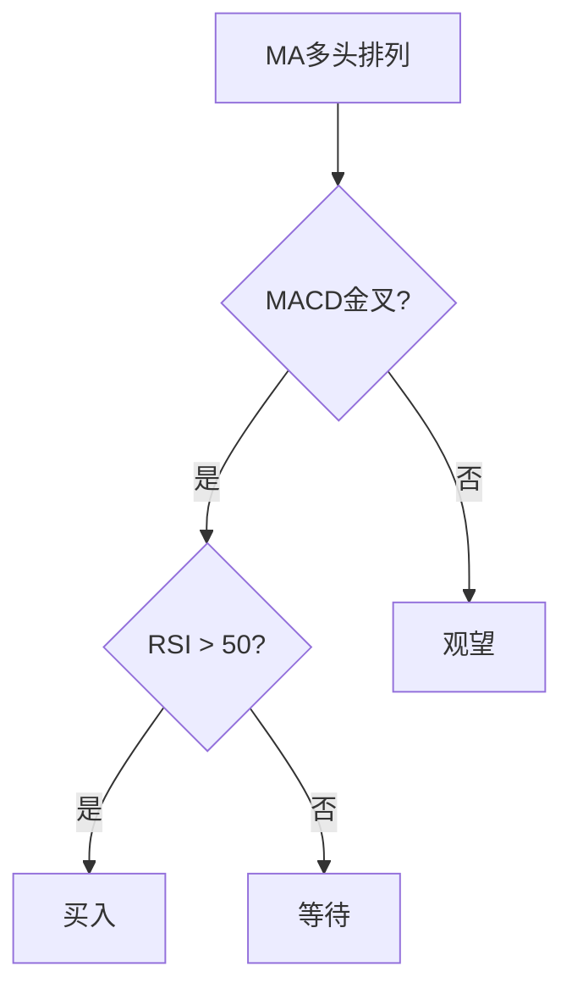

> [!note] 💡 概念解析
> 技术指标2025指南是对当前主流技术指标的最新总结，结合现代市场特点，提供了更系统、更实用的技术分析框架。

## 一、2025年技术分析的新特点

### 1.1 市场环境变化

| 变化 | 影响 |
|------|------|
| 量化交易普及 | 指标信号可能被程序化交易放大 |
| 信息传播加速 | 价格反应更快 |
| 市场联动增强 | 跨市场分析更重要 |
| 政策影响加大 | 基本面与技术面结合 |

### 1.2 指标应用的新趋势

> [!tip] 2025年趋势
> 1. **多指标组合**：单一指标可靠性下降
> 2. **跨市场分析**：不同市场相互影响
> 3. **机器学习**：AI辅助指标分析
> 4. **实时数据**：高频数据应用

## 二、2025年主流技术指标

### 2.1 趋势类指标

| 指标 | 应用 | 2025年改进 |
|------|------|-----------|
| MA | 趋势判断 | 自适应参数 |
| MACD | 趋势确认 | 多时间框架 |
| EMA | 趋势跟踪 | 权重优化 |

### 2.2 动量类指标

| 指标 | 应用 | 2025年改进 |
|------|------|-----------|
| RSI | 超买超卖 | 动态阈值 |
| KDJ | 短期买卖 | 参数优化 |
| CCI | 偏离程度 | 多周期分析 |

### 2.3 波动性指标

| 指标 | 应用 | 2025年改进 |
|------|------|-----------|
| BOLL | 波动范围 | 自适应宽度 |
| ATR | 止损设置 | 动态止损 |

### 2.4 成交量指标

| 指标 | 应用 | 2025年改进 |
|------|------|-----------|
| OBV | 量价关系 | 多因子增强 |
| VR | 买卖气势 | 跨市场分析 |

## 三、2025年指标组合策略

### 3.1 趋势跟踪策略

### 3.2 震荡交易策略

| 信号 | 条件 | 操作 |
|------|------|------|
| 超卖买入 | RSI < 30 + KDJ金叉 | 买入 |
| 超买卖出 | RSI > 70 + KDJ死叉 | 卖出 |
| 通道交易 | 价格触及BOLL下轨 | 买入 |

### 3.3 多因子选股策略

> [!example] 多因子选股
> 1. **趋势因子**：MA多头排列
> 2. **动量因子**：RSI > 50
> 3. **波动因子**：BOLL中轨以上
> 4. **成交量因子**：OBV上升

## 四、2025年指标应用的注意事项

> [!warning] 避免误区
> 1. 不要过度依赖**单一指标**
> 2. 不要忽视**市场环境**变化
> 3. 不要把**历史数据**直接应用于未来
> 4. 不要忽略**基本面**分析

## 📚 相关概念

[[五大核心技术指标指南]] [[十大技术指标详解]] [[六大技术指标指南]] [[多因子趋势跟踪策略]] [[指标组合使用方法论]]
