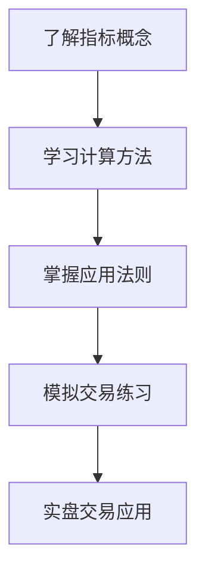

> [!note] 💡 概念解析
> 技术指标入门指南为初学者提供技术分析的基础知识，从指标的概念、分类到实际应用，帮助新手快速掌握技术分析的核心工具。

## 一、什么是技术指标

技术指标是通过对**价格、成交量、时间**等市场数据进行数学计算，得出的用于分析市场趋势和预测价格走势的工具。

### 1.1 技术指标的作用

| 作用 | 说明 |
|------|------|
| 趋势判断 | 判断市场是上涨、下跌还是盘整 |
| 买卖时机 | 寻找最佳的入场和出场点 |
| 风险控制 | 设置止损和止盈位 |
| 市场情绪 | 衡量市场的超买超卖状态 |

### 1.2 技术指标的分类

| 类别 | 代表指标 | 核心功能 |
|------|---------|---------|
| 趋势类 | MA、MACD | 判断趋势方向 |
| 动量类 | RSI、KDJ | 衡量价格动量 |
| 波动性 | BOLL、ATR | 衡量价格波动 |
| 成交量 | OBV、VR | 分析量价关系 |

## 二、最常用的五个指标

### 2.1 MA（移动平均线）

- **作用**：平滑价格波动，判断趋势方向
- **信号**：金叉买入，死叉卖出
- **适用**：趋势跟踪

### 2.2 MACD（指数平滑异同移动平均线）

- **作用**：判断趋势强度和动量
- **信号**：金叉买入，死叉卖出
- **适用**：趋势确认

### 2.3 RSI（相对强弱指数）

- **作用**：衡量价格动量，识别超买超卖
- **信号**：> 80超买，< 20超卖
- **适用**：震荡市

### 2.4 KDJ（随机指标）

- **作用**：衡量收盘价在价格区间中的位置
- **信号**：金叉买入，死叉卖出
- **适用**：短线交易

### 2.5 BOLL（布林带）

- **作用**：衡量价格波动性
- **信号**：触及上轨超买，触及下轨超卖
- **适用**：通道交易

## 三、技术指标的使用步骤

### 3.1 学习步骤

### 3.2 实践步骤

> [!tip] 实践建议
> 1. 先学习**一个指标**，不要贪多
> 2. 在**模拟交易**中练习
> 3. 记录交易日志，总结经验
> 4. 逐步增加指标组合

## 四、技术指标的常见误区

> [!warning] 避免误区
> 1. **不要过度依赖**：指标只是辅助工具
> 2. **不要忽视基本面**：技术面和基本面要结合
> 3. **不要频繁交易**：减少交易次数，提高胜率
> 4. **不要逆势操作**：顺势而为是基本原则

## 五、技术指标的学习资源

| 资源类型 | 推荐 |
|---------|------|
| 书籍 | 《技术分析》《日本蜡烛图技术》 |
| 网站 | TradingView、雪球、东方财富 |
| 软件 | 同花顺、通达信、文华财经 |
| 社区 | 知乎、雪球、股吧 |

## 📚 相关概念

[[五大核心技术指标指南]] [[趋势类指标（MA、EMA、MACD）]] [[震荡类指标（KDJ、RSI、CCI）]] [[趋势强度指标（DMI、布林带）]] [[指标组合使用方法论]]
