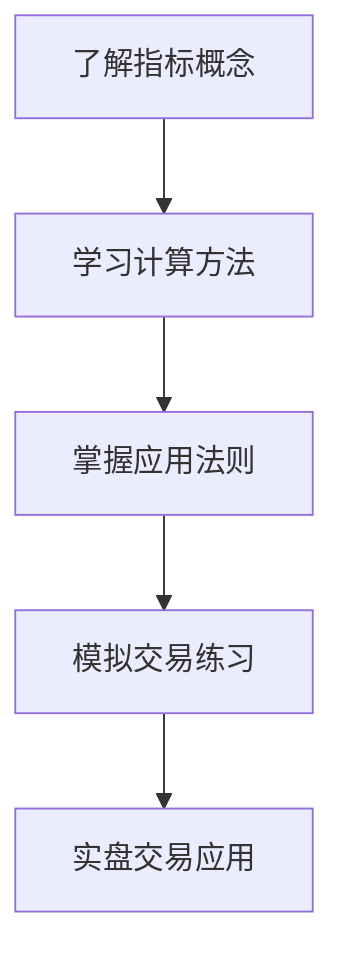

# 技术指标入门指南

> [!note] 💡 概念解析
> 技术指标入门指南为初学者提供技术分析的基础知识，从指标的概念、分类到实际应用，帮助新手快速掌握技术分析的核心工具。

## 一、什么是技术指标

技术指标是通过对**价格、成交量、时间**等市场数据进行数学计算，得出的用于分析市场趋势和预测价格走势的工具。

### 1.1 技术指标的作用

| 作用 | 说明 |
|------|------|
| 趋势判断 | 判断市场是上涨、下跌还是盘整 |
| 买卖时机 | 寻找最佳的入场和出场点 |
| 风险控制 | 设置止损和止盈位 |
| 市场情绪 | 衡量市场的超买超卖状态 |

### 1.2 技术指标的分类

| 类别 | 代表指标 | 核心功能 |
|------|---------|---------|
| 趋势类 | MA、MACD | 判断趋势方向 |
| 动量类 | RSI、KDJ | 衡量价格动量 |
| 波动性 | BOLL、ATR | 衡量价格波动 |
| 成交量 | OBV、VR | 分析量价关系 |

## 二、最常用的五个指标

### 2.1 MA（移动平均线）

- **作用**：平滑价格波动，判断趋势方向
- **信号**：金叉买入，死叉卖出
- **适用**：趋势跟踪

### 2.2 MACD（指数平滑异同移动平均线）

- **作用**：判断趋势强度和动量
- **信号**：金叉买入，死叉卖出
- **适用**：趋势确认

### 2.3 RSI（相对强弱指数）

- **作用**：衡量价格动量，识别超买超卖
- **信号**：> 80超买，< 20超卖
- **适用**：震荡市

### 2.4 KDJ（随机指标）

- **作用**：衡量收盘价在价格区间中的位置
- **信号**：金叉买入，死叉卖出
- **适用**：短线交易

### 2.5 BOLL（布林带）

- **作用**：衡量价格波动性
- **信号**：触及上轨超买，触及下轨超卖
- **适用**：通道交易

## 三、技术指标的使用步骤

### 3.1 学习步骤

### 3.2 实践步骤

> [!tip] 实践建议
> 1. 先学习**一个指标**，不要贪多
> 2. 在**模拟交易**中练习
> 3. 记录交易日志，总结经验
> 4. 逐步增加指标组合

## 四、技术指标的常见误区

> [!warning] 避免误区
> 1. **不要过度依赖**：指标只是辅助工具
> 2. **不要忽视基本面**：技术面和基本面要结合
> 3. **不要频繁交易**：减少交易次数，提高胜率
> 4. **不要逆势操作**：顺势而为是基本原则

## 五、技术指标的学习资源

| 资源类型 | 推荐 |
|---------|------|
| 书籍 | 《技术分析》《日本蜡烛图技术》 |
| 网站 | TradingView、雪球、东方财富 |
| 软件 | 同花顺、通达信、文华财经 |
| 社区 | 知乎、雪球、股吧 |

## 📚 相关概念

[[五大核心技术指标指南]] [[趋势类指标（MA、EMA、MACD）]] [[震荡类指标（KDJ、RSI、CCI）]] [[趋势强度指标（DMI、布林带）]] [[指标组合使用方法论]]

## 课程化学习补充

> [!important] 学习定位
> 技术指标是价格与成交量的压缩表达，适合做信号过滤、风险控制和交易纪律，不适合孤立预测未来。本文仅用于学习、研究与复盘，不构成任何投资建议。

### 必须掌握的问题

- 指标参数是否符合交易周期
- 信号是否经过样本外验证
- 是否与趋势/量能/波动率共振
- 是否明确无效条件

### 实战应用流程

1. 先写清楚你的投资假设：为什么这个信号、资产或方法应该产生收益。
2. 明确数据口径：样本范围、更新时间、复权/分红/停牌处理和交易日历。
3. 做最小可行验证：先用简单规则验证方向，再逐步加入复杂模型。
4. 把成本和约束前置：手续费、滑点、冲击成本、保证金、流动性和容量都要进入测算。
5. 上线后持续复盘：记录信号、下单、成交、持仓、回撤和失效原因。

### 风险与失效条件

- 指标共线导致虚假确认
- 震荡市和趋势市参数错配
- 过度优化
- 忽略滑点和交易成本

### 复盘问题

- 这笔交易或这套模型赚的是什么钱：风险补偿、行为偏差、流动性溢价，还是偶然噪音？
- 如果市场环境反过来，最大亏损和最长恢复期会是多少？
- 当前结论是否依赖某个不可持续假设，例如低利率、低波动、充裕流动性或监管套利？
- 有没有一个更简单的基准策略能取得接近效果？

### 延伸学习

- [[技术分析完整指南]]
- [[量价关系与成交量指标]]
- [[假形态识别与应对]]
- [[风险度量指标]]

## 跨领域进阶扩展

> [!tip] 交易者视角
> 学到 `技术指标入门指南` 时，不要只把它当成孤立知识点。把指标当成信号过滤器和纪律工具，不能替代交易系统。优秀投资交易者会把它放入“宏观背景 - 资产选择 - 估值/信号 - 组合风险 - 交易执行 - 复盘反馈”的闭环。

### 与其他知识的连接

- 趋势、动量、均值回归和波动率
- 成交量和资金流验证
- 多周期共振与冲突
- 成本、滑点和过度交易

### 进阶训练

1. 比较指标在趋势市和震荡市的表现
2. 给每个信号定义入场、退出、止损和暂停条件
3. 用样本外数据检查参数稳定性

### 能力验收

- 能否说清楚这个主题影响的是收益来源、风险来源、交易成本、流动性还是心理纪律？
- 能否指出它在什么市场环境、资产类别或交易周期中更有效？
- 能否把它写成一条可复盘的研究或交易规则？
- 能否说明如果判断错误，组合最大损失和退出机制是什么？

### 全局关联

- [[综合金融知识体系/金融投资全知识地图|金融投资全知识地图]]
- [[综合金融知识体系/优秀投资交易者能力地图|优秀投资交易者能力地图]]
- [[综合金融知识体系/一次性学习路线与复盘模板|一次性学习路线与复盘模板]]
