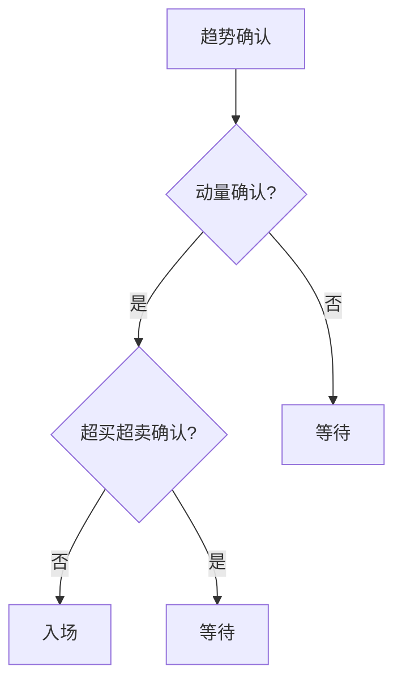

# 技术指标第十章

> [!note] 💡 概念解析
> 技术指标第十章总结了技术指标的综合应用方法，包括指标的选择、组合和策略构建，是技术分析从理论到实践的关键章节。

## 一、技术指标的选择原则

### 1.1 根据市场状态选择

| 市场状态 | 推荐指标 | 避免指标 |
|---------|---------|---------|
| 趋势市 | MA、MACD、EMA | RSI、KDJ |
| 震荡市 | RSI、KDJ、BOLL | MA、MACD |
| 盘整市 | BOLL、CCI | 趋势类指标 |

### 1.2 根据交易风格选择

| 交易风格 | 推荐指标 | 特点 |
|---------|---------|------|
| 长线投资 | MA、MACD | 滑后性强，信号可靠 |
| 中线波段 | MACD、RSI | 平衡性好 |
| 短线交易 | KDJ、CCI | 灵敏度高 |

## 二、技术指标的组合方法

### 2.1 趋势确认组合

> [!tip] MA + MACD组合
> 1. MA判断趋势方向
> 2. MACD确认趋势强度
> 3. 两者信号一致时交易

### 2.2 超买超卖组合

> [!tip] RSI + KDJ组合
> 1. RSI判断中期超买超卖
> 2. KDJ判断短期超买超卖
> 3. 两者信号一致时交易

### 2.3 综合分析组合

> [!tip] MA + RSI + BOLL组合
> 1. MA判断趋势方向
> 2. RSI判断超买超卖
> 3. BOLL判断波动范围
> 4. 三者信号一致时交易

## 三、技术指标的策略构建

### 3.1 入场策略

### 3.2 出场策略

| 出场条件 | 信号 | 操作 |
|---------|------|------|
| 止盈 | RSI > 80 | 部分止盈 |
| 止损 | 价格跌破支撑 | 全部止损 |
| 趋势反转 | MACD死叉 | 全部出场 |

### 3.3 仓位管理

> [!important] 仓位管理原则
> 1. **信号强度**：多个指标信号一致时加大仓位
> 2. **市场状态**：趋势市加大仓位，震荡市减小仓位
> 3. **风险控制**：单笔交易风险不超过总资金的2%

## 四、技术指标的局限性

> [!warning] 认识局限
> 1. 技术指标是**滞后指标**，不能预测未来
> 2. 指标信号可能**相互矛盾**
> 3. 指标参数**需要优化**
> 4. 指标不能替代**基本面分析**

## 📚 相关概念

[[五大核心技术指标指南]] [[十大技术指标详解]] [[六大技术指标指南]] [[多因子趋势跟踪策略]] [[指标组合使用方法论]]

## 课程化学习补充

> [!important] 学习定位
> 技术指标是价格与成交量的压缩表达，适合做信号过滤、风险控制和交易纪律，不适合孤立预测未来。本文仅用于学习、研究与复盘，不构成任何投资建议。

### 必须掌握的问题

- 指标参数是否符合交易周期
- 信号是否经过样本外验证
- 是否与趋势/量能/波动率共振
- 是否明确无效条件

### 实战应用流程

1. 先写清楚你的投资假设：为什么这个信号、资产或方法应该产生收益。
2. 明确数据口径：样本范围、更新时间、复权/分红/停牌处理和交易日历。
3. 做最小可行验证：先用简单规则验证方向，再逐步加入复杂模型。
4. 把成本和约束前置：手续费、滑点、冲击成本、保证金、流动性和容量都要进入测算。
5. 上线后持续复盘：记录信号、下单、成交、持仓、回撤和失效原因。

### 风险与失效条件

- 指标共线导致虚假确认
- 震荡市和趋势市参数错配
- 过度优化
- 忽略滑点和交易成本

### 复盘问题

- 这笔交易或这套模型赚的是什么钱：风险补偿、行为偏差、流动性溢价，还是偶然噪音？
- 如果市场环境反过来，最大亏损和最长恢复期会是多少？
- 当前结论是否依赖某个不可持续假设，例如低利率、低波动、充裕流动性或监管套利？
- 有没有一个更简单的基准策略能取得接近效果？

### 延伸学习

- [[技术分析完整指南]]
- [[量价关系与成交量指标]]
- [[假形态识别与应对]]
- [[风险度量指标]]
