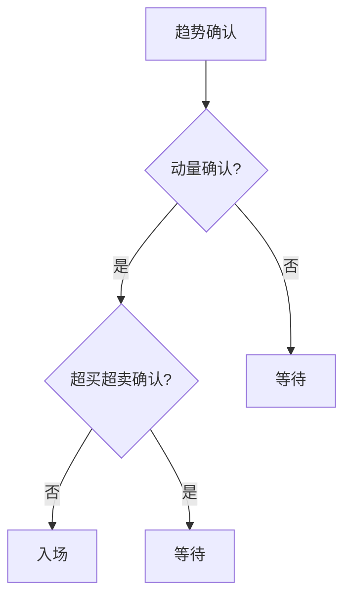

# 技术指标第十章

> [!note] 💡 概念解析
> 技术指标第十章总结了技术指标的综合应用方法，包括指标的选择、组合和策略构建，是技术分析从理论到实践的关键章节。

## 一、技术指标的选择原则

### 1.1 根据市场状态选择

| 市场状态 | 推荐指标 | 避免指标 |
|---------|---------|---------|
| 趋势市 | MA、MACD、EMA | RSI、KDJ |
| 震荡市 | RSI、KDJ、BOLL | MA、MACD |
| 盘整市 | BOLL、CCI | 趋势类指标 |

### 1.2 根据交易风格选择

| 交易风格 | 推荐指标 | 特点 |
|---------|---------|------|
| 长线投资 | MA、MACD | 滑后性强，信号可靠 |
| 中线波段 | MACD、RSI | 平衡性好 |
| 短线交易 | KDJ、CCI | 灵敏度高 |

## 二、技术指标的组合方法

### 2.1 趋势确认组合

> [!tip] MA + MACD组合
> 1. MA判断趋势方向
> 2. MACD确认趋势强度
> 3. 两者信号一致时交易

### 2.2 超买超卖组合

> [!tip] RSI + KDJ组合
> 1. RSI判断中期超买超卖
> 2. KDJ判断短期超买超卖
> 3. 两者信号一致时交易

### 2.3 综合分析组合

> [!tip] MA + RSI + BOLL组合
> 1. MA判断趋势方向
> 2. RSI判断超买超卖
> 3. BOLL判断波动范围
> 4. 三者信号一致时交易

## 三、技术指标的策略构建

### 3.1 入场策略

### 3.2 出场策略

| 出场条件 | 信号 | 操作 |
|---------|------|------|
| 止盈 | RSI > 80 | 部分止盈 |
| 止损 | 价格跌破支撑 | 全部止损 |
| 趋势反转 | MACD死叉 | 全部出场 |

### 3.3 仓位管理

> [!important] 仓位管理原则
> 1. **信号强度**：多个指标信号一致时加大仓位
> 2. **市场状态**：趋势市加大仓位，震荡市减小仓位
> 3. **风险控制**：单笔交易风险不超过总资金的2%

## 四、技术指标的局限性

> [!warning] 认识局限
> 1. 技术指标是**滞后指标**，不能预测未来
> 2. 指标信号可能**相互矛盾**
> 3. 指标参数**需要优化**
> 4. 指标不能替代**基本面分析**

## 📚 相关概念

[[五大核心技术指标指南]] [[十大技术指标详解]] [[六大技术指标指南]] [[多因子趋势跟踪策略]] [[指标组合使用方法论]]

## 实战掌握清单

> [!tip] 交易者视角
> 技术指标第十章 的学习重点不是记住术语，而是把它放进研究、组合、执行和复盘的闭环。技术指标是价格、成交量和波动率的二次加工，核心价值在于把主观观察变成稳定规则。

### 关键判断

- 先确认指标属于趋势、震荡、量能、波动率还是资金流。
- 判断当前市场是否适合该指标：趋势指标怕横盘，震荡指标怕单边。
- 把参数选择、信号延迟和交易频率写清楚。

### 落地动作

1. 用样本外数据检验信号，而不是只看历史图形好不好看。
2. 同时记录胜率、盈亏比、换手、滑点和回撤。
3. 把指标作为过滤器、触发器或退出规则，避免多个同源指标重复投票。

### 失效边界

- 参数过拟合。
- 忽略手续费和滑点。
- 在市场结构变化后继续迷信旧阈值。

### 复盘问题

- 这项知识改变了哪一个具体决策：标的、方向、仓位、退出、对冲还是不交易？
- 如果判断相反，最大亏损、最长恢复期和退出触发条件是什么？
- 有没有一个更简单的基准方法可以取得相近结果？

## 深度案例与训练

### 指标实验

围绕 技术指标第十章 设计三组实验：趋势行情、震荡行情和急跌反弹。分别测试参数、信号延迟、胜率、盈亏比、换手率和最大回撤。

### 组合使用

- 不要堆叠多个同源指标，例如多个均线指标重复投票。
- 指标最好分工：趋势判断、入场触发、风险退出、仓位过滤。
- 对指标做样本外验证，避免只适合历史图形。

### 实盘要求

指标信号必须配合交易成本、流动性和止损纪律。

## 最小可执行项目

### 指标参数实验

围绕 技术指标第十章 做一个参数实验：默认参数、短周期参数和长周期参数分别在趋势、震荡和极端波动中表现如何。

| 输出 | 用途 |
|---|---|
| 胜率 | 判断信号命中 |
| 盈亏比 | 判断是否值得交易 |
| 换手 | 判断成本压力 |
| 回撤 | 设计仓位 |
| 参数稳定性 | 识别过拟合 |

### 验收标准

指标必须服务于明确分工：判断趋势、触发入场、过滤风险或辅助退出。
