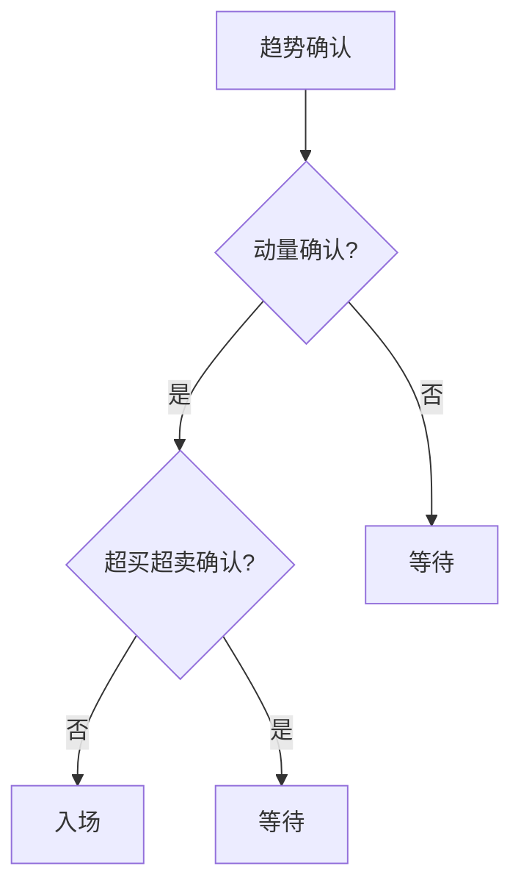

> [!note] 💡 概念解析
> 技术指标第十章总结了技术指标的综合应用方法，包括指标的选择、组合和策略构建，是技术分析从理论到实践的关键章节。

## 一、技术指标的选择原则

### 1.1 根据市场状态选择

| 市场状态 | 推荐指标 | 避免指标 |
|---------|---------|---------|
| 趋势市 | MA、MACD、EMA | RSI、KDJ |
| 震荡市 | RSI、KDJ、BOLL | MA、MACD |
| 盘整市 | BOLL、CCI | 趋势类指标 |

### 1.2 根据交易风格选择

| 交易风格 | 推荐指标 | 特点 |
|---------|---------|------|
| 长线投资 | MA、MACD | 滑后性强，信号可靠 |
| 中线波段 | MACD、RSI | 平衡性好 |
| 短线交易 | KDJ、CCI | 灵敏度高 |

## 二、技术指标的组合方法

### 2.1 趋势确认组合

> [!tip] MA + MACD组合
> 1. MA判断趋势方向
> 2. MACD确认趋势强度
> 3. 两者信号一致时交易

### 2.2 超买超卖组合

> [!tip] RSI + KDJ组合
> 1. RSI判断中期超买超卖
> 2. KDJ判断短期超买超卖
> 3. 两者信号一致时交易

### 2.3 综合分析组合

> [!tip] MA + RSI + BOLL组合
> 1. MA判断趋势方向
> 2. RSI判断超买超卖
> 3. BOLL判断波动范围
> 4. 三者信号一致时交易

## 三、技术指标的策略构建

### 3.1 入场策略

### 3.2 出场策略

| 出场条件 | 信号 | 操作 |
|---------|------|------|
| 止盈 | RSI > 80 | 部分止盈 |
| 止损 | 价格跌破支撑 | 全部止损 |
| 趋势反转 | MACD死叉 | 全部出场 |

### 3.3 仓位管理

> [!important] 仓位管理原则
> 1. **信号强度**：多个指标信号一致时加大仓位
> 2. **市场状态**：趋势市加大仓位，震荡市减小仓位
> 3. **风险控制**：单笔交易风险不超过总资金的2%

## 四、技术指标的局限性

> [!warning] 认识局限
> 1. 技术指标是**滞后指标**，不能预测未来
> 2. 指标信号可能**相互矛盾**
> 3. 指标参数**需要优化**
> 4. 指标不能替代**基本面分析**

## 📚 相关概念

[[五大核心技术指标指南]] [[十大技术指标详解]] [[六大技术指标指南]] [[多因子趋势跟踪策略]] [[指标组合使用方法论]]
