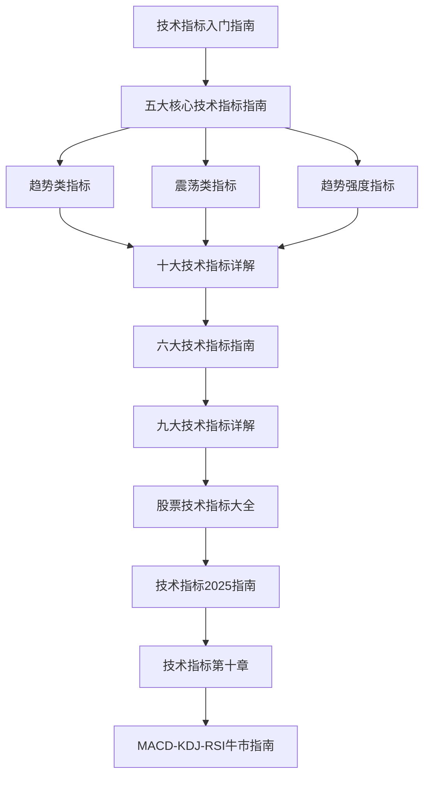

# 一、核心指标

本章节系统介绍技术分析的核心指标，从基础概念到高级应用。

## 笔记列表

### 基础指标（已有）
1. [[趋势类指标（MA、EMA、MACD）]] - 趋势类指标的详细解析
2. [[震荡类指标（KDJ、RSI、CCI）]] - 震荡类指标的详细解析
3. [[趋势强度指标（DMI、布林带）]] - 趋势强度指标的详细解析

### 综合指南
4. [[五大核心技术指标指南]] - MA、MACD、RSI、KDJ、BOLL五大指标
5. [[十大技术指标详解]] - 涵盖趋势、动量、波动性、成交量四大类
6. [[九大技术指标详解]] - 九大核心指标的综合对比
7. [[六大技术指标指南]] - 量化交易中最常用的六大指标
8. [[股票技术指标大全]] - 所有常用技术指标的完整梳理

### 专项指标
9. [[CCI指标详解]] - CCI指标的深度解析
10. [[布林带详解]] - 布林带的深度解析

### 实战应用
11. [[MACD-KDJ-RSI牛市指南]] - 牛市中三大指标的应用策略
12. [[技术指标2025指南]] - 2025年技术指标的最新应用
13. [[技术指标第十章]] - 技术指标的综合应用方法
14. [[技术指标入门指南]] - 初学者的技术指标入门

## 学习路径

## 核心要点

- 技术指标分为趋势、动量、波动性、成交量四大类
- 不同市场状态使用不同类型的指标
- 多指标组合可以提高信号可靠性
- 技术指标需要结合基本面分析
