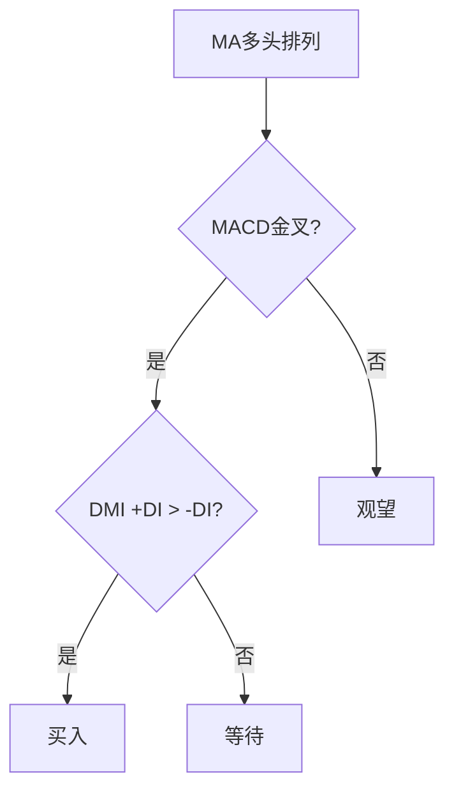

> [!note] 💡 概念解析
> 股票技术指标大全系统梳理了所有常用技术指标，从趋势、动量、波动性到成交量四大类别，为投资者提供完整的技术分析工具箱。

## 一、技术指标分类体系

### 1.1 趋势类指标

| 指标 | 全称 | 核心功能 |
|------|------|---------|
| MA | 移动平均线 | 趋势方向 |
| EMA | 指数移动平均线 | 趋势方向（更灵敏） |
| MACD | 指数平滑异同移动平均线 | 趋势强度与动量 |
| DMI | 动向指标 | 趋势方向与强度 |
| SAR | 抛物线指标 | 趋势反转点 |

### 1.2 动量类指标

| 指标 | 全称 | 核心功能 |
|------|------|---------|
| RSI | 相对强弱指数 | 超买超卖 |
| KDJ | 随机指标 | 短期买卖 |
| CCI | 商品通道指数 | 偏离程度 |
| WR | 威廉指标 | 超买超卖 |
| ROC | 变动率指标 | 动量变化 |

### 1.3 波动性指标

| 指标 | 全称 | 核心功能 |
|------|------|---------|
| BOLL | 布林带 | 波动范围 |
| ATR | 平均真实波幅 | 波动幅度 |
| 标准差 | 标准差 | 波动程度 |

### 1.4 成交量指标

| 指标 | 全称 | 核心功能 |
|------|------|---------|
| OBV | 能量潮指标 | 量价关系 |
| VR | 成交量比率 | 买卖气势 |
| VOL | 成交量 | 成交活跃度 |
| VWAP | 成交量加权平均价 | 日内交易 |

## 二、技术指标应用原则

### 2.1 市场状态匹配

> [!tip] 选择原则
> 1. **趋势市**：使用趋势类指标（MA、MACD、DMI）
> 2. **震荡市**：使用动量类指标（RSI、KDJ、CCI）
> 3. **盘整市**：使用波动性指标（BOLL、ATR）

### 2.2 交易风格匹配

| 交易风格 | 推荐指标 | 特点 |
|---------|---------|------|
| 长线投资 | MA、MACD | 信号少但可靠 |
| 中线波段 | MACD、RSI | 平衡性好 |
| 短线交易 | KDJ、CCI、WR | 灵敏度高 |
| 日内交易 | VWAP、分时指标 | 实时性强 |

## 三、技术指标组合策略

### 3.1 趋势跟踪组合

### 3.2 震荡交易组合

| 信号 | 条件 | 操作 |
|------|------|------|
| 超卖买入 | RSI < 30 + KDJ金叉 | 买入 |
| 超买卖出 | RSI > 70 + KDJ死叉 | 卖出 |
| 通道交易 | 价格触及BOLL下轨 | 买入 |

### 3.3 成交量确认组合

> [!important] 量价配合
> 1. **放量突破**：成交量放大 + 价格突破 → 有效突破
> 2. **缩量回调**：成交量缩小 + 价格回调 → 下跌动能不足
> 3. **天量见顶**：成交量天量 + 价格滞涨 → 警惕见顶

## 四、技术指标的局限性

> [!warning] 认识局限
> 1. 技术指标是**滞后指标**，不能预测未来
> 2. 指标信号可能**相互矛盾**
> 3. 指标参数**需要优化**
> 4. 指标不能替代**基本面分析**
> 5. 指标在**极端行情**中可能失效

## 📚 相关概念

[[五大核心技术指标指南]] [[十大技术指标详解]] [[九大技术指标详解]] [[六大技术指标指南]] [[指标组合使用方法论]]
