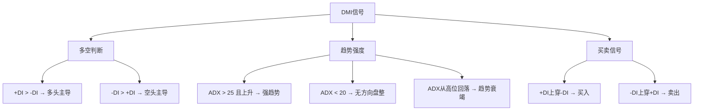

> [!note] 💡 概念解析
> 趋势强度指标不直接预测涨跌，而是回答"趋势存在吗？"和"趋势有多强？"。DMI判断趋势方向与强度，布林带衡量波动率并识别突破与回归。

## 一、DMI（趋向指标）

### 核心任务

DMI回答两个问题：
1. **趋势存在吗？** — 当前是趋势市还是震荡市？
2. **趋势有多强？** — 值得参与还是应该观望？

### 指标构成

DMI由三根线组成：

| 线条 | 含义 | 角色 |
|------|------|------|
| **+DI**（白线） | 多头力量 | 买方力度 |
| **-DI**（黄线） | 空头力量 | 卖方力度 |
| **ADX**（紫/红线） | 趋势强度 | 裁判角色 |

### 计算原理

1. **真实波幅（TR）**：
$$TR = \max(H-L, |H-C_{prev}|, |L-C_{prev}|)$$

2. **方向运动（DM）**：
$$+DM = \max(0, H - H_{prev})$$
$$-DM = \max(0, L_{prev} - L)$$

3. **方向指标（DI）**：
$$+DI = \frac{+DM的N日平滑}{TR的N日平滑} \times 100$$
$$-DI = \frac{-DM的N日平滑}{TR的N日平滑} \times 100$$

4. **ADX（平均趋向指数）**：
$$DX = \frac{|+DI - -DI|}{+DI + -DI} \times 100$$
$$ADX = DX的M日移动平均$$

### 实战信号体系



> [!important] ADX是最关键的信号
> - **ADX > 25 且上升**：不管涨跌，趋势强劲——顺势而为
> - **ADX < 20**：无方向盘整——减少操作，避免被反复打脸
> - **ADX 从45以上回落**：强趋势进入尾声，警惕反转

> [!example] 实战案例
> 当MACD在零轴上方金叉（趋势向好），同时+DI上穿-DI（多方增强），且ADX拐头向上（趋势强度增加）——三重确认，买入信号可靠性达到巅峰。

## 二、布林带（Bollinger Bands）

### 定义与构成

布林带由三条线组成，基于统计学原理衡量价格波动范围：

- **中轨**：N日移动平均线（通常N=20）
- **上轨**：中轨 + K × 标准差（通常K=2）
- **下轨**：中轨 - K × 标准差

$$上轨 = MA_N + 2 \times \sigma$$
$$下轨 = MA_N - 2 \times \sigma$$

其中 $\sigma$ 为N日收盘价的标准差。

> [!note] 为什么是2倍标准差？
> 假设价格服从正态分布，约95%的价格波动应落在±2σ范围内。价格触及或突破轨道，意味着出现了"小概率事件"，往往预示趋势延续或反转。

### 四大核心信号

| 信号 | 形态 | 含义 | 操作 |
|------|------|------|------|
| **突破上轨** | 价格>上轨 | 强势突破 | 顺势做多（配合放量更可靠） |
| **跌破下轨** | 价格<下轨 | 弱势突破 | 顺势做空/观望 |
| **收口** | 带宽缩小 | 波动率降低，变盘前兆 | 警惕大幅波动 |
| **开口** | 带宽扩大 | 波动率放大 | 趋势延续 |

### 布林带宽度指标

$$带宽 = \frac{上轨 - 下轨}{中轨} \times 100\%$$

- 带宽缩小到极值 → 蓄势待发，关注突破方向
- 带宽持续扩大 → 趋势运行中，顺势而为

> [!tip] 布林带+RSI黄金组合
> 价格触及下轨且RSI<30（超卖），是较好的低吸机会；价格触及上轨且RSI>70（超买），是较好的高抛机会。

### 量化策略示例

```python
# 布林带突破策略
if close > upper_band and volume > vol_ma * 1.5:
    buy()   # 放量突破上轨
elif close < lower_band:
    sell()  # 跌破下轨

# 均值回归策略（震荡市适用）
if close <= lower_band and rsi < 30:
    buy()   # 触及下轨+超卖
elif close >= upper_band and rsi > 70:
    sell()  # 触及上轨+超买
```

## 两指标对比

| 特性 | DMI | 布林带 |
|------|-----|--------|
| 核心功能 | 判断趋势有无+强度 | 衡量波动率+支撑压力 |
| 输出信号 | 多空方向+强度数值 | 价格通道+带宽变化 |
| 假信号控制 | 好（ADX过滤） | 中（需配合其他指标） |
| 最佳搭配 | MACD | RSI/成交量 |
| 适用场景 | 趋势确认+择时 | 突破交易+均值回归 |

## 📚 相关概念

[[趋势类指标（MA、EMA、MACD）]] [[震荡类指标（KDJ、RSI、CCI）]] [[道氏理论]] [[指标组合使用方法论]] [[量价关系与成交量指标]]
